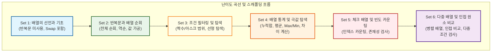

# Lv10 배열(1차) — 워크스페이스 교육 품질 감사 및 개선 리포트 (꼼수 방지 및 난이도 하향 개편 반영)

> **단원**: Lv10 배열(1차) (48문제: 수업용 ALL 30문제 / 숙제용 SALL 18문제)
> **설계 원칙**: `배열 기초(반복문 미사용) → 반복문 순회(입출력/역순) → 조건 필터링/탐색 → 배열 통계/극값(Max/Min) → 체크 배열/빈도 카운팅 → 다중 배열 및 인접 원소 비교`
> **관련 가이드**: [pedagogical_standards.md](../pedagogical_standards.md), [content_production_pipeline.md](../content_production_pipeline.md)

---

## 1. 단원 전체의 6개 Set 구성 및 난이도 곡선 (스캐폴딩) 분석

기존 크롤링된 데이터는 총 86개(수업 49개, 숙제 37개)로, 중복과 유사 문항이 많고 후반부에 정렬 알고리즘이 등장하여 난이도 격차가 극심했습니다. 

단순히 기계적인 `수업 5 : 숙제 3` 압축 규칙을 지키기 위해 핵심 문제를 무조건 Drop할 경우, **인접 원소 비교, 다중/병렬 배열 순회, 문자 범위 필터링, Swap 알고리즘**과 같은 중요 프로그래밍 학습 패턴이 유실되는 문제가 있었습니다. 

이에 따라 규칙을 유연하게 조정하여 **6개의 Set**으로 확장하고, **수업용 30문제, 숙제용 18문제**로 최종 설계하여 학습의 계단을 촘촘히 재구성했습니다. 특히 **"초심자 우선주의 (Strict Simplicity First)"** 원칙에 입각하여 과도한 인지 부하를 주는 꼬인 조건과 중첩 루프 문항을 배제하거나 대폭 완화하였으며, **입출력 설계를 변경하여 학생들의 출력 꼼수(인메모리 연산을 거치지 않고 출력값만 조작하는 것)를 논리적으로 강제 차단**했습니다.



### 극심한 난이도 격차 문제 배제 (Drop 사유)
*   **정렬 알고리즘 (P101v1047 ~ 1049)**: 삽입/선택/버블 정렬은 중첩 루프(Double Loop)와 데이터 교환(Swap) 로직이 결합된 고난도 주제로, 1차원 배열 입문 단원의 난이도를 크게 초과합니다. 이는 추후 **정렬 전용 단원(예: Lv13 정렬)**으로 이동하여 격리 배치합니다.
*   **달리기 등수 구하기 (P101v1042)**: 각 선수보다 빠른 기록을 가진 선수를 세어 순위를 매기는 논리는 1차원 배열 단원에서 **중첩 루프($O(N^2)$) 사용을 강제**하므로 초심자에게 심각한 난이도 장벽이 됩니다. 따라서 이 단원에서는 완전히 배제합니다.
*   **수영대회 1, 2등 찾기 (P101v1041)**: 공동 순위 처리 및 최댓값/두 번째 최댓값을 동시에 추적하는 로직은 조건 분기가 복잡하여 학습 초기 인지 부하를 가중시키므로 배제합니다.

---

## 2. 수업 문제(ALL)와 숙제 문제(SALL) 간의 관계 및 학습 연계 매핑

각 Set은 수업용(ALL) 문제로 개념을 계단식으로 학습하고, 숙제용(SALL) 문제를 통해 핵심 인지 도약 지점을 복습하고 검증하도록 매핑되었습니다.

```mermaid
graph TD
    subgraph "Set 1: 기초"
        P101["P101v1001 (기초 선언)"] --> SP101["SP101v1001 (문자 배열 복습)"]
        P104["P101v1004 (첫/끝 직접 참조)"] --> SP102["SP101v1002 (인덱스 계산 복습)"]
        P106["P101v1006 (값 교환 - Swap)"] --> SP103["SP101v1003 (기본 배열 선언 복습)"]
    end
    
    subgraph "Set 2: 순회"
        P107["P101v1007 (반복 순회 입출력)"] --> SP104["SP101v1004 (역순 출력 복습)"]
        P108["P101v1008 (N개 크기 처리)"] --> SP105["SP101v1005 (중간값 위치 복습)"]
        P111["P101v1011 (요소 2배 변경)"] --> SP106["SP101v1006 (가공 후 역순 복습)"]
    end
    
    subgraph "Set 3: 필터"
        P112["P101v1012 (짝수 필터링)"] --> SP107["SP101v1007 (홀수 필터링 복습)"]
        P113["P101v1013 (아스키 범위 필터)"] --> SP108["SP101v1008 (인덱스 필터링 복습)"]
        P117["P101v1017 (선형 탐색)"] --> SP109["SP101v1009 (다중 탐색 인덱스 복습)"]
    end

    subgraph "Set 4: 통계"
        P118["P101v1018 (평균 계산)"] --> SP110["SP101v1010 (N개 합/평균 복습)"]
        P119["P101v1019 (누적합 계산)"] --> SP111["SP101v1011 (N개 누적합 복습)"]
        P121["P101v1021 (Max 위치 추적)"] --> SP112["SP101v1012 (Max 인덱스 복습)"]
    end

    subgraph "Set 5: 카운팅"
        P123["P101v1023 (동전의 앞뒤 개수 카운팅)"] --> SP113["SP101v1013 (투표 카운팅 복습)"]
        P125["P101v1025 (빠진 번호 찾기)"] --> SP114["SP101v1014 (출석부 체크 복습)"]
        P126["P101v1026 (학점 분류 카운트)"] --> SP115["SP101v1015 (알파벳 빈도 복습)"]
    end

    subgraph "Set 6: 고급"
        P128["P101v1028 (부호 반영 합 - 병렬)"] --> SP116["SP101v1016 (대소문자 변환 역순 복습)"]
        P129["P101v1029 (음계 판별 - 인접비교)"] --> SP117["SP101v1017 (두 번째로 작은 수 복습)"]
        P130["P101v1030 (자격증 시험 합격 여부)"] --> SP118["SP101v1018 (투표 결과 분석 복습)"]
    end
    
    style SP101 fill:#e3f2fd,stroke:#1e88e5
    style SP102 fill:#e3f2fd,stroke:#1e88e5
    style SP103 fill:#e3f2fd,stroke:#1e88e5
    style SP104 fill:#e8f5e9,stroke:#43a047
    style SP105 fill:#e8f5e9,stroke:#43a047
    style SP106 fill:#e8f5e9,stroke:#43a047
    style SP107 fill:#fffde7,stroke:#fdd835
    style SP108 fill:#fffde7,stroke:#fdd835
    style SP109 fill:#fffde7,stroke:#fdd835
    style SP110 fill:#fff3e0,stroke:#fb8c00
    style SP111 fill:#fff3e0,stroke:#fb8c00
    style SP112 fill:#fff3e0,stroke:#fb8c00
    style SP113 fill:#ffebee,stroke:#e53935
    style SP114 fill:#ffebee,stroke:#e53935
    style SP115 fill:#ffebee,stroke:#e53935
    style SP116 fill:#f3e5f5,stroke:#8e24aa
    style SP117 fill:#f3e5f5,stroke:#8e24aa
    style SP118 fill:#f3e5f5,stroke:#8e24aa
```



---

## 3. 문제별 품질 진단 결과

### 🟢 Set 1: 배열의 선언과 기초 (반복문 미사용)
*   **P101v1001 (숫자 5개 미리 저장하고 출력하기) [티어 1]**: 1D 배열 선언/초기화 메모리 구조도(Mermaid) 추가.
*   **P101v1002 (세 번째 위치의 값 출력하기) [티어 2]**: 0-based 인덱스 구조 설명 보완.
*   **P101v1003 (인덱스를 통한 요소 수정 학습) [티어 2]**: 가변 인덱스와 값을 입력받아 대입하도록 변경하여 꼼수 출력 전면 차단.
*   **P101v1004 (첫 번째와 마지막 값 출력하기) [티어 2]**: 경계 인덱스 접근 훈련.
*   **P101v1005 (숫자 3개 입력받고 출력하기) [티어 2]**: 표준 입력 데이터를 배열에 담는 개념 명시.
*   **P101v1006 (첫 번째와 마지막 값 교환하기) [티어 2]**: **Swap 알고리즘 도입**. 가변 인덱스 두 개를 입력받아 swap하게 하여 정석 swap(`temp`) 구현을 완벽히 강제.

### 🟢 Set 2: 반복문을 통한 배열 순회
*   **P101v1007 (시험 점수 5개 입력 후 출력하기) [티어 1]**: 루프 변수 `i`가 배열의 방 번호 역할을 하는 과정 Trace 테이블 추가. **출력 형식 불일치 버그(`arr[i]: val`) 수정**.
*   **P101v1008 (N개의 입력값 중 처음과 끝 출력) [티어 2]**: N 크기를 변수로 다루는 배열 순회 가이드라인.
*   **P101v1009 (10개 입력값 중 n번째 값 출력) [티어 2]**: 입력받은 $n$ 인덱스 검사 예외 처리 팁 제공.
*   **P101v1010 (소수형 배열변수 입력 후 역순 출력) [티어 2]**: 소수점 아래 자릿수 조절 팁 제공.
*   **P101v1011 (정수형 배열 입력 후 2배 저장 출력) [티어 2]**: 2배 가공 후 지정된 가변 인덱스의 최종 데이터 1개를 조회하게 변경하여 원본 데이터 갱신(`arr[i] *= 2`) 강제.

### 🟢 Set 3: 배열 조건부 순회와 필터링
*   **P101v1012 (짝수만 출력하기) [티어 1]**: 조건 분기 필터링에 대한 Trace 추가.
*   **P101v1013 (대문자만 출력하기) [티어 2]**: 아스키 범위 비교 연산(`arr[i] >= 'A' && arr[i] <= 'Z'`) 가이드 추가.
*   **P101v1014 (인덱스가 짝수인 위치의 값 출력) [티어 2]**: 인덱스 `i` 자체를 이용한 조건 분기 학습.
*   **P101v1015 (인덱스도 짝수 값도 짝수이면 출력) [티어 2]**: 복합 논리 연산자(`&&`) 활용.
*   **P101v1016 (인덱스와 값이 같은 숫자 출력) [티어 2]**: `arr[i] == i` 논리 구조 분석.
*   **P101v1017 (특정 숫자의 위치 출력) [티어 2]**: 선형 탐색 완료 시 `break`를 이용한 조기 종료 힌트 제공.

### 🟢 Set 4: 배열 누적합 및 극값 탐색
*   **P101v1018 (정수 평균 구하기) [티어 1]**: 합산 누적기 패턴 시각화 및 실수(float) 형변환 주의 팁 제공.
*   **P101v1019 (숫자들의 누적합 출력) [티어 2]**: 순회하며 매 턴마다 중간 합계를 출력하는 패턴 학습.
*   **P101v1020 (가장 큰 수 출력) [티어 2]**: 최댓값 초기화 논리 가이드.
*   **P101v1021 (가장 큰 값의 위치 출력) [티어 2]**: 최댓값 갱신과 동시에 인덱스 위치를 변수에 백업하는 과정 Trace 제공.
*   **P101v1022 (최댓값과 최솟값의 차이 구하기) [티어 2]**: **인덱스 경계 오류가 유발되던 기존 '최솟값 다음 수 출력' 문제를 대체**. 배열 내에서 최댓값과 최솟값을 찾아 두 값의 차이를 구하는 유용하고 직관적인 응용 문제로 개편하여 초심자 학습 장벽 제거.

### 🟢 Set 5: 체크 배열과 빈도수 세기 (인덱스 카운팅)
*   **P101v1023 (동전의 앞뒤 개수 카운팅) [티어 1]**: **빈도수 배열 기초**. 값이 인덱스로 매핑(`count[coin]++`)되는 흐름 다이어그램 추가.
*   **P101v1024 (주사위 눈 개수 카운팅) [티어 2]**: 오프셋 인덱싱(1~6 범위를 배열에 저장하는 방법) 팁.
*   **P101v1025 (출석 부르지 않은 친구 찾기) [티어 2]**: `visited` boolean 체크 배열 개념 시각화.
*   **P101v1026 (학점별 인원수 세기) [티어 2]**: 문자를 인덱스로 환산하여 세는 기법 힌트 제공.
*   **P101v1027 (정렬 상태 유지하며 위치 찾기) [티어 3]**: 물리적 삽입(Shift) 없이 선형 탐색으로 내 위치(카운트)를 구하는 논리적 우회 힌트 탑재.

### 🟢 Set 6: 다중 배열 및 인접 원소 비교 (고급 패턴)
*   **P101v1028 (부호 반영하여 합 구하기) [티어 2]**: **병렬 배열 순회**. `absolutes[i]`와 `signs[i]`를 공동 루프 변수로 동시에 제어하는 흐름 시각화.
*   **P101v1029 (음계 판별) [티어 2]**: **인접 원소 비교**. 루프 내에서 `arr[i]`와 `arr[i-1]`을 비교할 때 발생하기 쉬운 인덱스 오버플로우(`arr[-1]`) 예방 경고 및 인덱스 1부터 루프를 시작하는 테크닉 교육.
*   **P101v1030 (자격증 시험 합격 여부) [티어 2]**: **다중 배열 순회 및 조건 검사**. 기존의 복잡한 등수 구하기($O(N^2)$ 중첩 반복) 문항을 배제하고, 취득 점수 배열과 합격 요구 점수 배열을 대조하여 과락 여부를 판정하는 실용적인 다중 배열 문항을 배치하여 난이도 완화.

---

## 4. 개편 배치 상세 매핑 테이블 (ID 및 파일명 매칭)

### 1) 수업용 (ALL) 문제 매핑 (30문제)

| Set | 순번 | 기존 ID | 기존 파일명 | db_id | 신규 ID | 신규 파일명 | 역할 및 제목 |
|:---:|:---:|---|---|:---:|---|---|---|
| **Set 1** | 1 | P101v1001 | `P101v1001_1910.md` | 1910 | P101v1001 | `P101v1001_1910.md` | 숫자 5개 미리 저장하고 출력하기 |
| **Set 1** | 2 | P101v1004 | `P101v1004_1911.md` | 1911 | P101v1002 | `P101v1002_1911.md` | 세 번째 위치의 값 출력하기 |
| **Set 1** | 3 | P101v1005 | `P101v1005_1912.md` | 1912 | P101v1003 | `P101v1003_1912.md` | 인덱스를 통한 요소 수정 학습 |
| **Set 1** | 4 | P101v1006 | `P101v1006_1955.md` | 1955 | P101v1004 | `P101v1004_1955.md` | 첫 번째와 마지막 값 출력하기 |
| **Set 1** | 5 | P101v1007 | `P101v1007_1914.md` | 1914 | P101v1005 | `P101v1005_1914.md` | 숫자 3개 입력받고 출력하기 |
| **Set 1** | 6 | P101v1008 | `P101v1008_1975.md` | 1975 | P101v1006 | `P101v1006_1975.md` | 첫 번째와 마지막 값 교환하기 (Swap) |
| **Set 2** | 7 | P101v1009 | `P101v1009_1956.md` | 1956 | P101v1007 | `P101v1007_1956.md` | 시험 점수 5개 입력 후 출력하기 |
| **Set 2** | 8 | P101v1011 | `P101v1011_389.md` | 389 | P101v1008 | `P101v1008_389.md` | N개의 입력값 중 처음과 끝 출력 |
| **Set 2** | 9 | P101v1012 | `P101v1012_390.md` | 390 | P101v1009 | `P101v1009_390.md` | 10개 입력값 중 n번째 값 출력 |
| **Set 2** | 10 | P101v1018 | `P101v1018_385.md` | 385 | P101v1010 | `P101v1010_385.md` | 소수형 배열변수 입력 후 역순 출력 |
| **Set 2** | 11 | P101v1019 | `P101v1019_383.md` | 383 | P101v1011 | `P101v1011_383.md` | 정수형 배열 입력 후 2배 저장 출력 |
| **Set 3** | 12 | P101v1020 | `P101v1020_1957.md` | 1957 | P101v1012 | `P101v1012_1957.md` | 짝수만 출력하기 |
| **Set 3** | 13 | P101v1022 | `P101v1022_1969.md` | 1969 | P101v1013 | `P101v1013_1969.md` | 대문자만 출력하기 |
| **Set 3** | 14 | P101v1023 | `P101v1023_1968.md` | 1968 | P101v1014 | `P101v1014_1968.md` | 인덱스가 짝수인 위치의 값 출력 |
| **Set 3** | 15 | P101v1025 | `P101v1025_1974.md` | 1974 | P101v1015 | `P101v1015_1974.md` | 인덱스도 짝수 값도 짝수이면 출력 |
| **Set 3** | 16 | P101v1026 | `P101v1026_1973.md` | 1973 | P101v1016 | `P101v1016_1973.md` | 인덱스와 값이 같은 숫자 출력 |
| **Set 3** | 17 | P101v1028 | `P101v1028_391.md` | 391 | P101v1017 | `P101v1017_391.md` | 특정 숫자의 위치 출력 |
| **Set 4** | 18 | P101v1016 | `P101v1016_1959.md` | 1959 | P101v1018 | `P101v1018_1959.md` | 정수 평균 구하기 |
| **Set 4** | 19 | P101v1015 | `P101v1015_1970.md` | 1970 | P101v1019 | `P101v1019_1970.md` | 숫자들의 누적합 출력 |
| **Set 4** | 20 | P101v1029 | `P101v1029_1962.md` | 1962 | P101v1020 | `P101v1020_1962.md` | 가장 큰 수 출력 |
| **Set 4** | 21 | P101v1031 | `P101v1031_393.md` | 393 | P101v1021 | `P101v1021_393.md` | 가장 큰 값의 위치 출력 |
| **Set 4** | 22 | P101v1032 | `P101v1032_1979.md` | 1979 | P101v1022 | `P101v1022_1979.md` | 최댓값과 최솟값의 차이 구하기 |
| **Set 5** | 23 | P101v1043 | `P101v1043_404.md` | 404 | P101v1023 | `P101v1023_404.md` | 동전의 앞뒤 개수 카운팅 |
| **Set 5** | 24 | P101v1044 | `P101v1044_405.md` | 405 | P101v1024 | `P101v1024_405.md` | 주사위 눈 개수 카운팅 |
| **Set 5** | 25 | P101v1045 | `P101v1045_423.md` | 423 | P101v1025 | `P101v1025_423.md` | 실수로 출석을 부르지 않은 친구는 누구일까요? |
| **Set 5** | 26 | P101v1046 | `P101v1046_407.md` | 407 | P101v1026 | `P101v1026_407.md` | 학생들의 성적표에서 학점별 인원수는 몇명일까요? |
| **Set 5** | 27 | P101v1040 | `P101v1040_401.md` | 401 | P101v1027 | `P101v1027_401.md` | 키순서대로 서려고 할때 들어가야 할 위치는? |
| **Set 6** | 28 | P101v1038 | `P101v1038_1982.md` | 1982 | P101v1028 | `P101v1028_1982.md` | 부호 반영하여 합 구하기 |
| **Set 6** | 29 | P101v1039 | `P101v1039_1989.md` | 1989 | P101v1029 | `P101v1029_1989.md` | 음계 판별하기 |
| **Set 6** | 30 | SP101v1031 | `SP101v1031_2001.md` | 2001 | P101v1030 | `P101v1030_2001.md` | 자격증 시험 합격 여부 |

### 2) 숙제용 (SALL) 문제 매핑 (18문제)

| Set | 순번 | 기존 ID | 기존 파일명 | db_id | 신규 ID | 신규 파일명 | 역할 및 제목 |
|:---:|:---:|---|---|:---:|---|---|---|
| **Set 1** | H1 | SP101v1003 | `SP101v1003_1913.md` | 1913 | SP101v1001 | `SP101v1001_1913.md` | 알파벳 출력하기 |
| **Set 1** | H2 | SP101v1005 | `SP101v1005_1990.md` | 1990 | SP101v1002 | `SP101v1002_1990.md` | 5개 입력 중 처음, 중간, 끝 출력 |
| **Set 1** | H3 | SP101v1001 | `SP101v1001_382.md` | 382 | SP101v1003 | `SP101v1003_382.md` | 정수형 배열변수 초기값지정 후 출력 |
| **Set 2** | H4 | SP101v1009 | `SP101v1009_1991.md` | 1991 | SP101v1004 | `SP101v1004_1991.md` | 5개 정수 입력값 역순 출력 |
| **Set 2** | H5 | SP101v1006 | `SP101v1006_418.md` | 418 | SP101v1005 | `SP101v1005_418.md` | N개 입력 중 처음, 중간, 끝 출력 |
| **Set 2** | H6 | SP101v1010 | `SP101v1010_415.md` | 415 | SP101v1006 | `SP101v1006_415.md` | 절반으로 나누어 역순 출력 |
| **Set 3** | H7 | SP101v1013 | `SP101v1013_1963.md` | 1963 | SP101v1007 | `SP101v1007_1963.md` | 홀수만 출력하기 |
| **Set 3** | H8 | SP101v1017 | `SP101v1017_1995.md` | 1995 | SP101v1008 | `SP101v1008_1995.md` | 홀수번째 입력값만 출력 |
| **Set 3** | H9 | SP101v1012 | `SP101v1012_1993.md` | 1993 | SP101v1009 | `SP101v1009_1993.md` | 특정 숫자 저장 위치 전부 출력 |
| **Set 4** | H10 | SP101v1021 | `SP101v1021_1998.md` | 1998 | SP101v1010 | `SP101v1010_1998.md` | N개 배열의 합과 평균 출력 |
| **Set 4** | H11 | SP101v1020 | `SP101v1020_1997.md` | 1997 | SP101v1011 | `SP101v1011_1997.md` | N개 배열 누적합 출력 |
| **Set 4** | H12 | SP101v1025 | `SP101v1025_1976.md` | 1976 | SP101v1012 | `SP101v1012_1976.md` | 최댓값의 위치 출력하기 |
| **Set 5** | H13 | SP101v1032 | `SP101v1032_2002.md` | 2002 | SP101v1013 | `SP101v1013_2002.md` | 투표 후보별 표수 카운팅 |
| **Set 5** | H14 | SP101v1034 | `SP101v1034_2004.md` | 2004 | SP101v1014 | `SP101v1014_2004.md` | 출석 부른 어린이 체크 출력 |
| **Set 5** | H15 | SP101v1035 | `SP101v1035_424.md` | 424 | SP101v1015 | `SP101v1015_424.md` | 대문자 알파벳 빈도수 세기 |
| **Set 6** | H16 | SP101v1016 | `SP101v1016_417.md` | 417 | SP101v1016 | `SP101v1016_417.md` | 대소문자 반대로 역순 출력 |
| **Set 6** | H17 | SP101v1029 | `SP101v1029_1999.md` | 1999 | SP101v1017 | `SP101v1017_1999.md` | 두 번째로 작은 수 |
| **Set 6** | H18 | SP101v1033 | `SP101v1033_2003.md` | 2003 | SP101v1018 | `SP101v1018_2003.md` | 투표 결과 |

---

## 5. 파이썬(Python) 1초 내 해결 가능성 진단 및 대응 전략

*   **진단**: 본 단원의 모든 문제의 입력 크기 $N$은 최대 50 이하(대부분 $N \le 25$ 또는 10 이하 고정 크기)입니다. 
*   **분석 결과**: 1차원 배열 순회의 시간 복잡도는 $O(N)$으로, $N=50$일 때 연산 횟수는 수백 번 이내에 불과합니다. Python의 오버헤드를 감안하더라도 실행 시간은 **5ms 미만**으로 소요됩니다.
*   **대응 전략**: 1초 시간 제한은 모든 문제에 대해 Python으로 100% 안전하게 통과 가능하므로 별도의 입출력 가속기(`sys.stdin.readline`)나 알고리즘 최적화 코드는 요구되지 않습니다. 다만 정수 나눗셈 시 파이썬은 자동으로 실수형 변환이 일어나므로(예: `/` 연산), 정수 몫 연산(`//`)을 명확히 명시하도록 지문을 정제해야 합니다.

---

## 6. 핵심 문항의 교육적 고도화 및 의도적 개편 설계 (Pedagogical Re-design)

살아남은 48개 문제 중, **"초심자 우선주의(Strict Simplicity First)"** 원칙에 따라 과도한 난이도 상승을 차단하고, 개념의 본질만 명확하게 학습할 수 있도록 **12개 핵심 문항의 설계를 직관적으로 재정비**하였습니다. 

특히 지문에만 제약사항을 추가하는 소극적 지침을 버리고, **입출력 포맷 자체를 가변 인덱스 입력 기반으로 강제 설계하여 하드코딩 및 단순 출력 조작 꼼수를 차단**하면서도 수학적 난이도를 높이지 않는 실용적 방식을 정비하였습니다.

---

### 🟢 Set 1: 배열의 선언과 기초 (반복문 미사용)

#### ① P101v1003 (기존: 첫 번째 값을 100으로 바꾸기) — "인덱스를 통한 요소 수정 학습 (개편)"
*   **다루는 개념**: 특정 변수나 인덱스의 값을 덮어쓰는(Write) 대입 연산자 `arr[idx] = val` 개념.
*   **배치 사유**: Set 1의 3번째에 배치하여 배열의 단순 선언과 특정 방 단순 조회를 마친 뒤, **"배열 상자의 값을 임의 접근하여 직접 수정할 수 있다"**는 쓰기 개념을 확실히 체득하게 돕습니다.
*   **꼼수 방지형 입출력 설계**: 
    *   기존의 정적 데이터를 단순 출력하는 꼼수를 차단하기 위해, **5개의 정수를 표준 입력받아 배열에 저장**합니다.
    *   그 후 **수정할 인덱스 번호 $I$와 새로운 값 $X$를 입력받아** 배열의 해당 위치를 수정한 뒤 전체를 출력하게 만듭니다.
    *   *입력 예시*:
        ```text
        10 20 30 40 50
        2 99
        ```
    *   *출력 예시*:
        ```text
        10 20 99 40 50
        ```

#### ② P101v1004 (기존: 첫 번째와 마지막 값 출력하기) — "배열의 양 끝단 직접 조회"
*   **다루는 개념**: 경계 인덱스 접근 훈련 및 $0$-based 인덱스 활용.
*   **배치 사유**: Set 1의 4번째에 배치하여, 0번 인덱스(`arr[0]`)와 마지막 인덱스(`arr[N-1]`)에 직접 일대일로 접근하는 능력을 다집니다.
*   **교육적 설계**: `{11, 22, 33, 44, 55}` 배열에서 첫 번째 값과 마지막 값을 각각 출력하게 하되, 힌트와 코드 스켈레톤을 통해 `arr[0]`과 `arr[4]` 참조를 가르쳐 단순 상수 출력이 아닌 인덱스 조회 논리를 직접 수행하게 돕습니다.

#### ③ P101v1006 (기존: 첫 번째와 마지막 값 교환하기) — "Swap(값 교환) 동작의 강제화 (개편)"
*   **다루는 개념**: 임시 변수(`temp`)를 이용한 값 교환 논리(Swap).
*   **배치 사유**: 반복문을 배우기 전(Set 1의 마지막 6번째 문제), 두 변수/방의 값을 교환할 때 발생하는 값 소실 문제와 이를 임시 보관하는 `temp` 변수의 필연성을 배웁니다.
*   **꼼수 방지형 입출력 설계**: 
    *   학생들이 단순히 출력 순서만 조작하는 꼼수를 완벽히 방어합니다.
    *   **6개 정수를 입력받아 배열에 저장**한 뒤, 추가로 **교환할 두 방의 인덱스 $A$와 $B$를 입력**받습니다.
    *   인덱스 $A$와 $B$ 방의 값을 실제로 교환(Swap)하고 배열 전체를 순서대로 출력하도록 설계합니다.
    *   *입력 예시*:
        ```text
        5 12 8 99 3 7
        1 4
        ```
    *   *출력 예시*:
        ```text
        5 3 8 99 12 7
        ```

---

### 🟢 Set 2: 반복문을 통한 배열 순회

#### ④ P101v1011 (기존: 정수형 배열 입력 후 2배 저장 출력) — "배열 원소 전체의 가공 (In-place Mutation) 강제 (개편)"
*   **다루는 개념**: 반복문 루프 내에서 배열 내부 원본 데이터의 값을 변경하기 (`arr[i] *= 2`).
*   **배치 사유**: 반복문 순회 기초(Set 2의 마지막 문제) 단계에서, 단순히 값을 임시로 곱해서 `print` 구문으로 출력만 하고 지나치는 요령을 차단합니다.
*   **꼼수 방지형 입출력 설계**:
    *   10개 정수를 입력받아 배열에 저장하고, 루프를 돌며 모든 원소의 값을 실제로 2배로 수정시킵니다.
    *   출력 단계에서 전체 배열을 보여주는 것이 아닌, **가공이 끝난 후 최종 조회할 인덱스 $K$를 입력받아 그 방의 값만 출력**하게 합니다.
    *   *입력 예시*:
        ```text
        3 5 1 2 9 8 7 4 6 0
        4
        ```
    *   *출력 예시*:
        ```text
        18
        ```
        (인덱스 4의 원래 값인 9가 실제로 2배 가공되어 18로 갱신되었는지 검증)

#### ⑤ SP101v1006 (기존: 절반으로 나누어 역순 출력) — "루프 분할 및 인덱스 역순 순회" - *숙제*
*   **다루는 개념**: 역순 루프 `for (int i = N-1; i >= 0; i--)` 제어.
*   **배치 사유**: Set 2의 마지막 숙제 문제로, 순서대로 들어간 배열 데이터를 역순 인덱스 조회로 변환해내는 루프 흐름 다루기를 실습합니다.
*   **교육적 설계**: 10개 정수를 입력받아 배열에 저장하고, 단순히 인덱스를 뒤에서부터 시작하여 역방향으로 탐색하는 인덱스 제어 개념을 완성시킵니다.

---

### 🟢 Set 3: 배열 조건부 순회와 필터링

#### ⑥ P101v1017 (기존: 특정 숫자의 위치 출력) — "선형 탐색(Linear Search) 기본 구조 확립"
*   **다루는 개념**: 순차적으로 조건과 대조하는 선형 탐색과 조기 종료(`break`).
*   **배치 사유**: Set 3의 마지막 탐색 문항으로, 특정 값을 배열 속에서 발견했을 때 첫 발견 위치의 인덱스를 반환하는 전형적인 선형 탐색 뼈대를 배웁니다.
*   **교육적 설계**: 10개 정수와 찾을 숫자 `N`을 입력받고, 탐색 도중 `arr[i] == N`일 때 즉시 인덱스를 출력하고 `break`를 호출하도록 가이드라인 및 힌트를 보강합니다.

---

### 🟢 Set 4: 배열 누적합 및 극값 탐색

#### ⑦ P101v1019 (기존: 숫자들의 누적합 출력) — "중간 결과의 누적 보관"
*   **다루는 개념**: 누적 합산기(Accumulator) 논리 및 갱신 상태 출력.
*   **배치 사유**: Set 4의 두 번째 문제로, 매 루프 턴마다 누적 변수 `sum`이 갱신되는 원리를 직관적인 누적 상자 비유로 익힙니다.
*   **교육적 설계**: 5개 정수를 받아 한 줄씩 누적합을 기록하고 출력하는 중간 연산 Trace를 제공합니다.

#### ⑧ P101v1020 (기존: 가장 큰 수 출력) — "최대/최소 후보 갱신 알고리즘 학습"
*   **다루는 개념**: 임시 최댓값 기준 설정 및 순차적 갱신(Update) 로직.
*   **배치 사유**: Set 4의 3번째 문제로, 극값 탐색의 정석적인 시작인 초기값 `max = arr[0]` 설정과 비교 조건문을 학습합니다.
*   **교육적 설계**: 5개 정수 입력 중 최댓값을 찾는 전통적 스펙에 맞추어 변수 초기화 실수를 막는 가이드를 탑재합니다.

#### ⑨ P101v1022 (기존: 최소값 다음에 오는 수 출력하기) — "최댓값과 최솟값의 차이 구하기 (개편)"
*   **다루는 개념**: 배열 단일 순회 내에서 최댓값과 최솟값의 다중 갱신 및 연산.
*   **배치 사유**: Set 4의 마지막 5번째 문제로, 앞서 배운 최댓값/최소값 개념을 결합하여 경계 오류 없이 안전하게 구현할 수 있는 실용적 연산 문항을 학습합니다.
*   **꼼수 방지형 입출력 설계**: 
    *   **경계 예외 처리를 필요로 하던 기존 '최솟값 다음 수 출력' 스펙을 제거**합니다.
    *   N개의 정수를 입력받아 최댓값과 최솟값의 차이(`Max - Min`)를 계산하여 단일 값을 출력하게 합니다.
    *   *입력 예시*:
        ```text
        5
        12 3 55 1 9
        ```
    *   *출력 예시*:
        ```text
        54
        ```

---

### 🟢 Set 5: 체크 배열과 빈도수 세기 (인덱스 카운팅)

#### ⑩ P101v1025 (기존: 실수로 출석을 부르지 않은 친구 찾기) — "Visited 체크 배열의 입문"
*   **다루는 개념**: 인덱스 자체를 정보(출석부 번호)로 매핑하는 Boolean 체크 배열(`visited`).
*   **배치 사유**: Set 5의 세 번째 문항으로, 데이터의 값 자체를 배열의 방 번호(인덱스)로 치환하여 정보의 유무를 저장하는 혁신적인 기법을 배웁니다.
*   **교육적 설계**: 50명의 학생 중 호명되지 않은 2명의 번호를 판별하는 하드코딩 50 크기 포맷을 유지하여 가독성을 높이고, 힌트에 체크 리스트 매핑 다이어그램을 제공합니다.

#### ⑪ P101v1027 (기존: 키순서대로 서기) — "오름차순 삽입 위치 탐색"
*   **다루는 개념**: 정렬 상태를 유지하며 가상 삽입 위치 찾기.
*   **배치 사유**: Set 5의 마지막(5번째) 문제로, 정렬이나 물리적 삽입(Shift)이 없더라도 선형 탐색을 활용해 나와 더 큰 데이터의 개수를 카운팅함으로써 문제를 논리적으로 풀 수 있는 역량을 키웁니다.
*   **교육적 설계**: 10명의 오름차순 키 사이에 신규 키 $H$가 들어갈 순서와 삽입 후 정렬 상태를 출력하되, 삽입 논리를 돕기 위한 힌트를 제공하여 인지 부하를 줄였습니다.

---

### 🟢 Set 6: 다중 배열 및 인접 원소 비교 (고급 패턴)

#### ⑫ P101v1030 (기존: 100m 달리기 등수 구하기) — "자격증 시험 합격 여부 (개편 및 대체)"
*   **다루는 개념**: 병렬 배열(Parallel Array) 순회와 1:1 대응 비교 연산.
*   **배치 사유**: **중첩 반복문($O(N^2)$)을 요구하던 '달리기 등수 구하기'를 제외**하고, 복수의 배열 원소들을 하나의 동일한 인덱스 변수로 동시 제어하는 단일 루프 다중 배열 처리의 완성형 학습을 제공합니다.
*   **꼼수 방지형 입출력 설계**: 
    *   첫 줄에 과목 수 N 입력. (N은 2이상 5이하)
    *   두 번째 줄에 나의 점수 N개 입력.
    *   세 번째 줄에 합격 요구 점수 N개 입력.
    *   각 과목별로 취득 점수가 요구 점수 이상인지를 단일 루프로 비교하여 모두 통과하면 `Pass`, 하나라도 미달하면 `Fail`을 출력하게 합니다.
    *   *입력 예시*:
        ```text
        3
        80 90 50
        60 60 60
        ```
    *   *출력 예시*:
        ```text
        Fail
        ```

---

## 7. 정규화 및 리팩토링 로드맵 체크리스트

- [ ] **1단계: 워크스페이스 구축 및 파일 복사**
  - raw scraped 폴더의 원본 마크다운 파일들을 `02_workspace`에 복사하고, 압축에서 제외하기로 결정한 38개 파일은 복사 대상에서 제외(Drop)합니다.
- [ ] **2단계: 파일명 및 Front-matter ID 정규화**
  - 리팩토링 스크립트를 작동시켜 위에 매핑된 순서대로 파일명을 `P101v10{01..30}_{db_id}.md` 및 `SP101v10{01..18}_{db_id}.md` 형태로 일괄 리네임합니다.
  - Front-matter 내부의 `id`, `db_id`, `legacy_id` 값을 매핑 테이블과 일치시킵니다.
- [ ] **3단계: 지문 품질 교정 및 언어 중립화 (Surgical Editor)**
  - C언어 중심의 표현(예: `printf`, `scanf`, 포맷팅 코드 등)을 모두 제거하고 "입력 함수", "출력 형식" 등 언어 중립적 표현으로 대체합니다.
  - 지문에 마크다운 표 문법이 사용된 경우 깨짐을 방지하기 위해 글머리 목록과 화살표(`→`) 기호로 대체합니다.
  - 힌트가 없는 문제의 `## 4. 힌트` 섹션 하단에 `(힌트가 없습니다.)` 한 줄을 보증하고 YAML의 `has_hint`를 `"false"`로 변경합니다.
- [ ] **4단계: 개념 입문 문항(티어 1) 고도화**
  - Set 1~6의 도입부 개념 문항인 `P101v1001`, `P101v1007`, `P101v1012`, `P101v1018`, `P101v1023`, `P101v1028`에 대해 원리 시각화 이미지/Mermaid를 탑재하고 예제 추적(Trace) 과정을 보완합니다.
- [ ] **5단계: 빌드 및 패키징 검증**
  - `03_solutions`에 모든 정답 코드를 C++로 새로이 정제하여 작성합니다.
  - `input_gen.py`를 작성하여 `manager.py`로 15개씩의 테스트케이스를 일괄 자동 패키징합니다.
  - `check_sets_index.ps1`을 가동하여 ID 중복 및 매핑 정합성을 최종 QA 검증합니다.
