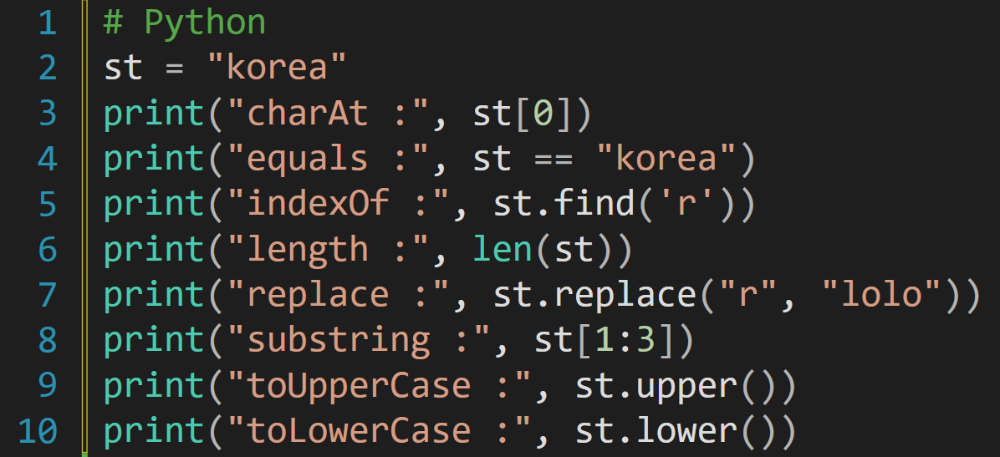
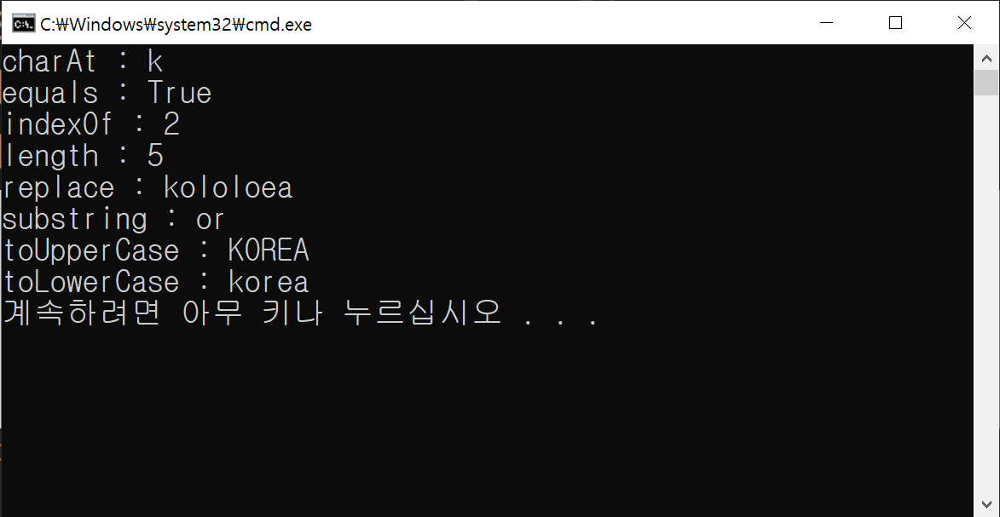
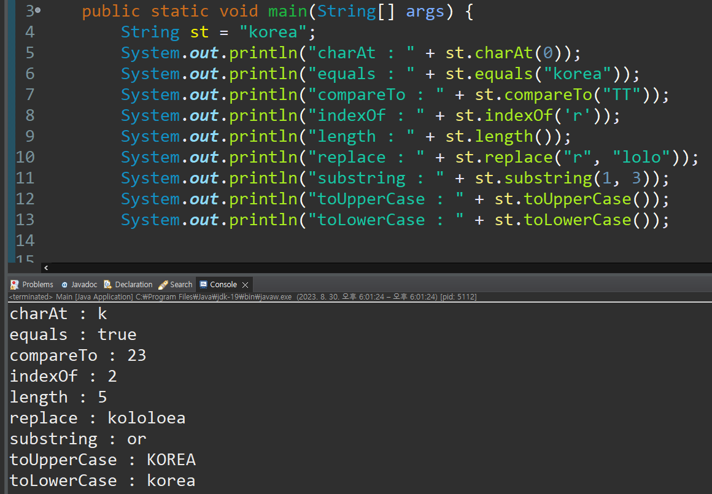

---
id: "P102v1801"
db_id: 1559
legacy_id: "P102v1801"
title: "01. [문자열2(함수)] strlen() 문자열 길이 출력"
platform: "doingcoding"
level: "Low"
tags:
  - "Lv18 문자열2(함수)"
authors:
  - "root"
supported_languages:
  - "C"
  - "C++"
  - "Golang"
  - "Java"
  - "Python2"
  - "Python3"
time_limit: "1s"
memory_limit: "256MB"
accepted_user_count: 194
has_hint: "true"
archived_at: "2026-08-03"
---

# 01. [문자열2(함수)] strlen() 문자열 길이 출력

## 1. 문제 설명
이제는 문자를 한글자 한글자가 아닌 문자열 그대로 명령어를 통해서 다뤄보도록 하겠습니다.

#include <string.h>

를 사용하여 문제를 풀어봅시다.

문자열 길이를 출력합니다.

기존에 배운것 처럼 문자열의 길이를 알기위해서는 함수 strlen("문자열") 을 사용했습니다.

하나의 문자열을 입력받아

문자열의 길이를 출력해주세요.

---

## 2. 입출력 설명

* **입력:**
문자열 하나가 입력됩니다.

- 문자열은 1글자 이상 20글자 이하 입니다.

* **출력:**
문자열의 길이를 정수형태로 출력합니다.

---

## 3. 예시
### 예시 입력 1
```text
korea
```

### 예시 출력 1
```text
5
```

---

## 4. 힌트
strlen(문자열 또는 문자열 변수)

**설명**:`strlen`함수는 문자열의 길이를 반환하는 함수입니다.

**함수 원형**:`size_t strlen(const char *str);`

**리턴값**: 문자열의 길이(널 문자를 제외한 길이)를 반환합니다.

#include <string.h>

strlen(문자열 또는 문자열변수) // 문자열 길이 return

### **Python**





---

### 

### **JAVA**

### 

###
---

