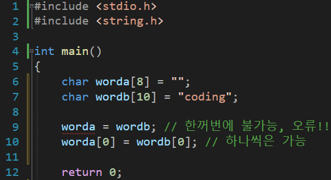
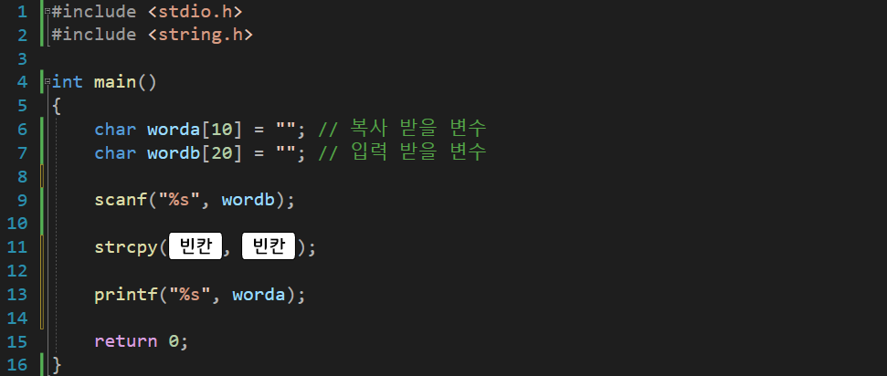

---
id: "P102v1804"
db_id: 1563
legacy_id: "P102v1804"
title: "04. [문자열2(함수)] strcpy() 문자열 복사 함수 이용 출력"
platform: "doingcoding"
level: "Low"
tags:
  - "Lv18 문자열2(함수)"
authors:
  - "root"
supported_languages:
  - "C"
  - "C++"
  - "Golang"
  - "Java"
  - "Python2"
  - "Python3"
time_limit: "1s"
memory_limit: "256MB"
accepted_user_count: 152
has_hint: "true"
archived_at: "2026-08-03"
---

# 04. [문자열2(함수)] strcpy() 문자열 복사 함수 이용 출력

## 1. 문제 설명


위에서처럼 처음 변수를 정의하면서 문자열을 저장(초기 값)할 수 있지만

아래와 같이 worda = wordb 로 저장 할 수는 없습니다.

a가 몇글자인지, b가 몇글자인지, 공간은 있는지 알수 없기 때문입니다.

혹시 "doing"은 {'d', 'o', 'i', 'n', 'g', '\n'} 으로 되어 있는건 다들 알고 계시죠?

에러가 나지 않게 하려면 한글자씩 복사를 하거나

아래와 같이 함수를 사용해야 합니다.

`strcpy(a, b);`

a변수에 b변수안에 있는 문자열을 넣어준다(문자열복사 a = b)라고 해석하면 편합니다.

하지만 아쉽게도a의 배열 공간이 b의 글자 수 보다 작다면 당연히 에러가 납니다.

wordb에 입력을 받고

복사 함수 사용 후

worda를 출력해 봅니다.



빈칸을 채워 전체 코드를 완성해주세요.

---

## 2. 입출력 설명

* **입력:**
문자열 하나가 입력됩니다.

- 문자열은 1글자 이상 10글자 미만 입니다.

* **출력:**
복사된 문자열을 출력합니다.

---

## 3. 예시
### 예시 입력 1
```text
hello
```

### 예시 출력 1
```text
hello
```

---

## 4. 힌트
지금까지 배운 문자열 변수

#include <string.h>

strlen(문자열 또는 문자열변수명) // 문자열 길이 return

strcpy(저장할변수명, 문자열 또는 문자열 변수명) // 저장할변수명에 문자열 또는 문자열변수의 값을 저장
---

