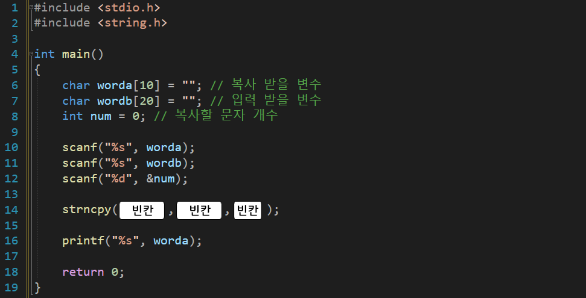

---
id: "P102v1805"
db_id: 1565
legacy_id: "P102v1805"
title: "05. [문자열2(함수)] strncpy() 문자열중 n개 문자 복사 함수 이용 출력"
platform: "doingcoding"
level: "Low"
tags:
  - "Lv18 문자열2(함수)"
authors:
  - "root"
supported_languages:
  - "C"
  - "C++"
  - "Golang"
  - "Java"
  - "Python2"
  - "Python3"
time_limit: "1s"
memory_limit: "256MB"
accepted_user_count: 175
has_hint: "true"
archived_at: "2026-08-03"
---

# 05. [문자열2(함수)] strncpy() 문자열중 n개 문자 복사 함수 이용 출력

## 1. 문제 설명
이번에는 문자열 복사를 할 때 앞의 몇 글자만 복사하고 싶을 때사용하는 함수 입니다.

예를 들어

char a[50] = "firend";

char b[50] = "apple";

b의 문자열중 3개를 a에 복사한다면

a에는 "append" 로 저장될 것입니다.

이러한 방식을 이용할 수 있는 함수를 배워봅시다.

`strncpy(a, b, n);`

문자열 몇개만 복사 a에 b의 앞글자 n개만

라고 해석하면 편합니다.

아래의 소스코드를 보고 그대로 작성 후



빈칸을 채워 전체 코드를 완성해주세요.

---

## 2. 입출력 설명

* **입력:**
문자열 두개와 정수 하나가가 입력됩니다.

- 첫번째 문자열은 1글자 이상 10글자 미만 입니다.

- 두번째 문자열은 1글자 이상 20글자 미만 입니다.

- 정수는 1이상 첫번째 문자열 수 이하입니다.

* **출력:**
첫번째 문자열에 두번째문자열의 앞부분 n개를 복사하여 저장된 첫번째 문자열을 출력합니다.

---

## 3. 예시
### 예시 입력 1
```text
friend apple 3
```

### 예시 출력 1
```text
append
```

---

## 4. 힌트
지금까지 배운 문자열 변수

#include <string.h>

strlen(문자열변수명) // 문자열 길이 return

strcpy(저장할변수명, 문자열) // 저장할변수명 = 문자열 or 문자열변수

strncpy(저장할변수명, 문자열, 문자개수) // 저장할변수명 = 문자열 or 문자열변수 의 앞에 개수만
---

