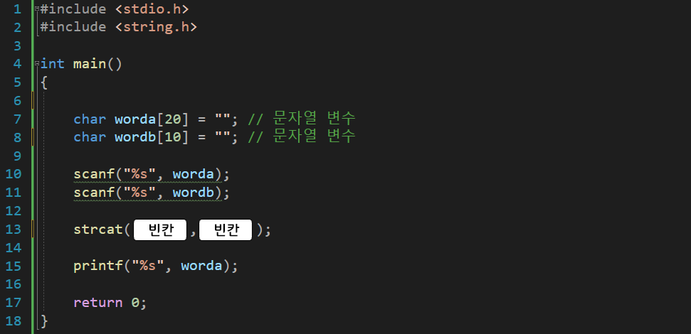

---
id: "P102v1806"
db_id: 1567
legacy_id: "P102v1806"
title: "06. [문자열2(함수)] strcat() 문자열 이어붙이기 함수 이용 출력"
platform: "doingcoding"
level: "Low"
tags:
  - "Lv18 문자열2(함수)"
authors:
  - "root"
supported_languages:
  - "C"
  - "C++"
  - "Golang"
  - "Java"
  - "Python2"
  - "Python3"
time_limit: "1s"
memory_limit: "256MB"
accepted_user_count: 192
has_hint: "true"
archived_at: "2026-08-03"
---

# 06. [문자열2(함수)] strcat() 문자열 이어붙이기 함수 이용 출력

## 1. 문제 설명
문자열은 당연히 +(더하기) 연산이 되지 않습니다.

"doing" += "coding" 연산이 된다면 편하게 사용할 수 있지 않을까요?

<문자열 더하기(이어붙이기) 코드>

`strcat(a, b);`

string(문자열) Concatenate(동:사슬 같이 잊다)의 약자입니다.

문자열의 a += b

라고 해석하면 편합니다.

하지만 아쉽게도a의 배열 공간이 a+b의 글자 수 보다 작다면 에러가 납니다.

아래의 소스코드를 보고 그대로 작성 후



빈칸을 채워 전체 코드를 완성해주세요.

---

## 2. 입출력 설명

* **입력:**
문자열 두개가 입력됩니다.

- 문자열은 1글자 이상 10글자 미만 입니다.

* **출력:**
두번째 문자열을 첫번째 문자열 뒤에 이어붙인 후 첫번째 문자열 변수를 출력합니다.

---

## 3. 예시
### 예시 입력 1
```text
friend apple
```

### 예시 출력 1
```text
friendapple
```

---

## 4. 힌트
지금까지 배운 문자열 변수

#include <string.h>

strlen(문자열변수명) // 문자열 길이 return

strcpy(저장할변수명, 문자열변수 or 문자열) // 저장할변수명 = 문자열 or 문자열변수

strcat(문자열변수명, 문자열변수명 or 문자열) // 문자열변수명 += 문자열변수 or 문자열
---

