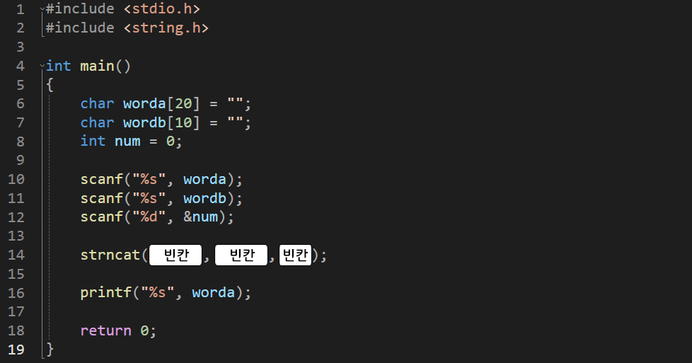

---
id: "P102v1808"
db_id: 1734
legacy_id: "P102v1808"
title: "08. [문자열2(함수)] strncat() 문자열 n개 이어붙이기 함수 이용 출력"
platform: "doingcoding"
level: "Low"
tags:
  - "Lv18 문자열2(함수)"
authors:
  - "root"
supported_languages:
  - "C"
  - "C++"
  - "Golang"
  - "Java"
  - "Python2"
  - "Python3"
time_limit: "1s"
memory_limit: "256MB"
accepted_user_count: 134
has_hint: "false"
archived_at: "2026-08-03"
---

# 08. [문자열2(함수)] strncat() 문자열 n개 이어붙이기 함수 이용 출력

## 1. 문제 설명
이번에는 기존글자의 몇 글자만 골라서 이어붙이고 싶을 때 사용하는 함수를 배워 봅시다.

<문자열 n개 더하기(이어붙이기) 코드>

`strncat(a, b, n);`

당연히 이 함수 역시a의 배열 공간이 a+b(n개)의 글자 수 보다 작다면 에러가 납니다.

아래의 소스코드를 보고 그대로 작성 후



빈칸을 채워 전체 코드를 완성해주세요.

---

## 2. 입출력 설명

* **입력:**
문자열 두개와 정수 하나가가 입력됩니다.

- 문자열은 1글자 이상 20글자 미만 입니다.

- 정수는 1이상 두번째 문자열 수 미만입니다.

* **출력:**
첫번째 문자열에 두번째문자열의 앞부분 n개를 이어붙여 저장된 첫번째 문자열을 출력합니다.

---

## 3. 예시
### 예시 입력 1
```text
doingcoding korea 3
```

### 예시 출력 1
```text
doingcodingkor
```

---

## 4. 힌트
(힌트가 없습니다.)
---

