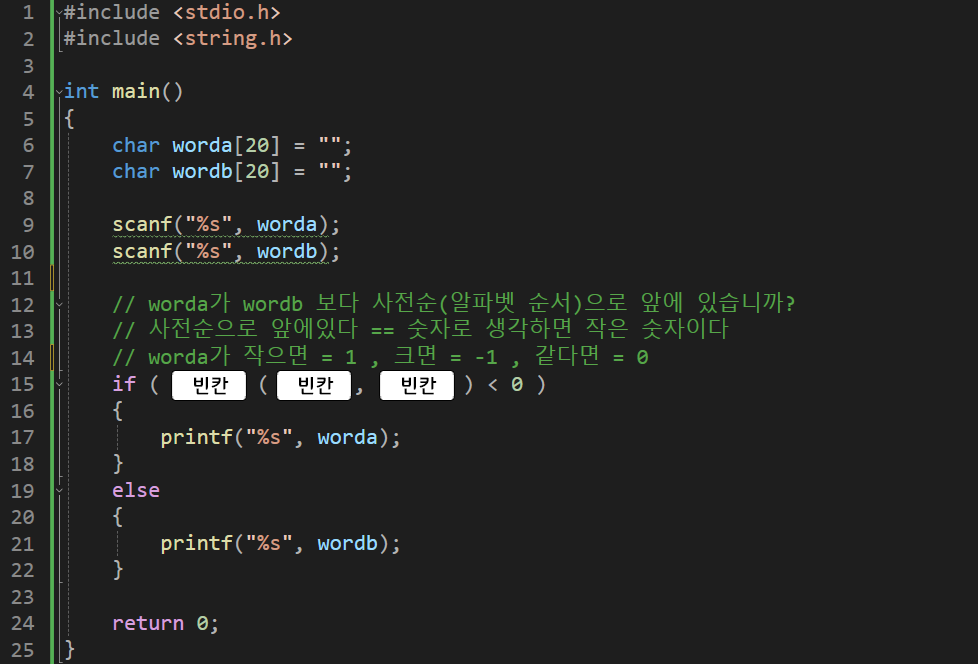

---
id: "P102v1810"
db_id: 1741
legacy_id: "P102v1810"
title: "10. [문자열2(함수)] strcmp() 문자열비교 함수 이용 출력"
platform: "doingcoding"
level: "Low"
tags:
  - "Lv18 문자열2(함수)"
authors:
  - "root"
supported_languages:
  - "C"
  - "C++"
  - "Golang"
  - "Java"
  - "Python2"
  - "Python3"
time_limit: "1s"
memory_limit: "256MB"
accepted_user_count: 144
has_hint: "true"
archived_at: "2026-08-03"
---

# 10. [문자열2(함수)] strcmp() 문자열비교 함수 이용 출력

## 1. 문제 설명
이번에는 문자열이 사전순으로 어느쪽이 큰지 작은지를 알아내고 싶을 때 사용하는 함수를 배워 봅시다.

<문자열 비교하기 코드>

`strcmp(worda, wordb);`

`worda가 크면 0보다 큰 숫자, 작으면 0보다 작은 숫자, 같으면 0`

문자 'b' > 'a' = 1(참)이라는 것을 알고 있을겁니다.

하지만 문자열 "bcd" > "abc" 는 오류가 납니다.

이러한 부분을 함수를 사용하여 strcmp("bcd", "abc")으로 확인 할 수 있는데

`printf("%d", strcmp("bcd", "abc"));`

이때 나오는 값은 0보다 큰 숫자입니다.

이 함수의 동작은 두 문자열 각 첫번째 문자 'b'>'a'의 결과를 보여줍니다.

만약 첫번째 글자가 같다면 두번째 글자를 비교하여 차이를 나타내주고

두번째 글자가 같다면 세번째 글자를...순으로 나타내며,

만약 strcmp("aa", "aaa")라면

3번째 문자를 비교할때 없는것은 0으로 취급되며 'a'와 비교하여 0보다 작은 숫자가 결과로 나옵니다.

아래의 소스코드를 보고 그대로 작성 후



빈칸을 채워 전체 코드를 완성해주세요.

---

## 2. 입출력 설명

* **입력:**
문자열 두개가 입력됩니다.

- 문자열은 1글자 이상 10글자 미만 입니다.

- 같은 문자열이 입력되지 않습니다.

* **출력:**
사전 순서에서 앞에 나오는 문자열을 출력해주세요

---

## 3. 예시
### 예시 입력 1
```text
friend apple
```

### 예시 출력 1
```text
apple
```

### 예시 입력 2
```text
apple friend
```

### 예시 출력 2
```text
apple
```

---

## 4. 힌트

---

