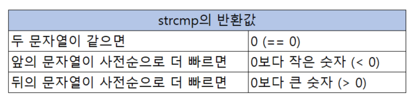

---
id: "P102v1811"
db_id: 1743
legacy_id: "P102v1811"
title: "11. [문자열2(함수)] 두 문자열을 비교하여 출력"
platform: "doingcoding"
level: "Low"
tags:
  - "Lv18 문자열2(함수)"
authors:
  - "root"
supported_languages:
  - "C"
  - "C++"
  - "Golang"
  - "Java"
  - "Python2"
  - "Python3"
time_limit: "1s"
memory_limit: "256MB"
accepted_user_count: 130
has_hint: "true"
archived_at: "2026-08-03"
---

# 11. [문자열2(함수)] 두 문자열을 비교하여 출력

## 1. 문제 설명
문자열 2개가 입력됩니다.

사전순서에서 뒤에 나타나는 문자열을 출력해주세요.

만약 같은 글자라면  "Same"를 출력해주세요.

---

## 2. 입출력 설명

* **입력:**
문자열 두개 입력됩니다.

- 문자열은 1글자 이상 20글자 미만 입니다.

* **출력:**
두 문자가 같으면 "Same"을 다르면 사전 뒤에 오는 단어를 출력해주세요.

---

## 3. 예시
### 예시 입력 1
```text
doing coding
```

### 예시 출력 1
```text
doing
```

### 예시 입력 2
```text
doing doing
```

### 예시 출력 2
```text
Same
```

---

## 4. 힌트

---

