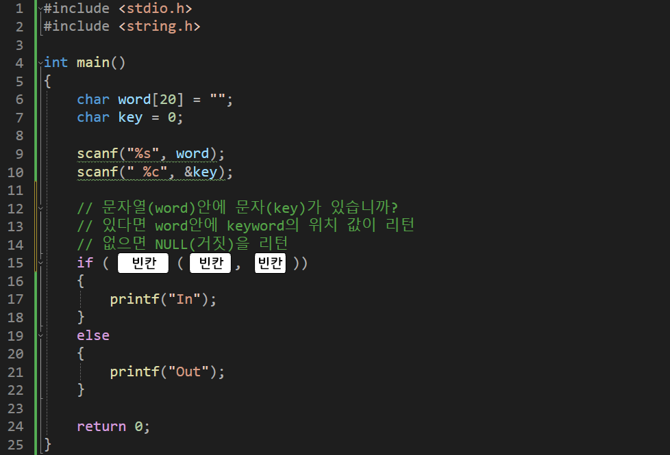

---
id: "P102v1814"
db_id: 1749
legacy_id: "P102v1814"
title: "14. [문자열2(함수)] strchr() 문자열속 문자 찾기 함수 이용 출력"
platform: "doingcoding"
level: "Low"
tags:
  - "Lv18 문자열2(함수)"
authors:
  - "root"
supported_languages:
  - "C"
  - "C++"
  - "Golang"
  - "Java"
  - "Python2"
  - "Python3"
time_limit: "1s"
memory_limit: "256MB"
accepted_user_count: 89
has_hint: "false"
archived_at: "2026-08-03"
---

# 14. [문자열2(함수)] strchr() 문자열속 문자 찾기 함수 이용 출력

## 1. 문제 설명
이번에는 문자열안에 찾고자 하는 문자가 있는지를  알아내는 함수를 배워 봅시다.

<문자열 비교하기 코드>

`strchr(word, key);`

`word안에 key가 있으면 있는 위치(주소), 없으면 NULL(거짓)`

doingcoding 안에 c를 찾으려고 한다면

`printf("%p", strstr("doingcoding", 'c'));`

이때 나오는 값은 doingcoding 에서 c가 있는 c의 주소값입니다.

변수를 만들때마다 매번 그 주소값을 달라지기 때문에 사실상 0초과(0, NULL 이외의 값은 모두 참)의 값이 나온다고 보면됩니다.

찾는 문자열이 없다면 NULL(거짓)이 나옵니다.

아래의 소스코드를 보고 그대로 작성 후



빈칸을 채워 전체 코드를 완성해주세요.

---

## 2. 입출력 설명

* **입력:**
문자열 두개가 입력됩니다.

- 문자열은 1글자 이상 10글자 미만 입니다.

- 같은 문자열이 입력되지 않습니다.

* **출력:**
첫번째 문자열 안에

두번째 문자열이 있다면

"In"을 출력하고

없다면 "Out"을 출력해주세요.

---

## 3. 예시
### 예시 입력 1
```text
doingcoding c
```

### 예시 출력 1
```text
In
```

### 예시 입력 2
```text
welcometomyhome C
```

### 예시 출력 2
```text
Out
```

---

## 4. 힌트
(힌트가 없습니다.)
---

