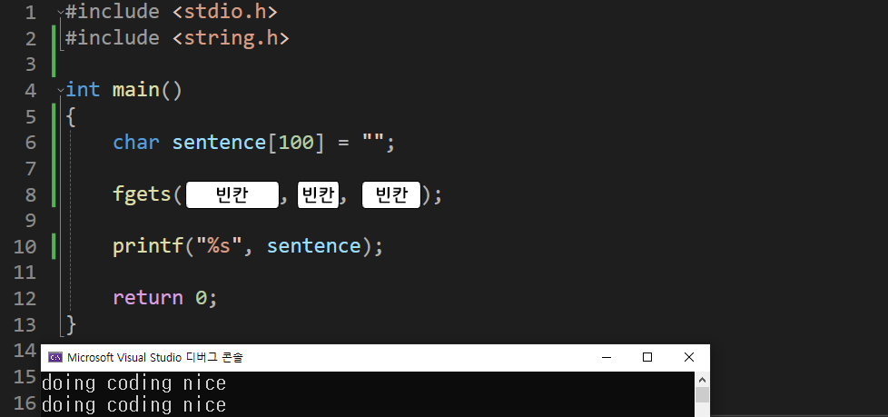

---
id: "P102v1816"
db_id: 1751
legacy_id: "P102v1816"
title: "16. [문자열2(함수)] fgets() 문장을 입력하는 함수 이용 출력"
platform: "doingcoding"
level: "Low"
tags:
  - "Lv18 문자열2(함수)"
authors:
  - "root"
supported_languages:
  - "C"
  - "C++"
  - "Golang"
  - "Java"
  - "Python2"
  - "Python3"
time_limit: "1s"
memory_limit: "256MB"
accepted_user_count: 86
has_hint: "false"
archived_at: "2026-08-03"
---

# 16. [문자열2(함수)] fgets() 문장을 입력하는 함수 이용 출력

## 1. 문제 설명
문자열이 아닌 문장(엔터까지)을 입력받는 함수를 배워 봅시다.

<문장 입력 함수>

`char sentence[100] = "";`

`fgets(sentence, 100, stdin);`

`100글자 이내의 문장(엔터까지)을 키보드 입력(stdin)으로 받아 sentence 변수에 저장`

이때 입력하는 문장의 글자수(띄어쓰기 포함)가 만든 변수 크기(100)를 넘기면 100-1글자(마지막은 '\0'으로 자동저장)까지만 저장됩니다.

아래의 소스코드를 보고 그대로 작성 후



빈칸을 채워 전체 코드를 완성해주세요.

---

## 2. 입출력 설명

* **입력:**
띄어쓰기를 포함한 문장 하나가 입력됩니다.

- 문장의 총 길이는 5글자 이상 100글자 미만 입니다.

* **출력:**
입력 받은 문장을 그대로 출력해 주세요.

---

## 3. 예시
### 예시 입력 1
```text
Hello! Nice to meet you.
```

### 예시 출력 1
```text
Hello! Nice to meet you.
```

### 예시 입력 2
```text
I'm studying coding at the DoingCoding Academy.
```

### 예시 출력 2
```text
I'm studying coding at the DoingCoding Academy.
```

---

## 4. 힌트
(힌트가 없습니다.)
---

