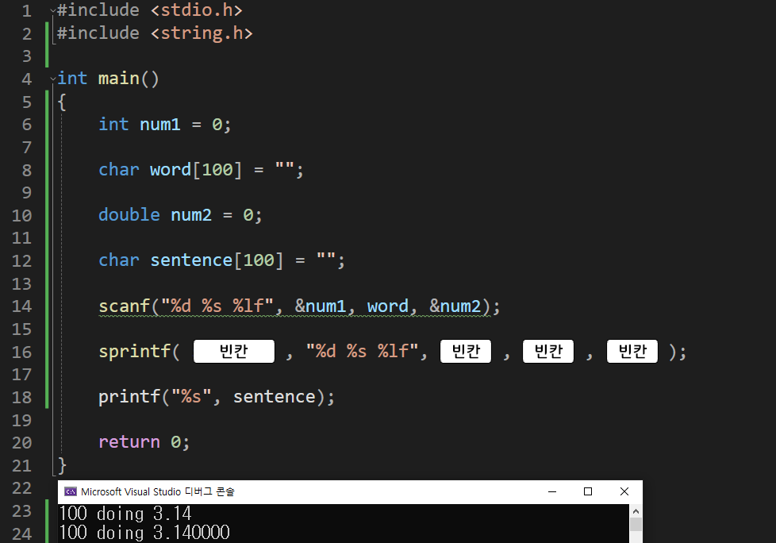

---
id: "P102v1817"
db_id: 1752
legacy_id: "P102v1817"
title: "17. [문자열2(함수)] sprintf() 화면이 아닌 변수에 출력하는 함수"
platform: "doingcoding"
level: "Low"
tags:
  - "Lv18 문자열2(함수)"
authors:
  - "root"
supported_languages:
  - "C"
  - "C++"
  - "Golang"
  - "Java"
  - "Python2"
  - "Python3"
time_limit: "1s"
memory_limit: "256MB"
accepted_user_count: 79
has_hint: "false"
archived_at: "2026-08-03"
---

# 17. [문자열2(함수)] sprintf() 화면이 아닌 변수에 출력하는 함수

## 1. 문제 설명
화면에 출력하는 printf()가 아닌 변수에 출력하는 sprintf() 함수를 배워 봅시다.

<문자열 변수에 저장 하는 함수>

`int num = 100;`

`char word[100] = "doing";`

`double pi = 3.141592;`

`char sentence[100] = "";`

`sprintf(sentence, "%d %s %lf", num, word, pi);`

`printf("%s", sentence);`

출력함수인 printf()는 화면에 출력하지만 sprintf("string + printf")는 출력할 내용을 변수에 문자열 형태로 저장합니다.

아래의 소스코드는 sentence에 저장 후 출력하는 소스코드입니다.

아래를 보고 작성 후



빈칸을 채워 전체 코드를 완성해주세요.

---

## 2. 입출력 설명

* **입력:**
정수, 문자열, 소수각 각 하나씩 입력됩니다.

- 정수 1이상 1000이하

- 문자열 1글자 이상 100글지 미만

- 소수 1이상 100이하

* **출력:**
입력받은 3개의 데이터를 띄어쓰기로 구분하여 sentence 변수에 저장하여

sentence 변수만 출력합니다.

- 소수는 6자리까지 표현합니다.

---

## 3. 예시
### 예시 입력 1
```text
100 doing 3.14
```

### 예시 출력 1
```text
100 doing 3.140000
```

### 예시 입력 2
```text
567 coding 3.1415926535
```

### 예시 출력 2
```text
567 coding 3.141593
```

---

## 4. 힌트
(힌트가 없습니다.)
---

