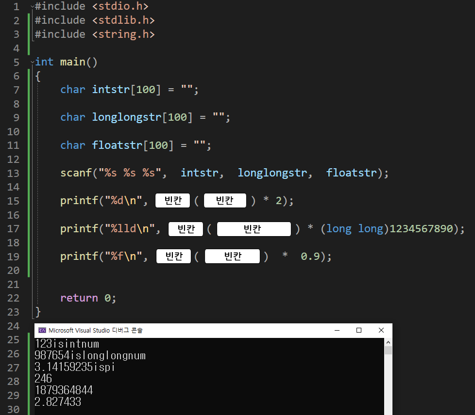

---
id: "P102v1818"
db_id: 1753
legacy_id: "P102v1818"
title: "18. [문자열2(함수)] atoi(), atol(), atof() 문자열에서 앞의 숫자를 추출하는 함수"
platform: "doingcoding"
level: "Low"
tags:
  - "Lv18 문자열2(함수)"
authors:
  - "root"
supported_languages:
  - "C"
  - "C++"
  - "Golang"
  - "Java"
  - "Python2"
  - "Python3"
time_limit: "1s"
memory_limit: "256MB"
accepted_user_count: 75
has_hint: "false"
archived_at: "2026-08-03"
---

# 18. [문자열2(함수)] atoi(), atol(), atof() 문자열에서 앞의 숫자를 추출하는 함수

## 1. 문제 설명
숫자로 시작하는 문자열데이터에서 앞의 숫자를 숫자로 가져오는 함수를 배워 봅시다.

ascii to integer, ascii to long long, ascii to float

<앞의 숫자를 추출하는 함수>

`atoi("123isintnum");`

`// 문자열 "123isintnum"의 정수(4바이트)값 123을 리턴합니다.`

`atol(9876543210islonglongint");`

`// 문자열 9876543210islonglongint"의 정수(8바이트)값 9876543210을 리턴합니다.`

`atof("3.14159235ispi");`

`// 문자열 "3.14159235ispi"의 실수값 3.14159235를 리턴합니다.`

위 예시코드처럼 문자열의 앞부분의 숫자를 리턴하는 함수 입니다.

아래를 보고 작성 후



빈칸을 채워 전체 코드를 완성해주세요.

---

## 2. 입출력 설명

* **입력:**
숫자로 시작하는 문자열 3개가 입력됩니다.

- 문자열 1글자 이상 100글지 미만

* **출력:**
첫번째 줄에는 정수(4바이트)부분의 2배를

두번째 줄에는 정수(8바이트)부분의 1234567890배를

세번째 줄에는 소수부분의 0.9배를 출력해주세요.

---

## 3. 예시
### 예시 입력 1
```text
123isintnum
987654islonglongnum
3.14159235ispi
```

### 예시 출력 1
```text
246
1219325914830060
2.827433
```

---

## 4. 힌트
(힌트가 없습니다.)
---

