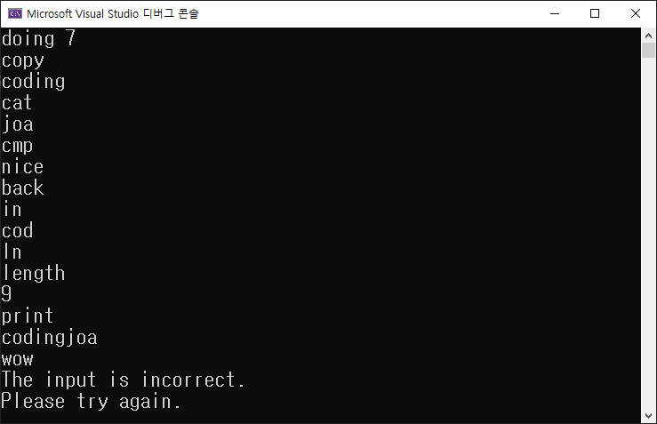

---
id: "P102v1820"
db_id: 1755
legacy_id: "P102v1820"
title: "20. [문자열2(함수)] 문자열함수 종합"
platform: "doingcoding"
level: "Low"
tags:
  - "Lv18 문자열2(함수)"
authors:
  - "root"
supported_languages:
  - "C"
  - "C++"
  - "Golang"
  - "Java"
  - "Python2"
  - "Python3"
time_limit: "1s"
memory_limit: "256MB"
accepted_user_count: 106
has_hint: "false"
archived_at: "2026-08-03"
---

# 20. [문자열2(함수)] 문자열함수 종합

## 1. 문제 설명
문자열 함수를 명령어를 통해 이용해 봅시다.

---

하나의 문자열 str과 명령어의 개수 n이 입력됩니다.

`입력 : doing 7`

처음 입력한 문자는 doing 이고 이후 명령어 7개를 받겠다는 뜻 입니다.

---

명령어를 "copy"를 입력하면 추가적으로 문자열을 하나 더 받습니다.

`입력 : copy`

`입력 : coding`

처음 저장한 변수 str을 "coding"으로 변경합니다.

---

명령어를 "cat"를 입력하면 추가적으로 문자열을 하나 더 받습니다.

`입력 : cat`

`입력 : joa`

변수 str뒤에 joa를 이어 붙입니다. str은 "codingjoa"로 변경되었습니다.

---

명령어를 "cmp"를 입력하면 추가적으로 문자열을 하나 더 받고,

추가로 받은 문자열이 사전순으로 앞에 있다면`"front"`를 뒤에 있다면`"back"`을 출력합니다.

`입력 : cmp`

`입력 : nice`

`출력 : back`

---

명령어를 "in"를 입력하면 추가적으로 문자열을 하나 더 받고,

추가로 받은 문자열이 안에 포함되어 있다면`"In"`를 없다면`"Out"`을 출력합니다.

`입력 : in`

`입력 : cod`

`출력 : In`

---

명령어를 "length"를 입력하면 문자열이 몇글자인지를 출력합니다.

`입력 : length`

`출력 : 9`

---

명령어를 "print"를 입력하면 저장된 문자열을 출력합니다.

`입력 : print`

`출력 : codingjoa`

---

위 명령어 이외의 글자가 입력된다면

`"The input is incorrect.`

`Please try again."`(두줄)을 출력해 주세요

`입력 : wow`

`출력 : The input is incorrect.`

`출력 : Please try again.`



테스트 실행시 입력과 출력이 위 그림처럼 뒤섞일 수 있습니다.

출력만 골라서 채점되니 입력받자마자 필요시 바로 출력해도 됩니다.

---

## 2. 입출력 설명

* **입력:**
하나의 문자열 str과 명령어의 개수 n이 입력됩니다.

- 문자열은 1이상 10이하의 문자열 입니다.

- n은 1이상 10이하의 정수 입니다.

* **출력:**
위 문제설명과 같이 출력해주세요.

---

## 3. 예시
### 예시 입력 1
```text
doing 6
copy
coding
cat
joa
cmp
nice
in
cod
length
print
```

### 예시 출력 1
```text
back
In
9
codingjoa
```

---

## 4. 힌트
(힌트가 없습니다.)
---

