# 01. [구조체-기초] 단일 구조체 정의 및 입출력

## 1. 문제 설명
서로 다른 종류의 정보(이름: 문자열, 나이: 정수)를 하나로 묶는 사용자 정의 데이터 타입(구조체/클래스)을 선언하고, 한 학생의 정보(이름, 나이)를 입력받아 형식에 맞게 출력하는 프로그램을 작성하세요.

구조체(Struct)는 개별적으로 다루던 변수들을 **하나의 의미 있는 개체(Entity)** 로 그룹화하여 관리할 수 있게 해줍니다.

컴퓨터 메모리 상에서 구조체 변수가 형성되는 구조는 다음과 같습니다.



---

## 2. 입출력 설명

* **입력:**
첫 번째 줄에 한 학생의 이름과 나이가 공백으로 구분되어 주어집니다. (이름은 20자 이하의 영문 알파벳 단어, 나이는 1 이상 100 이하의 정수)

* **출력:**
`이름: [이름], 나이: [나이]` 형식으로 한 줄에 출력합니다.

### 🖥️ 예시 1 추적 (Alice 15 입력 시)
```text
1. [구조체 변수 생성] 학생 정보(name, age)를 담을 구조체 변수를 메모리에 할당합니다.
2. [데이터 입력] 표준 입력으로부터 이름 "Alice"를 name 멤버에, 나이 15를 age 멤버에 저장합니다.
3. [멤버 접근 및 출력] 점(.) 연산자를 통해 student.name과 student.age에 접근하여 "이름: Alice, 나이: 15" 형식으로 출력합니다.
```

---

## 3. 예시
### 예시 입력 1
```text
Alice 15
```

### 예시 출력 1
```text
이름: Alice, 나이: 15
```

---

## 4. 힌트
서로 다른 속성을 하나의 데이터로 묶기 위해 아래와 같이 사용자 정의 타입을 정의합니다.

- **C / C++**: `struct Student { char name[20]; int age; };`
- **C#**: `struct Student { public string name; public int age; }`
- **Java**: `class Student { String name; int age; Student(String n, int a) { this.name = n; this.age = a; } }`
- **Python**: 
  ```python
  class Student:
      def __init__(self, name, age):
          self.name = name
          self.age = age
  ```
- 변수 선언 후 점(`.`) 연산자를 이용해 멤버 변수에 접근할 수 있습니다. (예: `s.name`, `s.age`)
---
