# 02. [구조체-대입] 구조체 변수 간 통째 대입

## 1. 문제 설명
배열과 달리 구조체는 대입 연산자(`=`) 하나로 구조체 내부의 모든 멤버 변수를 **메모리 통째로 복사(Value Copy)** 할 수 있는 강력한 문법적 특징이 있습니다.

첫 번째 학생의 정보(이름, 나이)를 입력받아 `student1` 구조체에 저장합니다.
그 후 대입 연산자(`student2 = student1;`)를 사용하여 `student2`에 통째로 복사하세요.

복사가 완료된 후, 원래의 `student1`의 나이를 **새로 주어지는 수정 나이**로 변경한 뒤, 복사된 `student2`의 정보를 출력하여 독립된 값 복사가 올바르게 유지되는지 검증하는 프로그램을 작성하세요.

구조체 대입 동작 과정은 다음과 같습니다:



---

## 2. 입출력 설명

* **입력:**
첫 번째 줄에 첫 번째 학생의 이름과 나이가 공백으로 주어집니다.
두 번째 줄에 첫 번째 학생의 변경할 새 나이가 정수로 주어집니다.

* **출력:**
`student1`의 나이를 변경한 후, 대입 복사되었던 `student2`의 정보를 `이름: [이름], 나이: [나이]` 형식으로 출력합니다.

### 🖥️ 예시 1 추적
```text
1. [구조체 입력] student1에 (Alice, 15)를 저장합니다.
2. [통째 대입] student2 = student1 연산으로 student2에 (Alice, 15)가 통째로 복사됩니다.
3. [값 변경] student1.age = 20으로 원래 학생의 나이를 변경합니다.
4. [독립 복사 검증] student2의 멤버를 출력하면 student1의 변경과 독립되게 "이름: Alice, 나이: 15"가 유지 출력됩니다.
```

---

## 3. 예시
### 예시 입력 1
```text
Alice 15
20
```

### 예시 출력 1
```text
이름: Alice, 나이: 15
```

---

## 4. 힌트
- 구조체 변수 간의 대입(`s2 = s1;`)은 내부 멤버 변수들을 일괄적으로 복사합니다.
- 복사 이후 원래 변수(`s1`)의 값을 수정하더라도 대입받은 변수(`s2`)에는 영향을 미치지 않습니다.
- 지문에 단순히 복사하는 척만 하는 꼼수를 방지하기 위해 `s1` 변경 후 `s2`의 멤버를 정확히 출력해야 정답 처리됩니다.
---
