# 05. [구조체-중첩] 주소 포함 학생 정보

## 1. 문제 설명
구조체의 멤버로 또 다른 구조체 타입을 포함하는 **중첩 구조체(Nested Structure)** 개념을 활용하여 학생 1명의 정보를 저장하고 출력하는 프로그램을 작성하세요.

주소 정보를 담는 `Address` 구조체(도시, 우편번호)를 먼저 선언하고, 학생 정보를 담는 `Student` 구조체(이름, 나이, `Address addr`)의 멤버로 포함시킵니다.

중첩 구조체의 계층적 메모리 접근 구조는 다음과 같습니다:



---

## 2. 입출력 설명

* **입력:**
한 줄에 학생의 이름, 나이, 도시, 우편번호가 공백으로 구분되어 주어집니다.

* **출력:**
`이름: [이름], 나이: [나이], 도시: [도시], 우편번호: [우편번호]` 형식으로 한 줄에 출력합니다.

### 🖥️ 예시 1 추적
```text
1. [구조체 선언] Address 구조체를 선언하고, Student 구조체 내부에 Address addr 멤버를 정의합니다.
2. [데이터 입력] "Frank", 16, "Seoul", "04500"을 순서대로 입력받습니다.
3. [중첩 접근] s.name, s.age, s.addr.city, s.addr.zipcode와 같이 점(.) 연산자를 2단계로 거쳐 접근합니다.
4. [출력] 지정된 양식대로 정보를 출력합니다.
```

---

## 3. 예시
### 예시 입력 1
```text
Frank 16 Seoul 04500
```

### 예시 출력 1
```text
이름: Frank, 나이: 16, 도시: Seoul, 우편번호: 04500
```

---

## 4. 힌트
- 중첩 구조체 정의 예시:
  ```cpp
  struct Address {
      char city[30];
      char zipcode[10];
  };

  struct Student {
      char name[30];
      int age;
      struct Address addr; // 중첩 구조체 멤버
  };
  ```
- 중첩된 멤버 변수 접근 시 점(`.`) 연산자를 연속으로 사용합니다. (예: `student.addr.city`)
---
