# 06. [구조체-배열] 구조체 배열 선언과 기본 순회

## 1. 문제 설명
수많은 객체 데이터를 한 번에 다루기 위해 **구조체 배열(Array of Structures)** 을 선언하고 반복문(for문)으로 순회하여 입출력하는 방법을 연습합니다.

사람 수 $N$명을 입력받고, $N$명의 이름과 나이를 구조체 배열에 순서대로 저장한 후 입력된 순서대로 모두 출력하는 프로그램을 작성하세요.

구조체 배열의 연속적인 메모리 배치 구조는 다음과 같습니다:



---

## 2. 입출력 설명

* **입력:**
첫 번째 줄에 사람의 수 $N$이 주어집니다. ($1 \le N \le 100$)
두 번째 줄부터 $N$개의 줄에 걸쳐 각 사람의 이름과 나이가 공백으로 구분되어 주어집니다.

* **출력:**
입력된 순서대로 $N$명 각 사람의 정보를 `이름: [이름], 나이: [나이]` 형식으로 한 줄에 하나씩 출력합니다.

### 🖥️ 예시 1 추적 (N=3일 때)
```text
1. [배열 선언] Student arr[100] 크기의 구조체 배열을 준비합니다.
2. [반복 입력] for문을 0부터 N-1까지 돌며 arr[i].name과 arr[i].age에 순서대로 데이터를 채웁니다.
3. [반복 출력] for문을 돌며 arr[i]의 멤버들을 "이름: [이름], 나이: [나이]" 형식으로 순차 출력합니다.
```

---

## 3. 예시
### 예시 입력 1
```text
3
Anna 24
Ben 30
Cara 28
```

### 예시 출력 1
```text
이름: Anna, 나이: 24
이름: Ben, 나이: 30
이름: Cara, 나이: 28
```

---

## 4. 힌트
- 구조체 배열 선언 및 인덱스 접근 예시:
  - C / C++: `struct Student arr[100];` $\rightarrow$ `arr[i].name`, `arr[i].age`
  - Java: `Student[] arr = new Student[N];` $\rightarrow$ `arr[i] = new Student(...)`
  - Python: `arr = []` $\rightarrow$ `arr.append(Student(name, age))`
- 반복문(`for`)을 사용하여 `0`부터 `N-1`까지 순회하세요.
---
