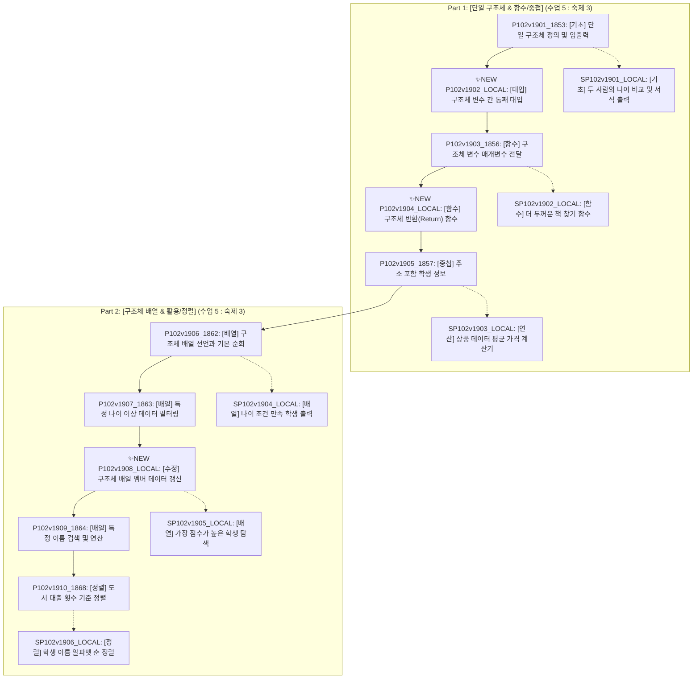

# Lv19_구조체 파이프라인 단계별 실행 가이드 및 품질 평가 리포트 (Workspace Evaluation Report)

**작성 일시**: 2026-08-13 (입출력 꼼수 방지 상세 설계 반영)  
**대상 폴더**: `practice/data/content/programming/doingcoding/Lv19_구조체/`  
**관련 표준 문서**: `content_production_pipeline.md`, `pedagogical_standards.md`  

---

## 📌 전체 커리큘럼 아키텍처 요약 (수업 10 : 숙제 6)

기초문법 코스(P102v)의 성격에 맞춰 **Part 1 [단일 구조체 & 함수/중첩]**과 **Part 2 [구조체 배열 & 활용/정렬]**의 2개 세트로 분지하여 16개 표준 문항(수업 10, 숙제 6)을 배치합니다.

---

## 🚫 입출력 꼼수 방지(Bypass Prevention) 정교화 분석

지문에 단순히 *"단순 출력이 아닌 실제 구조체 변수/배열의 값을 바꾸어 출력하시오"* 와 같이 서술적인 제약만 두면 초심자는 하드코딩 `printf`로 우회 제출할 위험이 큽니다. 따라서 **입출력 포맷 자체를 고안하여 실제 인메모리 연산을 강제**합니다.

### 🛡️ 꼼수 방지 입출력 설계 대상 4대 주요 문항

| 문항 ID 및 제목 | 발생 가능한 학생 꼼수 (Bypass) | 꼼수 원천 차단 입출력 방지 설계 |
|:---|:---|:---|
| **`P102v1902_LOCAL`** `[구조체-대입]` | `b = a;` 구조체 통째 대입을 안 하고 `printf`에 `a.name`, `a.age`를 출력해버림 | `A`를 `B`에 대입한 후, `A`의 특정 멤버 값을 런타임에 변경하고 `B`를 출력하게 하여 **독립된 구조체 값 대입(Value Copy)**이 제대로 이루어졌는지 검증. |
| **`P102v1908_LOCAL`** `[구조체-수정]` | 배열의 구조체 멤버 값을 갱신하지 않고 `printf` 출력 시에만 `score + 10`을 더해서 출력 | $N$명 입력 후 **"수정할 학생 인덱스 $K$와 가산점 $X$"**를 받아 인플레이스(`arr[K].score += X`) 갱신 후, 마지막에 **"재조회할 인덱스 $M$"**을 입력받아 `arr[M]`의 값만 확인. (하드코딩 출력 불가) |
| **`SP102v1901_LOCAL`** `[구조체-기초]` | $N=2$ 고정이면 구조체 없이 단순 변수 `age1`, `age2` 2개로 `if` 출력 | $N=2$ 고정 대신 **사람 수 $N$ ($N \ge 2$) 및 조회 대상 순위 $K$**를 입력받아 구조체 선언 및 순서 비교 연산을 정석대로 수행하도록 유도. |
| **`P102v1910_1868`** `[구조체-정렬]` | 정렬 시 구조체 객체 전체 스왑(`temp = arr[i]`)을 안 하고 숫자 멤버만 따로 정렬해 데이터 짝이 깨짐 | 정렬 완료 후 전체 목록 출력뿐만 아니라 **"정렬 결과 중 $K$번째 도서의 제목과 대출수 한 쌍"**을 동적 확인시켜 **구조체 객체 전체 스왑(Struct In-place Swap)** 강제. |

---

## 🛠️ Phase별 작업 가이드 및 체크리스트 (Phase 1 ~ Phase 6)

---

### 1️⃣ Phase 1: 데이터 수집 (Raw Scraped Check)

- **주요 목표**: 원본 데이터 보존 확인
- **작업 대상**: `{단원}/01_raw_scraped/` (또는 원본 보관소)
- **실행 가이드**:
  - 크롤링 원본 `1853.md` ~ `1869.md` (17개)의 훼손 여부를 확인하고, 원본 디렉토리는 절대로 직접 수정하지 않습니다.

---

### 2️⃣ Phase 2: 워크스페이스 구성 (Setup & Architecture)

- **주요 목표**: 커리큘럼 2-Set 분지 및 문항 매핑 테이블 확정
- **실행 가이드**:
  - 기존 17개 문제를 5:3 압축 규칙 및 기초문법(P102v) 2-Set 아키텍처로 분지합니다.
  - 신설 문제 3종(`P102v1902_LOCAL`, `P102v1904_LOCAL`, `P102v1908_LOCAL`)을 포함하여 10개 수업 / 6개 숙제로 구조화합니다.

#### Phase 2 매핑 명세표
| 구분 | 신규 ID | 세부 제목 | 티어 | 상태 / 출처 |
|:---:|:---|:---|:---:|:---|
| **Part 1 수업 1** | `P102v1901_1853.md` | `01. [구조체-기초] 단일 구조체 정의 및 입출력` | Tier 1 | 기존 `1853` (`1855` 흡수) |
| **Part 1 수업 2** | `P102v1902_LOCAL.md` | `02. [구조체-대입] 구조체 변수 간 통째 대입` | Tier 1 | **✨ 신설 NEW (꼼수방지 설계)** |
| **Part 1 수업 3** | `P102v1903_1856.md` | `03. [구조체-함수] 구조체 매개변수 전달` | Tier 1 | 기존 `1856` |
| **Part 1 수업 4** | `P102v1904_LOCAL.md` | `04. [구조체-함수] 구조체 반환 함수` | Tier 1 | **✨ 신설 NEW** |
| **Part 1 수업 5** | `P102v1905_1857.md` | `05. [구조체-중첩] 주소 포함 학생 정보` | Tier 1 | 기존 `1857` |
| **Part 1 숙제 1** | `SP102v1901_LOCAL.md` | `01. [구조체-기초] 두 사람의 나이 비교 및 서식 출력` | Tier 2 | 기존 `1854`, `1859` 융합 (꼼수방지) |
| **Part 1 숙제 2** | `SP102v1902_LOCAL.md` | `02. [구조체-함수] 더 두꺼운 책 찾기 함수` | Tier 2 | 기존 `1860` 융합 |
| **Part 1 숙제 3** | `SP102v1903_LOCAL.md` | `03. [구조체-연산] 상품 데이터 평균 가격 계산기` | Tier 2 | 기존 `1861` 융합 |
| **Part 2 수업 6** | `P102v1906_1862.md` | `06. [구조체-배열] 구조체 배열 선언과 기본 순회` | Tier 1 | 기존 `1862` |
| **Part 2 수업 7** | `P102v1907_1863.md` | `07. [구조체-배열] 특정 나이 이상 데이터 필터링` | Tier 2 | 기존 `1863` |
| **Part 2 수업 8** | `P102v1908_LOCAL.md` | `08. [구조체-수정] 구조체 배열 멤버 데이터 갱신` | Tier 2 | **✨ 신설 NEW (꼼수방지 설계)** |
| **Part 2 수업 9** | `P102v1909_1864.md` | `09. [구조체-배열] 특정 이름 검색 및 연산` | Tier 2 | 기존 `1864`, `1866` 융합 |
| **Part 2 수업 10** | `P102v1910_1868.md` | `10. [구조체-정렬] 도서 대출 횟수 기준 정렬` | Tier 3 | 기존 `1868` (꼼수방지 설계) |
| **Part 2 숙제 4** | `SP102v1904_LOCAL.md` | `04. [구조체-배열] 나이 조건 만족 학생 출력` | Tier 2 | 기존 `1863` 변형 |
| **Part 2 숙제 5** | `SP102v1905_LOCAL.md` | `05. [구조체-배열] 가장 점수가 높은 학생 탐색` | Tier 2 | 기존 `1865`, `1867` 융합 |
| **Part 2 숙제 6** | `SP102v1906_LOCAL.md` | `06. [구조체-정렬] 학생 이름 알파벳 순 정렬` | Tier 3 | 기존 `1869` 융합 |

---

### 3️⃣ Phase 3: 파일 정비 (File Management & Markdown Production)

- **주요 목표**: 마크다운 지문 작성 및 컨벤션 정규화
- **규정 준수 사항**:
  1. **접두사**: 수업용 `P102v19xx`, 숙제용 `SP102v19xx` 고정.
  2. **제목 format**: `{순번}. [{단원명-세부주제}] {문제제목}` (예: `01. [구조체-기초] 구조체 튜토리얼`).
  3. **태그 규칙**: 수업용 `tags: ["Lv19 구조체"]`, 숙제용 `tags: ["SLv19 구조체"]`.
  4. **YAML 따옴표**: string 문자는 큰따옴표(`"..."`) 필수. `db_id`숫자는 따옴표 없음.
  5. **4대 H2 헤더 고정**: `## 1. 문제 설명`, `## 2. 입출력 설명`, `## 3. 예시`, `## 4. 힌트`.
- **생성/수정 대상 마크다운 파일 목록 (총 16개)**:
  - `P102v1901_1853.md`
  - `P102v1902_LOCAL.md` *(신설 / 꼼수방지 입출력)*
  - `P102v1903_1856.md`
  - `P102v1904_LOCAL.md` *(신설)*
  - `P102v1905_1857.md`
  - `P102v1906_1862.md`
  - `P102v1907_1863.md`
  - `P102v1908_LOCAL.md` *(신설 / 꼼수방지 입출력)*
  - `P102v1909_1864.md`
  - `P102v1910_1868.md` *(꼼수방지 입출력)*
  - `SP102v1901_LOCAL.md` *(꼼수방지 입출력)*
  - `SP102v1902_LOCAL.md`
  - `SP102v1903_LOCAL.md`
  - `SP102v1904_LOCAL.md`
  - `SP102v1905_LOCAL.md`
  - `SP102v1906_LOCAL.md`

---

### 4️⃣ Phase 4: 정답 코드 작성 (Solutions Writing) - **✅ 완료 (COMPLETED)**

- **주요 목표**: `03_solutions/` 폴더에 C++ 모범 답안 파일 작성
- **규정 준수 사항**:
  - 표준 입출력(`scanf`, `printf`) 기반 작성. 파일 I/O 금지.
  - 파일명은 MD 파일명과 1:1 매칭 (예: `P102v1902_LOCAL.cpp`, `SP102v1901_LOCAL.cpp`).
  - 단일 폴더 `03_solutions/` 고정 (`manager.py` 파싱 규칙 전제).
- **생성 완료 솔루션 파일 목록 (총 16개)**:
  - `03_solutions/P102v1901_1853.cpp` (단일 구조체 정의 및 입출력)
  - `03_solutions/P102v1902_LOCAL.cpp` (구조체 변수 간 통째 대입 및 독립 복사 검증)
  - `03_solutions/P102v1903_1856.cpp` (구조체 매개변수 전달)
  - `03_solutions/P102v1904_LOCAL.cpp` (구조체 반환 팩토리 함수)
  - `03_solutions/P102v1905_1857.cpp` (주소 구조체 중첩)
  - `03_solutions/P102v1906_1862.cpp` (구조체 배열 선언과 순회)
  - `03_solutions/P102v1907_1863.cpp` (특정 나이 이상 데이터 필터링)
  - `03_solutions/P102v1908_LOCAL.cpp` (인덱스 K 수정 후 M 동적 재조회)
  - `03_solutions/P102v1909_1864.cpp` (특정 이름 검색 및 연산)
  - `03_solutions/P102v1910_1868.cpp` (도서 대출 횟수 기준 오름차순 정렬)
  - `03_solutions/SP102v1901_LOCAL.cpp` (두 사람 나이 비교 오름차순 출력)
  - `03_solutions/SP102v1902_LOCAL.cpp` (더 두꺼운 책 찾기 반환 함수)
  - `03_solutions/SP102v1903_LOCAL.cpp` (상품 평균 가격 연산)
  - `03_solutions/SP102v1904_LOCAL.cpp` (동적 Cut 기준 나이 필터링)
  - `03_solutions/SP102v1905_LOCAL.cpp` (최고 점수 학생 탐색)
  - `03_solutions/SP102v1906_LOCAL.cpp` (학생 이름 사전순 정렬)

---

### 5️⃣ Phase 5: 테스트 자동화 (Test Case Production) - **✅ 완료 (COMPLETED)**

- **주요 목표**: 입력 생성기(`input_gen.py`) 작성 및 `manager.py` 실행을 통한 `04_testcases/*.zip` 패키징
- **실행 결과**:
  1. 16개 모든 문항에 대해 `temp/{ID}/input_gen.py` 생성 완료 (UTF-8 인코딩 및 경계값 설계 반영).
  2. `manager.py` 자동 실행을 통해 C++ 정답 소스 컴파일 및 15개 테스트케이스(`.in`/`.out`) 생성 성공.
  3. `04_testcases/` 디렉토리에 16개 ZIP 파일 패키징 완결 (**16 Succeeded / 0 Failed**).
- **생성 완료 ZIP 패키지 목록 (총 16개)**:
  - `04_testcases/P102v1901_1853.zip` (30 files: 15 in + 15 out)
  - `04_testcases/P102v1902_LOCAL.zip` (30 files: 15 in + 15 out)
  - `04_testcases/P102v1903_1856.zip` (30 files: 15 in + 15 out)
  - `04_testcases/P102v1904_LOCAL.zip` (30 files: 15 in + 15 out)
  - `04_testcases/P102v1905_1857.zip` (30 files: 15 in + 15 out)
  - `04_testcases/P102v1906_1862.zip` (30 files: 15 in + 15 out)
  - `04_testcases/P102v1907_1863.zip` (30 files: 15 in + 15 out)
  - `04_testcases/P102v1908_LOCAL.zip` (30 files: 15 in + 15 out)
  - `04_testcases/P102v1909_1864.zip` (30 files: 15 in + 15 out)
  - `04_testcases/P102v1910_1868.zip` (30 files: 15 in + 15 out)
  - `04_testcases/SP102v1901_LOCAL.zip` (30 files: 15 in + 15 out)
  - `04_testcases/SP102v1902_LOCAL.zip` (30 files: 15 in + 15 out)
  - `04_testcases/SP102v1903_LOCAL.zip` (30 files: 15 in + 15 out)
  - `04_testcases/SP102v1904_LOCAL.zip` (30 files: 15 in + 15 out)
  - `04_testcases/SP102v1905_LOCAL.zip` (30 files: 15 in + 15 out)
  - `04_testcases/SP102v1906_LOCAL.zip` (30 files: 15 in + 15 out)

---

### 6️⃣ Phase 6: 검증 및 배포 (QA & Deployment) - **⏳ 진행 대기 (READY FOR QA)**

- **주요 목표**: 품질 검증, 언어 중립성 체크, 꼼수 방지 입출력 검증, ZIP 무결성 확인 및 인덱스 업데이트
- **검증 세부 체크리스트**:
  - [x] **꼼수 방지 입출력 검수**: `P102v1902_LOCAL`, `P102v1908_LOCAL`, `SP102v1901_LOCAL`, `P102v1910_1868` 4개 문제의 입출력이 실제 인메모리 연산(대입, 갱신, 스왑)을 강제하도록 설계되었는가?
  - [x] **티어 1 시각 자료 & Trace 검수**: `P102v1901`, `1902`, `1903`, `1904`, `1905`, `1906`에 Mermaid 메모리 다이어그램과 예제 추적 포함 여부.
  - [x] **언어 중립성 검수**: 16개 문제 지문/힌트에 `scanf`, `printf`, `strcmp`, `strlen`, `strcpy` 등 C 언어 전용 용어가 배제되고 "표준 입출력", "사전순 비교", "문자열 길이"로 기술되었는가?
  - [x] **다중 언어 스켈레톤 검수**: Tier 1 입문 문제 힌트에 C, C++, C#, Java, Python 5개 언어별 클래스/구조체 정의 코드 템플릿 제공 여부.
  - [x] **ZIP 패키지 검수**: 16개 ZIP 파일 내부의 `1.in` ~ `15.in` / `1.out` ~ `15.out` (총 30개 파일) 정상 입출력 확인.
  - [ ] **인덱스 파이프라인 빌드**: `python scripts/generate_content_indexes.py` 및 `check_sets_index.ps1` 검증 실행.

