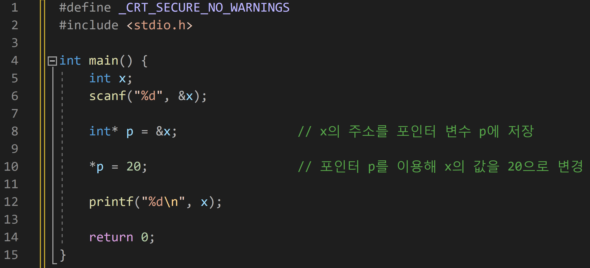

---
id: "P102v2002"
db_id: 1871
legacy_id: "P102v2002"
title: "02. [포인터] 포인터로 변수 값 바꾸기"
platform: "doingcoding"
level: "Low"
tags:
  - "Lv20 포인터1(기본)"
authors:
  - "root"
supported_languages:
  - "C"
  - "C++"
  - "Golang"
  - "Java"
  - "Python2"
  - "Python3"
time_limit: "1s"
memory_limit: "256MB"
accepted_user_count: 57
has_hint: "true"
archived_at: "2026-08-03"
---

# 02. [포인터] 포인터로 변수 값 바꾸기

## 1. 문제 설명
정수 x를 입력받고, 포인터를 이용해 그 값을 20으로 바꾸세요.

변경 후 x의 값을 출력하세요.

---

## 2. 입출력 설명

* **입력:**
x의 초기 값이 주어집니다.

* **출력:**
변경된 x의 값을 출력합니다.

---

## 3. 예시
### 예시 입력 1
```text
10
```

### 예시 출력 1
```text
20
```

---

## 4. 힌트

---

