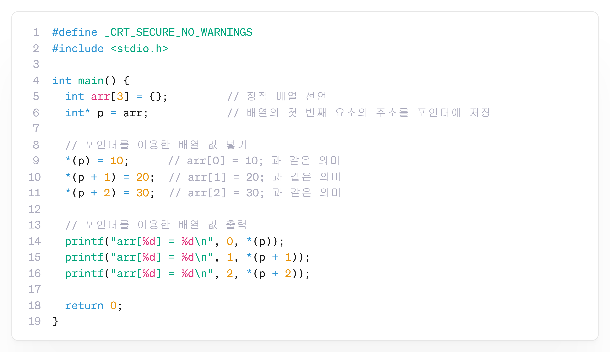

---
id: "P102v2003"
db_id: 1872
legacy_id: "P102v2003"
title: "03. [포인터] 배열 포인터 선언하기 튜토리얼"
platform: "doingcoding"
level: "Low"
tags:
  - "Lv20 포인터1(기본)"
authors:
  - "root"
supported_languages:
  - "C"
  - "C++"
  - "Golang"
  - "Java"
  - "Python2"
  - "Python3"
time_limit: "1s"
memory_limit: "256MB"
accepted_user_count: 36
has_hint: "true"
archived_at: "2026-08-03"
---

# 03. [포인터] 배열 포인터 선언하기 튜토리얼

## 1. 문제 설명
배열 arr에 3개의 정수를 저장하고, 각 인덱스의 값을 포인터를 사용하여 출력하세요.

저장될 데이터는 다음과 같습니다:

* 배열의 첫번째: 10
* 배열의 두번째: 20
* 배열의 세번째: 30

---

## 2. 입출력 설명

* **입력:**
입력은 없습니다.

* **출력:**
첫번째부터 세번째까지의 원소를 출력합니다.

---

## 3. 예시
### 예시 입력 1
```text
 
```

### 예시 출력 1
```text
arr[0] = 10
arr[1] = 20
arr[2] = 30
```

---

## 4. 힌트
### **[C언어]**

📘:포인터 변수를 사용하여, 배열의 값을 역참조할 수 있습니다.


---

