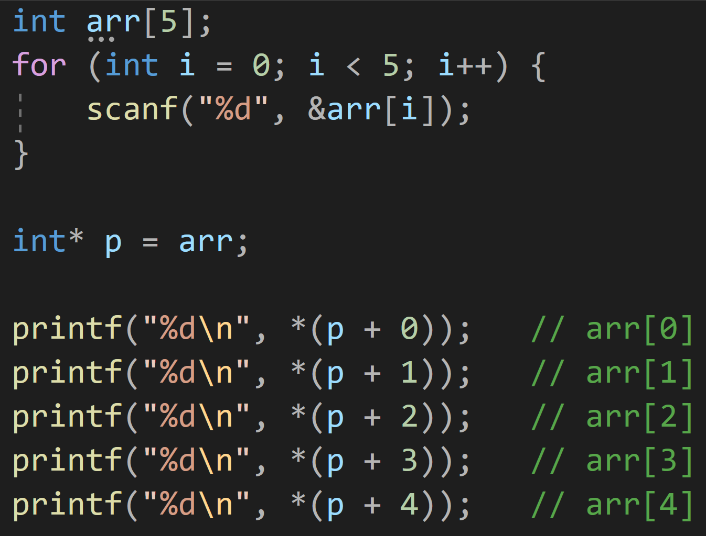

---
id: "P102v2004"
db_id: 1873
legacy_id: "P102v2004"
title: "04. [포인터] 포인터로 배열 출력"
platform: "doingcoding"
level: "Low"
tags:
  - "Lv20 포인터1(기본)"
authors:
  - "root"
supported_languages:
  - "C"
  - "C++"
  - "Golang"
  - "Java"
  - "Python2"
  - "Python3"
time_limit: "1s"
memory_limit: "256MB"
accepted_user_count: 38
has_hint: "true"
archived_at: "2026-08-03"
---

# 04. [포인터] 포인터로 배열 출력

## 1. 문제 설명
정수 5개를 입력받아 배열에 저장하고, 포인터를 이용해 배열의 값을 출력하세요.

---

## 2. 입출력 설명

* **입력:**
정수 5개가 공백 구분되어 주어집니다.

* **출력:**
각 값을 한 줄에 하나씩 출력합니다.

---

## 3. 예시
### 예시 입력 1
```text
1 2 3 4 5
```

### 예시 출력 1
```text
1  
2  
3  
4  
5
```

---

## 4. 힌트


위와 같이, 포인터를 옮길 때마다 배열의 인덱스에 맞춰서 출력할 수 있습니다.

이를 반복문으로도 표현할 수 있습니다.
---

