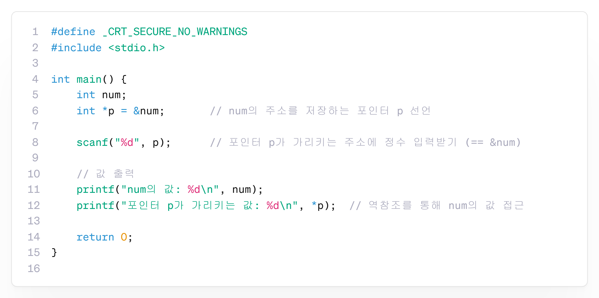

---
id: "P102v2001"
db_id: 1870
legacy_id: "P102v2001"
title: "01. [포인터1(기본)] 포인터 변수 선언과 주소 참조 튜토리얼"
platform: "doingcoding"
level: "Low"
tags:
  - "Lv20 포인터1(기본)"
authors:
  - "root"
supported_languages:
  - "C"
  - "C++"
time_limit: "1s"
memory_limit: "256MB"
accepted_user_count: 43
has_hint: "true"
archived_at: "2026-08-03"
---

# 01. [포인터1(기본)] 포인터 변수 선언과 주소 참조 튜토리얼

## 1. 문제 설명
컴퓨터의 모든 변수는 메모리(RAM)의 특정 위치에 저장되며, 각 위치는 고유한 **메모리 주소(Address)** 를 가집니다.

- 주소 연산자 `&`: 변수 앞에 붙여 해당 변수가 위치한 메모리 주소를 구합니다. (예: `&num`)
- 포인터 변수 `*`: 메모리 주소를 저장하는 특별한 변수입니다. (예: `int *p = &num;`)
- 역참조 연산자 `*`: 포인터가 가리키고 있는 주소로 직접 찾아가 그곳에 저장된 값을 읽거나 수정합니다. (예: `*p += K;`)

정수 $A$와 가산할 값 $K$를 입력받아 변수 `num`에 $A$를 저장한 뒤, 포인터 변수 `p`가 `num`을 가리키도록 설정하세요.  
그 후 포인터 `p`를 역참조하여 값을 $K$만큼 증가시키고, 변수 `num`과 포인터가 가리키는 값을 각각 출력하세요.

---

## 2. 입출력 설명

* **입력:**
  - 첫 번째 줄에 초기 정수 $A$와 더할 정수 $K$가 공백으로 구분되어 입력됩니다.
  - ($-1000 \le A, K \le 1000$)

* **출력:**
  - 첫 번째 줄에 `num의 값: [최종값]` 형식으로 출력합니다.
  - 두 번째 줄에 `포인터 p가 가리키는 값: [최종값]` 형식으로 출력합니다.

---

## 3. 예시

### 예시 입력 1
```text
10 5
```

### 예시 출력 1
```text
num의 값: 15
포인터 p가 가리키는 값: 15
```

### 예시 입력 2
```text
7 -3
```

### 예시 출력 2
```text
num의 값: 4
포인터 p가 가리키는 값: 4
```

---

## 4. 힌트

📘 **포인터는 "주소를 저장하고 직접 접근할 수 있는 변수"입니다.**

포인터를 이용하면 변수 이름을 직접 쓰지 않고도 메모리 주소를 통해 값을 간접적으로 읽거나 수정할 수 있습니다.



- **핵심 작성 가이드 (C/C++)**:
  ```c
  int num = A
  int *p = &num; // num의 주소를 포인터 p에 저장
  *p += K;       // p가 가리키는 실제 메모리 공간의 값을 K만큼 증가
  ```
