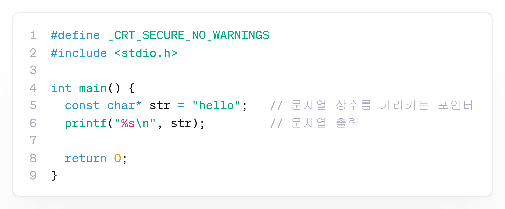

---
id: "P102v2005"
db_id: 1874
legacy_id: "P102v2005"
title: "05. [포인터1(기본)] 문자열 포인터 선언과 오프셋 출력"
platform: "doingcoding"
level: "Low"
tags:
  - "Lv20 포인터1(기본)"
authors:
  - "root"
supported_languages:
  - "C"
  - "C++"
time_limit: "1s"
memory_limit: "256MB"
accepted_user_count: 38
has_hint: "true"
archived_at: "2026-08-03"
---

# 05. [포인터1(기본)] 문자열 포인터 선언과 오프셋 출력

## 1. 문제 설명
C/C++에서 큰따옴표(`"..."`)로 묶인 문자열 리터럴은 메모리에 저장된 후 그 **첫 번째 문자의 메모리 주소**를 반환합니다.  
따라서 문자 포인터 변수(`const char *`)를 사용하여 문자열을 가리킬 수 있습니다.

문자열 `"HelloPointer"`를 가리키는 문자 포인터 `str`을 선언하세요.  
그 다음 건너뛸 글자 수 $N$을 입력받아, 포인터 연산 `str + N`을 통해 $N$번째 오프셋부터 시작하는 문자열을 출력하세요.

---

## 2. 입출력 설명

* **입력:**
  - 첫 번째 줄에 건너뛸 글자 수 $N$ ($0 \le N \le 5$)이 정수로 입력됩니다.

* **출력:**
  - 포인터 `str + N`이 가리키는 시작 위치부터 문자열의 끝까지 출력합니다.

---

## 3. 예시

### 예시 입력 1
```text
0
```

### 예시 출력 1
```text
HelloPointer
```

### 예시 입력 2
```text
5
```

### 예시 출력 2
```text
Pointer
```

---

## 4. 힌트

📘 **문자에 포인터를 사용하여 문자열 리터럴의 시작 위치를 가리킬 수 있습니다.**



- **핵심 작성 가이드 (C/C++)**:
  ```c
  const char *str = "HelloPointer";
  int N;
  scanf("%d", &N);
  // 포인터 덧셈 연산으로 시작 주소를 이동하여 출력
  printf("%s\n", str + N);
  ```
