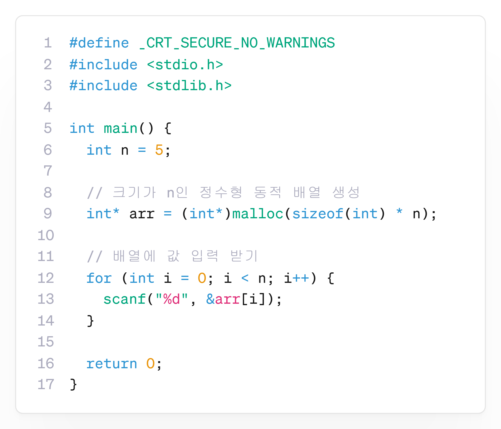

---
id: "P102v2101"
db_id: 1876
legacy_id: "P102v2101"
title: "01. [동적 배열] 정수 n개를 동적 배열에 저장하고 출력하기"
platform: "doingcoding"
level: "Low"
tags:
  - "Lv21 포인터2(동적배열)"
authors:
  - "root"
supported_languages:
  - "C"
  - "C++"
  - "Golang"
  - "Java"
  - "Python2"
  - "Python3"
time_limit: "1s"
memory_limit: "256MB"
accepted_user_count: 38
has_hint: "true"
archived_at: "2026-08-03"
---

# 01. [동적 배열] 정수 n개를 동적 배열에 저장하고 출력하기

## 1. 문제 설명
정수 n을 입력받고, 그만큼 정수를 동적 배열로 입력받은 후,

입력한 값을 한 줄에 하나씩 출력하는 프로그램을 작성하세요.

---

## 2. 입출력 설명

* **입력:**
첫 줄에 정수 n

둘째 줄에 정수 n개가 공백으로 입력됩니다.

* **출력:**
입력된 정수들을 순서대로 출력합니다.

---

## 3. 예시
### 예시 입력 1
```text
5  
10 20 30 40 50

```

### 예시 출력 1
```text
10  
20  
30  
40  
50
```

---

## 4. 힌트
### **[C언어]**

**📘**: 크기가 n(5)인 경우, 다음과 같이 동적배열을 만들 수 있습니다.

`자료형*배열이름 = (자료형)malloc(sizeof(자료형)*크기)`

또한,`#include <stdlib.h>`를 추가하여 동적 메모리 명령어를 사용할 수 있습니다.


---

