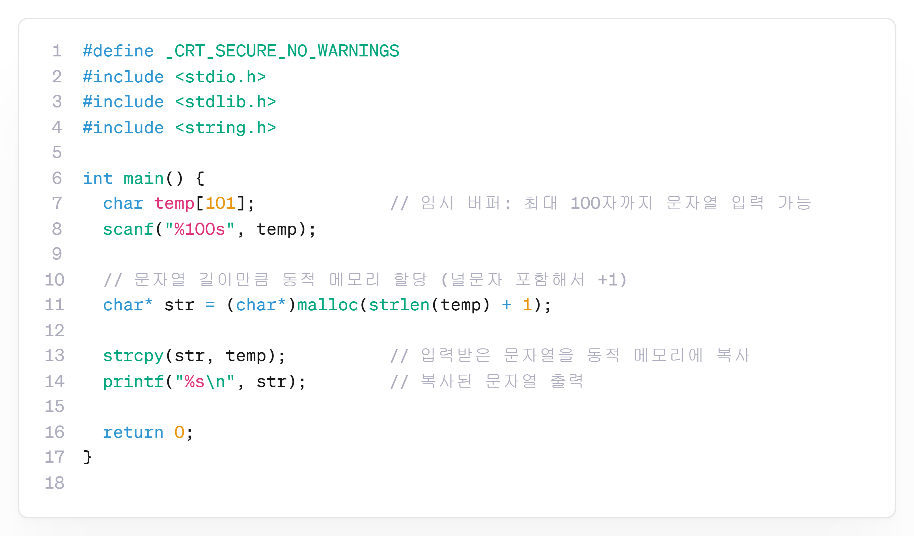

---
id: "P102v2105"
db_id: 1880
legacy_id: "P102v2105"
title: "05. [동적 문자열] 입력된 문자열 출력"
platform: "doingcoding"
level: "Low"
tags:
  - "Lv21 포인터2(동적배열)"
authors:
  - "root"
supported_languages:
  - "C"
  - "C++"
  - "Golang"
  - "Java"
  - "Python2"
  - "Python3"
time_limit: "1s"
memory_limit: "256MB"
accepted_user_count: 33
has_hint: "true"
archived_at: "2026-08-03"
---

# 05. [동적 문자열] 입력된 문자열 출력

## 1. 문제 설명
문자열을 입력받아 동적 메모리에 저장하고 출력하세요.

---

## 2. 입출력 설명

* **입력:**
첫번째 줄에 문자열이 입력됩니다.

* **출력:**
입력한 문자열을 출력합니다.

---

## 3. 예시
### 예시 입력 1
```text
HelloWorld
```

### 예시 출력 1
```text
HelloWorld
```

---

## 4. 힌트
### **[C언어]**

**📘**: 문자열을 동적포인터에 저장하면, 이후에 문자열로 이루어진 배열도 만들 수 있습니다.


---

