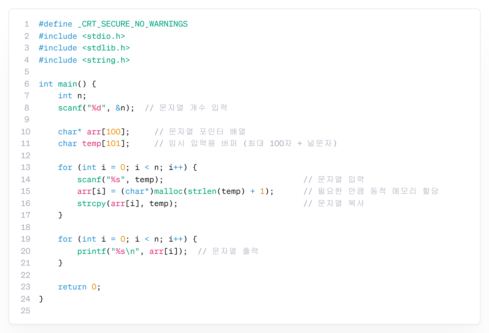

---
id: "P102v2106"
db_id: 1881
legacy_id: "P102v2106"
title: "06. [문자열 포인터 배열] 여러 문자열 출력"
platform: "doingcoding"
level: "Low"
tags:
  - "Lv21 포인터2(동적배열)"
authors:
  - "root"
supported_languages:
  - "C"
  - "C++"
  - "Golang"
  - "Java"
  - "Python2"
  - "Python3"
time_limit: "1s"
memory_limit: "256MB"
accepted_user_count: 33
has_hint: "true"
archived_at: "2026-08-03"
---

# 06. [문자열 포인터 배열] 여러 문자열 출력

## 1. 문제 설명
n개의 문자열을 입력받아 각각 동적 메모리에 저장하고 출력하세요.

---

## 2. 입출력 설명

* **입력:**
첫번째 줄에 문자열의 개수 n이 입력됩니다.

그 이후 n개의 줄에 걸쳐서 문자열이 입력됩니다.

* **출력:**
n개의 줄에 걸쳐서 문자열을 출력합니다.

---

## 3. 예시
### 예시 입력 1
```text
3  
apple  
banana  
cherry
```

### 예시 출력 1
```text
apple  
banana  
cherry
```

---

## 4. 힌트
### **[C언어]**

**📘**:2차원 배열처럼 문자열 여러 개를 저장할 수 있습니다.

하지만 각 문자열의 길이가 다르다면,

**각 문자열의 길이에 맞게 메모리를 동적으로 할당**하면 더 효율적으로 저장할 수 있습니다.


---

