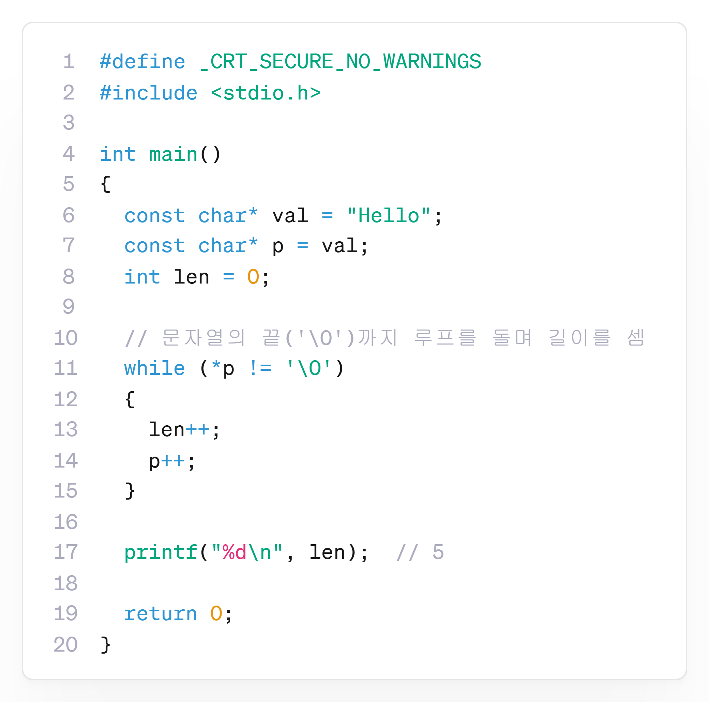

---
id: "P102v2107"
db_id: 1896
legacy_id: "P102v2107"
title: "07. [문자열 포인터 배열]  문자열들의 길이 출력하기"
platform: "doingcoding"
level: "Low"
tags:
  - "Lv21 포인터2(동적배열)"
authors:
  - "root"
supported_languages:
  - "C"
  - "C++"
  - "Golang"
  - "Java"
  - "Python2"
  - "Python3"
time_limit: "1s"
memory_limit: "256MB"
accepted_user_count: 34
has_hint: "true"
archived_at: "2026-08-03"
---

# 07. [문자열 포인터 배열]  문자열들의 길이 출력하기

## 1. 문제 설명
여러 개의 문자열을 입력받아 각 문자열의 길이를 출력하는 프로그램을 작성해 주세요.

포인터 배열을 활용해 문자열들을 관리하고, 길이는 직접 계산해 주세요.

---

## 2. 입출력 설명

* **입력:**
첫 줄에 문자열의 개수 n이 주어지고, 이후 n줄에 문자열이 하나씩 주어집니다.

* **출력:**
각 문자열의 길이를 한 줄에 하나씩 출력해 주세요.

---

## 3. 예시
### 예시 입력 1
```text
3  
hi  
hello  
bye
```

### 예시 출력 1
```text
2  
5  
3
```

---

## 4. 힌트
### **[C언어]**

📘: 포인터와 반복문을 사용하여 문자열의 길이를 구할 수 있습니다.

문자열의 끝에는 '\0' 문자가 있으므로, 해당 문자를 만나기 전까지 문자의 위치를 옮겨가며 길이를 확인할 수 있습니다.

아래의 예시는 "Hello"의 글자 개수를 출력하는 예시입니다.


---

