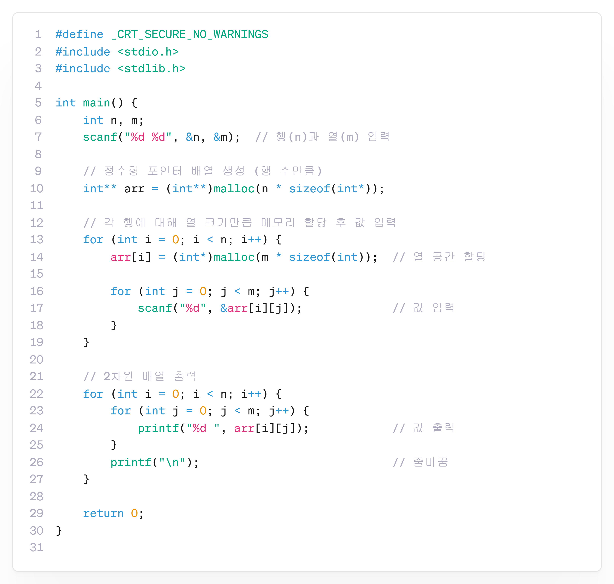

---
id: "P102v2108"
db_id: 1882
legacy_id: "P102v2108"
title: "08. [2차원 동적 배열] 행렬 입력 및 출력"
platform: "doingcoding"
level: "Low"
tags:
  - "Lv21 포인터2(동적배열)"
authors:
  - "root"
supported_languages:
  - "C"
  - "C++"
  - "Golang"
  - "Java"
  - "Python2"
  - "Python3"
time_limit: "1s"
memory_limit: "256MB"
accepted_user_count: 32
has_hint: "true"
archived_at: "2026-08-03"
---

# 08. [2차원 동적 배열] 행렬 입력 및 출력

## 1. 문제 설명
n행 m열의 정수 행렬을 동적 배열로 입력받고 출력하세요.

---

## 2. 입출력 설명

* **입력:**
첫번째 줄에 행의 길이 n, 열의 길이 m이 입력됩니다.

그리고 n개 줄에 걸쳐서 m개씩 정수를 입력받습니다.

* **출력:**
n\*m 크기로 2차원 배열을 출력해주세요.

---

## 3. 예시
### 예시 입력 1
```text
2 3  
1 2 3  
4 5 6
```

### 예시 출력 1
```text
1 2 3  
4 5 6
```

---

## 4. 힌트
### **[C언어]**

**📘**:포인터 하나당 정해진 크기만큼만 배열을 만들 수 있습니다. 즉,행과 열은 2개가 있으므로 포인터 2개를 사용하여 만들 수 있습니다.


---

