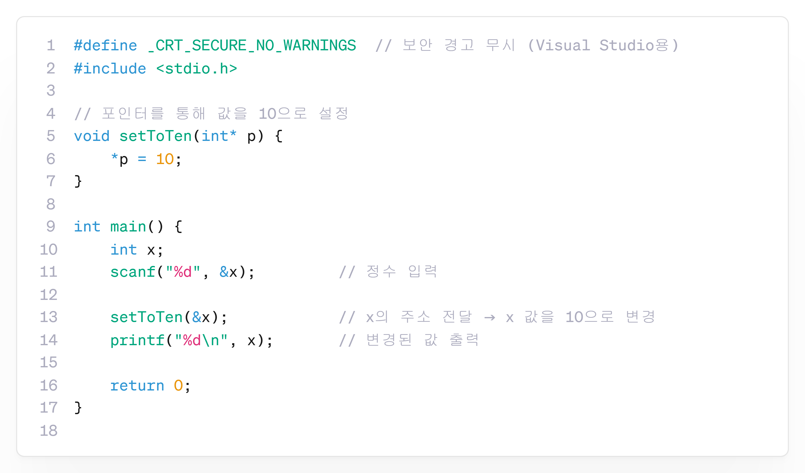

---
id: "P102v2201"
db_id: 1883
legacy_id: "P102v2201"
title: "01. [포인터+함수] 포인터 함수 튜토리얼"
platform: "doingcoding"
level: "Low"
tags:
  - "Lv22 포인터와함수"
authors:
  - "root"
supported_languages:
  - "C"
  - "C++"
  - "Golang"
  - "Java"
  - "Python2"
  - "Python3"
time_limit: "1s"
memory_limit: "256MB"
accepted_user_count: 32
has_hint: "true"
archived_at: "2026-08-03"
---

# 01. [포인터+함수] 포인터 함수 튜토리얼

## 1. 문제 설명
정수형 변수의 주소를 함수에 전달하고, 함수에서 그 주소에 10을 저장하세요.

---

## 2. 입출력 설명

* **입력:**
정수 1개가 입력됩니다.

* **출력:**
함수 실행 후 해당 변수의 값을 출력합니다.

---

## 3. 예시
### 예시 입력 1
```text
0
```

### 예시 출력 1
```text
10
```

---

## 4. 힌트
### **[C언어]**

📘:포인터를 사용하면, 함수에 변수의**주소를 전달**하여

함수 내부에서**원본 변수의 값을 직접 변경**할 수 있습니다.


---

