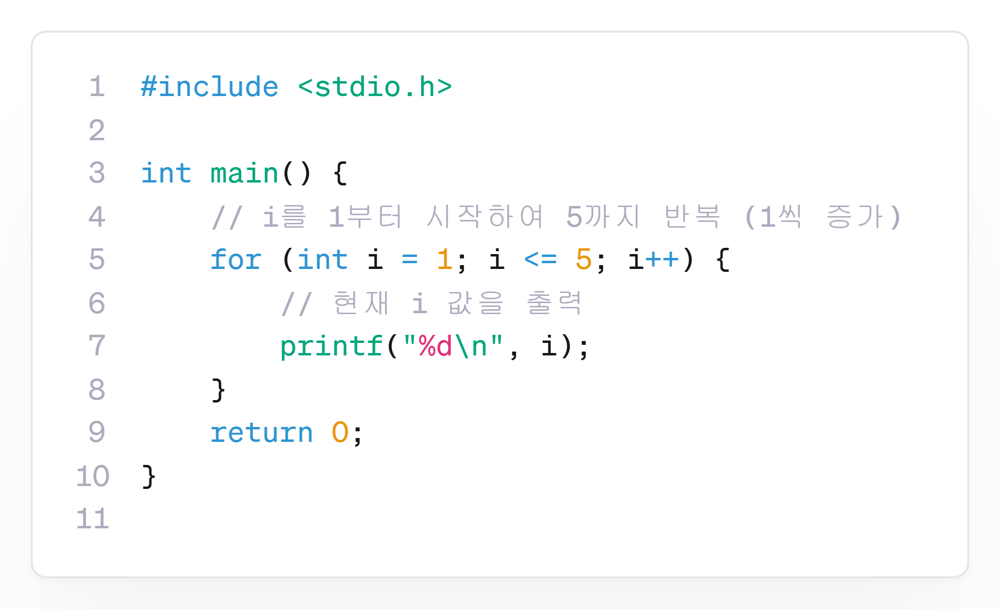
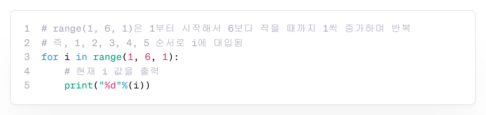
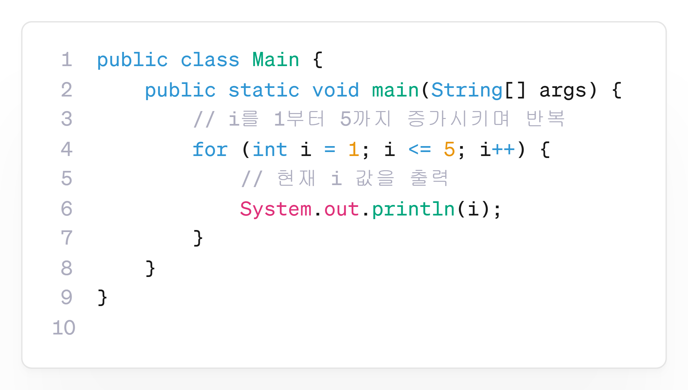

---
id: "P101v0701"
db_id: 1916
legacy_id: "P101v0701"
title: "01. [반복-for 기초1] 1부터 5까지 출력하기"
platform: "doingcoding"
level: "Low"
tags:
  - "for"
  - "Lv7 반복1(for)"
authors:
  - "root"
supported_languages:
  - "C"
  - "C++"
  - "Golang"
  - "Java"
  - "Python2"
  - "Python3"
time_limit: "1s"
memory_limit: "256MB"
accepted_user_count: 207
has_hint: "true"
archived_at: "2026-06-26"
---

# 01. [반복-for 기초1] 1부터 5까지 출력하기

## 1. 문제 설명
for문을 사용하여 1부터 5까지의 정수를 한 줄에 하나씩 출력하는 프로그램을 작성해 주세요.

---

## 2. 입출력 설명

* **입력:**
입력은 없습니다.

* **출력:**
1부터 5까지의 수를 순서대로 한 줄에 하나씩 출력합니다.

---

## 3. 예시
### 예시 입력 1
```text
 
```

### 예시 출력 1
```text
1
2
3
4
5
```

---

## 4. 힌트
for문의 초기값은 1부터 시작하고, 5까지 반복하여 출력해 주세요.

### **[C언어]**

`for (초기식; 조건식; 증감식)`

📘**:**`int i = 1`부터 시작해,`i <= 5`일 동안`i++`로 증가하며 반복합니다.



---

### **[Python]**

`for 변수 in range(시작, 끝+1, 증감값):`

📘**:**`1, 2, 3, 4, 5`를 차례로`i`에 대입하며 반복합니다.



---

### 

### **[Java]**

`for (초기값; 조건식; 증감식)`

📘**:**`i = 1`부터 시작하여`i <= 5`일 동안`i++`로 증가합니다.


---

