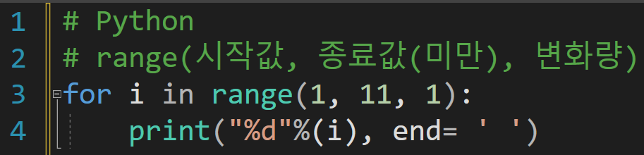

---
id: "SP101v0701"
db_id: 323
legacy_id: "SP101v0701"
title: "01. [반복-for 기초1] 1부터 10까지 출력하기"
platform: "doingcoding"
level: "Low"
tags:
  - "for"
  - "SLv7 반복1(for)"
authors:
  - "root"
supported_languages:
  - "C"
  - "C++"
  - "Golang"
  - "Java"
  - "Python3"
time_limit: "1s"
memory_limit: "256MB"
accepted_user_count: 609
has_hint: "true"
archived_at: "2026-06-26"
---

# 01. [반복-for 기초1] 1부터 10까지 출력하기

## 1. 문제 설명
반복문 for을 이용하여 1부터 10까지 출력해주세요.

---

## 2. 입출력 설명

* **입력:**
입력은 없습니다.

* **출력:**
1부터 10까지 출력해주세요.

---

## 3. 예시
### 예시 입력 1
```text
 
```

### 예시 출력 1
```text
1 2 3 4 5 6 7 8 9 10
```

---

## 4. 힌트
반복문 for는 (초기값 ; 조건 ; 증감) 으로 작성을하고 조건이 맞을경우{} 명령어를 실행합니다.

ex)

for( int i = 1 ; i <= 10 ; i++)

{

printf("%d ", i);

}

---

**Python**

****
---

