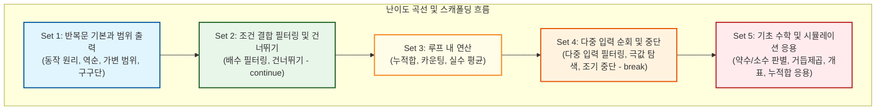

# Lv7 반복(for) — 워크스페이스 교육 품질 감사 및 개선 리포트 (풍부한 연습형)

> **단원**: Lv7 반복(for) (48문제: 수업용 P101v07 30문제 / 숙제용 SP101v07 18문제)
> **설계 원칙**: `반복문 기본과 범위 출력 → 조건 결합 필터링(배수, 건너뛰기) → 루프 내 연산(누적합, 카운팅, 평균) → 다중 입력 순회 및 중단(Sentinel, Break) → 기초 수학 및 시뮬레이션 응용`
> **관련 가이드**: [pedagogical_standards.md](../pedagogical_standards.md), [content_production_pipeline.md](../content_production_pipeline.md)

---

## 1. 단원 전체의 5개 Set 구성 및 난이도 곡선 (스캐폴딩) 분석

기존 크롤링된 데이터는 총 58개(수업 35개, 숙제 23개)로, 단순 조건 변경 문항이 중복되고 반복문의 제어 흐름이 단계적으로 학습되지 못하는 한계가 있었습니다. 

이번 리뉴얼에서는 **"풍부한 연습형 (Approach A)"**을 채택하여 단순 반복 및 중복 문항 10개를 걷어내고, 초심자가 다양한 조건(홀수, 짝수, 배수, 양수, 음수 등) 하에서 충분히 연습하여 숙련될 수 있도록 **수업용 30문제, 숙제용 18문제 (총 48문제)**로 촘촘히 재구성했습니다. 접두사 `P101v07` (수업용 ALL 역할) 및 `SP101v07` (숙제용 SALL 역할)은 기존 명명법을 고수하며 유지합니다.



### 중복 및 인지 과부하 문제 배제 (Drop 사유 - 10문항)
1.  **SP101v0703 (1부터 n까지 출력하기)**: 수업용 기본 문제(P101v0703)와 구조 및 목적이 완전히 겹쳐 드롭합니다.
2.  **SP101v0715 (입력된 n개의 합계와 평균을 출력)**: Set 3 수업용(P101v0710 등) 및 다중 입력과 누적 연산이 불필요하게 겹쳐 제외합니다.
3.  **P101v0718 (1부터 n까지 출력하다가 5에서 멈추기)**: P101v0720(음수를 만나면 출력 중단하기)과 break 기초 개념이 중복되어 조기 정리합니다.
4.  **P101v0721 (짝수만 출력, 0이면 멈추기)**: Sentinel break와 필터가 다른 문항(SP101v0716 등)과 겹쳐 제외합니다.
5.  **P101v0724 (1부터 n까지 출력 중 첫 5의 배수에서 멈추기)**: break 중복 문항으로 제외합니다.
6.  **P101v0728 (0 나오기 전까지 최대값 찾기)**: 배열 없이 0 입력 시점까지 최대값을 갱신하는 논리는 초심자에게 예외 조건이 깊어져 제외합니다.
7.  **P101v0733 (같이 만나는 날은?)**: 3개 값의 최소공배수를 루프로 탐색하는 것은 중첩 루프에 준하는 인지 부하를 주므로 배제합니다.
8.  **SP101v0718 (최대값과 최소값 출력)**: 최대와 최소를 동시에 갱신하는 로직은 조건 분기가 복잡하여 입문자의 인지 과부하를 초래하므로 배제합니다.
9.  **SP101v0720 (두 수 사이 수 들중 1의자리가 1인값은 몇 개일까?)**: 수학적 트릭에 가깝고 반복문의 제어 흐름 학습이라는 본래의 단원 목표에서 벗어나므로 배제합니다.
10. **SP101v0721 (1차 배열 좌표 출력)**: 배열 단원에 속하는 성격이 강해 본 단원에서 제외합니다.

---

## 2. 수업 문제(P101v07)와 숙제 문제(SP101v07) 간의 관계 및 학습 연계 매핑

총 48문항은 각 Set별로 개념 도약이 부드럽게 이어지도록 배치되었으며, 숙제는 수업 내용을 충실히 복습하고 응용력을 다지는 구조로 매핑되었습니다.

```mermaid
graph TD
    subgraph "Set 1: 기초"
        P01["P101v0701 (1~5 출력)"] --> SP01["SP101v0701 (1~10 출력 복습)"]
        P02["P101v0702 (역순 출력)"] --> SP02["SP101v0702 (20~1 출력 복습)"]
        P03["P101v0703 (1~n 출력)"] --> SP03["SP101v0703 (가변 역순 복습)"]
        P04["P101v0704 (두 수 사이 출력)"] --> SP04["SP101v0704 (두 수 사이 가변 복습)"]
        P05["P101v0705 (구구단 출력)"]
        P06["P101v0706 (짝수 출력)"]
    end
    
    subgraph "Set 2: 필터"
        P07["P101v0707 (3의배수 필터)"] --> SP05["SP101v0705 (홀수 필터 복습)"]
        P08["P101v0708 (3 건너뛰기)"] --> SP06["SP101v0706 (5의배수 복습)"]
        P09["P101v0709 (2,3배수 건너뛰기)"] --> SP07["SP101v0707 (건너뛰기 복습)"]
        P10["P101v0710 (3or5배수 필터)"] --> SP08["SP101v0708 (배수 합 복습)"]
        P11["P101v0711 (음수만남 종료필터)"]
        P12["P101v0712 (홀수3번 종료필터)"]
    end
    
    subgraph "Set 3: 연산"
        P13["P101v0713 (1~n 합)"] --> SP09["SP101v0709 (홀수 합 복습)"]
        P14["P101v0714 (짝수 합)"] --> SP10["SP101v0710 (짝수 개수 복습)"]
        P15["P101v0715 (홀수 개수)"] --> SP11["SP101v0711 (홀수 평균 복습)"]
        P16["P101v0716 (평균 구하기)"] --> SP12["SP101v0712 (짝수합/홀수평균 복습)"]
        P17["P101v0717 (짝수 평균)"]
        P18["P101v0718 (양수의 합)"]
    end
    
    subgraph "Set 4: 다중입력 및 중단"
        P19["P101v0719 (n개 입력출력)"] --> SP13["SP101v0713 (n개 짝수출력 복습)"]
        P20["P101v0720 (n개 홀수출력)"] --> SP14["SP101v0714 (n개 최대값 복습)"]
        P21["P101v0721 (n개 음수개수)"] --> SP15["SP101v0715 (배수 break 복습)"]
        P22["P101v0722 (n개 최소값)"]
        P23["P101v0723 (음수 break)"]
        P24["P101v0724 (합 k초과 break)"]
    end
    
    subgraph "Set 5: 응용"
        P25["P101v0725 (약수 출력)"] --> SP16["SP101v0716 (팩토리얼 복습)"]
        P26["P101v0726 (약수 개수)"] --> SP17["SP101v0717 (교대 급수 복습)"]
        P27["P101v0727 (소수 판별)"] --> SP18["SP101v0718 (나머지1 탐색 복습)"]
        P28["P101v0728 (2의 n제곱)"]
        P29["P101v0729 (부족금 계산)"]
        P30["P101v0730 (개표 카운팅)"]
    end
    
    style SP01 fill:#e3f2fd,stroke:#1e88e5
    style SP02 fill:#e3f2fd,stroke:#1e88e5
    style SP03 fill:#e3f2fd,stroke:#1e88e5
    style SP04 fill:#e3f2fd,stroke:#1e88e5
    
    style SP05 fill:#e8f5e9,stroke:#43a047
    style SP06 fill:#e8f5e9,stroke:#43a047
    style SP07 fill:#e8f5e9,stroke:#43a047
    style SP08 fill:#e8f5e9,stroke:#43a047
    
    style SP09 fill:#fffde7,stroke:#fdd835
    style SP10 fill:#fffde7,stroke:#fdd835
    style SP11 fill:#fffde7,stroke:#fdd835
    style SP12 fill:#fffde7,stroke:#fdd835
    
    style SP13 fill:#fff3e0,stroke:#fb8c00
    style SP14 fill:#fff3e0,stroke:#fb8c00
    style SP15 fill:#fff3e0,stroke:#fb8c00
    
    style SP16 fill:#ffebee,stroke:#e53935
    style SP17 fill:#ffebee,stroke:#e53935
    style SP18 fill:#ffebee,stroke:#e53935
```



---

## 3. 문제별 품질 진단 결과

### 🟢 Set 1: 반복문 기본과 범위 출력
*   **P101v0701 (1부터 5까지 출력하기) [티어 1]**: 루프 변수 `i`가 매 반복마다 변하는 상태 변화 Trace 제공.
*   **P101v0702 (5부터 1까지 출력하기) [티어 2]**: 역순 루프의 증감 연산자(`i--`) 원리 기술.
*   **P101v0703 (1부터 n까지 출력하기) [티어 2]**: 표준 입력을 받아 루프의 반복 횟수를 가변적으로 제어하는 기초.
*   **P101v0704 (작은수 부터 큰수까지 출력) [티어 2]**: 시작값과 끝값의 대소가 고정되어 입력될 때의 범위 제어 학습.
*   **P101v0705 (구구단 출력) [티어 2]**: 출력 포맷 문자열 `%d * %d = %d`에 단과 루프 변수 매핑 훈련.
*   **P101v0706 (1부터 n까지 짝수 출력하기) [티어 2]**: if문과 결합된 기본 조건부 반복 출력 입문.

### 🟢 Set 2: 조건 결합 필터링 및 건너뛰기
*   **P101v0707 (1부터 n까지 3의 배수 출력하기) [티어 1]**: 배수 판별 나머지 연산자 학습 및 흐름도(Mermaid) 추가.
*   **P101v0708 (1부터 n까지 출력 중 3은 건너뛰기) [티어 2]**: 특정 조건에서 `continue`를 호출하여 아래 코드를 생략하고 증감식으로 이동하는 개념 교육.
*   **P101v0709 (2와 3의 배수는 건너뛰기) [티어 2]**: 복합 논리 연산(`i % 2 == 0 || i % 3 == 0`)을 결합한 건너뛰기 실습.
*   **P101v0710 (3 또는 5의 배수만 출력) [티어 2]**: 필터링과 복합 조건 결합.
*   **P101v0711 (홀수만 출력하고 음수 만나면 종료) [티어 2]**: 반복 필터 조건과 break 융합 과도기형.
*   **P101v0712 (홀수 3번 나오면 종료, 짝수만 출력) [티어 2]**: 상태 변수를 사용한 복합 탈출 조건.

### 🟢 Set 3: 루프 내 연산 (누적합, 카운팅, 평균)
*   **P101v0713 (1부터 n까지 합 구하기) [티어 1]**: 누적 변수 `sum = 0`의 초기화 및 `sum += i` 연산 흐름 시각화.
*   **P101v0714 (1부터 입력받은 수까지의 짝수의 합 출력) [티어 2]**: 조건부 누적합 패턴.
*   **P101v0715 (1부터 n까지 홀수 개수 세기) [티어 2]**: 카운터 변수 `count = 0` 초기화 및 `count++` 흐름 실습.
*   **P101v0716 (1부터 n까지 평균 구하기) [티어 2]**: 정수 나누기 결과의 실수(float) 형변환에 대한 주의 팁 제공.
*   **P101v0717 (1부터 n까지 짝수 평균 구하기) [티어 2]**: 짝수를 판별해 합을 누적하고 개수를 세어 최종 나눗셈 연산.
*   **P101v0718 (n개의 숫자 중 양수 합 구하기) [티어 2]**: 입력과 동시에 누적합을 구하는 응용 훈련.

### 🟢 Set 4: 다중 입력 순회 및 중단 (Sentinel & Break)
*   **P101v0719 (n개의 숫자 입력받아 출력하기) [티어 1]**: 배열 없이 루프 내부에서 연속으로 표준 입력을 처리하는 구조 Trace 제공.
*   **P101v0720 (n개의 숫자 중 홀수만 출력하기) [티어 2]**: 입력 스트림에서 홀수만 걸러 출력하기.
*   **P101v0721 (n개의 숫자 중 음수 개수 세기) [티어 2]**: 입력 스트림에서 조건에 맞는 항목 카운팅하기.
*   **P101v0722 (n개의 숫자 중 최소값 찾기) [티어 2]**: 첫 번째 값을 초기 최소값으로 설정하고 갱신하는 극값 탐색 패턴.
*   **P101v0723 (음수를 만나면 출력 중단하기) [티어 2]**: 특정 조건에서 `break`를 호출하여 루프를 즉시 조기 탈출하는 개념 교육.
*   **P101v0724 (누적합이 k를 넘으면 멈추기) [티어 2]**: 누적 임계치에 도달할 때 루프 제어를 멈추는 선형 탐색 응용.

### 🟢 Set 5: 기초 수학 및 시뮬레이션 응용
*   **P101v0725 (약수 출력) [티어 1]**: 약수의 수학적 정의와 1부터 N까지 순회하며 나누어떨어짐 판별 시각화.
*   **P101v0726 (약수의 개수 출력) [티어 2]**: 약수 판별과 카운터 갱신의 결합.
*   **P101v0727 (소수 판별) [티어 3]**: 2부터 N-1까지 약수가 하나라도 존재하는지 확인하여 판정하는 논리 및 Flag/조기 break 훈련.
*   **P101v0728 (2의 n 제곱 구하기) [티어 2]**: 곱셈 누적기(`prod *= 2`) 활용.
*   **P101v0729 (부족한 금액 계산하기) [티어 2]**: 놀이기구 이용 횟수에 따른 요금의 등차급수적 누적합 계산 및 보유 금액과의 비교 판정.
*   **P101v0730 (칠판 개표 결과 출력하기) [티어 2]**: 문자열 형태로 들어오는 표들을 순회하며 각 후보의 개수를 카운팅하는 시뮬레이션.

---

## 4. 개편 배치 상세 매핑 테이블 (ID 및 파일명 매칭)

### 1) 수업용 (P101v07) 문제 매핑 (30문제)

| Set | 순번 | 기존 ID | 기존 파일명 | db_id | 신규 ID | 신규 파일명 | 역할 및 제목 |
|:---:|:---:|---|---|:---:|---|---|---|
| **Set 1** | 1 | P101v0701 | `P101v0701_1916.md` | 1916 | P101v0701 | `P101v0701_1916.md` | 1부터 5까지 출력하기 |
| **Set 1** | 2 | P101v0702 | `P101v0702_1917.md` | 1917 | P101v0702 | `P101v0702_1917.md` | 5부터 1까지 출력하기 |
| **Set 1** | 3 | P101v0703 | `P101v0703_1918.md` | 1918 | P101v0703 | `P101v0703_1918.md` | 1부터 n까지 출력하기 |
| **Set 1** | 4 | P101v0712 | `P101v0712_339.md` | 339 | P101v0704 | `P101v0704_339.md` | 작은수 부터 큰수까지 출력 |
| **Set 1** | 5 | P101v0704 | `P101v0704_326.md` | 326 | P101v0705 | `P101v0705_326.md` | 구구단 출력 |
| **Set 1** | 6 | P101v0705 | `P101v0705_1920.md` | 1920 | P101v0706 | `P101v0706_1920.md` | 1부터 n까지 짝수 출력하기 |
| **Set 2** | 7 | P101v0706 | `P101v0706_1922.md` | 1922 | P101v0707 | `P101v0707_1922.md` | 1부터 n까지 3의 배수 출력하기 |
| **Set 2** | 8 | P101v0719 | `P101v0719_1944.md` | 1944 | P101v0708 | `P101v0708_1944.md` | 1부터 n까지 출력 중 3은 건너뛰기 |
| **Set 2** | 9 | P101v0722 | `P101v0722_1949.md` | 1949 | P101v0709 | `P101v0709_1949.md` | 2와 3의 배수는 건너뛰기 |
| **Set 2** | 10 | P101v0723 | `P101v0723_1950.md` | 1950 | P101v0710 | `P101v0710_1950.md` | 3 또는 5의 배수만 출력 |
| **Set 2** | 11 | P101v0725 | `P101v0725_1952.md` | 1952 | P101v0711 | `P101v0711_1952.md` | 홀수만 출력하고 음수 만나면 종료 |
| **Set 2** | 12 | P101v0726 | `P101v0726_1953.md` | 1953 | P101v0712 | `P101v0712_1953.md` | 홀수 3번 나오면 종료, 짝수만 출력 |
| **Set 3** | 13 | P101v0707 | `P101v0707_1927.md` | 1927 | P101v0713 | `P101v0713_1927.md` | 1부터 n까지 합 구하기 |
| **Set 3** | 14 | P101v0708 | `P101v0708_327.md` | 327 | P101v0714 | `P101v0714_327.md` | 1부터 입력받은 수까지의 짝수의 합 출력 |
| **Set 3** | 15 | P101v0709 | `P101v0709_1932.md` | 1932 | P101v0715 | `P101v0715_1932.md` | 1부터 n까지 홀수 개수 세기 |
| **Set 3** | 16 | P101v0710 | `P101v0710_1933.md` | 1933 | P101v0716 | `P101v0716_1933.md` | 1부터 n까지 평균 구하기 |
| **Set 3** | 17 | P101v0711 | `P101v0711_1934.md` | 1934 | P101v0717 | `P101v0717_1934.md` | 1부터 n까지 짝수 평균 구하기 |
| **Set 3** | 18 | P101v0715 | `P101v0715_1939.md` | 1939 | P101v0718 | `P101v0718_1939.md` | n개의 숫자 중 양수 합 구하기 |
| **Set 4** | 19 | P101v0713 | `P101v0713_1936.md` | 1936 | P101v0719 | `P101v0719_1936.md` | n개의 숫자 입력받아 출력하기 |
| **Set 4** | 20 | P101v0714 | `P101v0714_1938.md` | 1938 | P101v0720 | `P101v0720_1938.md` | n개의 숫자 중 홀수만 출력하기 |
| **Set 4** | 21 | P101v0716 | `P101v0716_1940.md` | 1940 | P101v0721 | `P101v0721_1940.md` | n개의 숫자 중 음수 개수 세기 |
| **Set 4** | 22 | P101v0717 | `P101v0717_1942.md` | 1942 | P101v0722 | `P101v0722_1942.md` | n개의 숫자 중 최소값 찾기 |
| **Set 4** | 23 | P101v0720 | `P101v0720_1947.md` | 1947 | P101v0723 | `P101v0723_1947.md` | 음수를 만나면 출력 중단하기 |
| **Set 4** | 24 | P101v0727 | `P101v0727_1954.md` | 1954 | P101v0724 | `P101v0724_1954.md` | 누적합이 k를 넘으면 멈추기 |
| **Set 5** | 25 | P101v0729 | `P101v0729_329.md` | 329 | P101v0725 | `P101v0725_329.md` | 약수 출력 |
| **Set 5** | 26 | P101v0730 | `P101v0730_330.md` | 330 | P101v0726 | `P101v0726_330.md` | 약수의 개수 출력 |
| **Set 5** | 27 | P101v0731 | `P101v0731_331.md` | 331 | P101v0727 | `P101v0727_331.md` | 소수 판별 |
| **Set 5** | 28 | P101v0732 | `P101v0732_332.md` | 332 | P101v0728 | `P101v0728_332.md` | 2의 n 제곱 구하기 |
| **Set 5** | 29 | P101v0735 | `P101v0735_1985.md` | 1985 | P101v0729 | `P101v0729_1985.md` | 부족한 금액 계산하기 |
| **Set 5** | 30 | P101v0734 | `P101v0734_1983.md` | 1983 | P101v0730 | `P101v0730_1983.md` | 칠판 개표 결과 출력하기 |

---

### 2) 숙제용 (SP101v07) 문제 매핑 (18문제)

| Set | 순번 | 기존 ID | 기존 파일명 | db_id | 신규 ID | 신규 파일명 | 역할 및 제목 |
|:---:|:---:|---|---|:---:|---|---|---|
| **Set 1** | H1 | SP101v0701 | `SP101v0701_323.md` | 323 | SP101v0701 | `SP101v0701_323.md` | 1부터 10까지 출력하기 |
| **Set 1** | H2 | SP101v0702 | `SP101v0702_338.md` | 338 | SP101v0702 | `SP101v0702_338.md` | 20부터 1까지 출력하기 |
| **Set 1** | H3 | SP101v0704 | `SP101v0704_1919.md` | 1919 | SP101v0703 | `SP101v0703_1919.md` | n부터 1까지 출력하기 |
| **Set 1** | H4 | SP101v0711 | `SP101v0711_325.md` | 325 | SP101v0704 | `SP101v0704_325.md` | 처음 입력받은 수 부터 두번째 입력 받은 수 까지 출력 |
| **Set 2** | H5 | SP101v0705 | `SP101v0705_1921.md` | 1921 | SP101v0705 | `SP101v0705_1921.md` | 1부터 n까지 홀수 출력하기 |
| **Set 2** | H6 | SP101v0706 | `SP101v0706_1926.md` | 1926 | SP101v0706 | `SP101v0706_1926.md` | 1부터 n까지 5의 배수 출력하기 |
| **Set 2** | H7 | SP101v0717 | `SP101v0717_1946.md` | 1946 | SP101v0707 | `SP101v0707_1946.md` | 1부터 n까지 3의 배수만 출력하기 |
| **Set 2** | H8 | SP101v0708 | `SP101v0708_1930.md` | 1930 | SP101v0708 | `SP101v0708_1930.md` | 1부터 n까지 3의 배수의 합 구하기 |
| **Set 3** | H9 | SP101v0707 | `SP101v0707_1929.md` | 1929 | SP101v0709 | `SP101v0709_1929.md` | 1부터 n까지 홀수 합 구하기 |
| **Set 3** | H10 | SP101v0709 | `SP101v0709_1931.md` | 1931 | SP101v0710 | `SP101v0710_1931.md` | 1부터 n까지 짝수 개수 세기 |
| **Set 3** | H11 | SP101v0710 | `SP101v0710_1935.md` | 1935 | SP101v0711 | `SP101v0711_1935.md` | 1부터 n까지 홀수 평균 구하기 |
| **Set 3** | H12 | SP101v0712 | `SP101v0712_340.md` | 340 | SP101v0712 | `SP101v0712_340.md` | 두 수 사이의 짝수의 합과 홀수의 평균 출력 |
| **Set 4** | H13 | SP101v0713 | `SP101v0713_1937.md` | 1937 | SP101v0713 | `SP101v0713_1937.md` | n개의 숫자 중 짝수만 출력하기 |
| **Set 4** | H14 | SP101v0714 | `SP101v0714_1941.md` | 1941 | SP101v0714 | `SP101v0714_1941.md` | n개의 숫자 중 최대값 찾기 |
| **Set 4** | H15 | SP101v0716 | `SP101v0716_1945.md` | 1945 | SP101v0715 | `SP101v0715_1945.md` | 1부터 n까지 7의 배수 만나면 멈추기 |
| **Set 5** | H16 | SP101v0722 | `SP101v0722_333.md` | 333 | SP101v0716 | `SP101v0716_333.md` | 팩토리얼 구하기 |
| **Set 5** | H17 | SP101v0719 | `SP101v0719_346.md` | 346 | SP101v0717 | `SP101v0717_346.md` | 홀수는 더하고 짝수는 빼고 |
| **Set 5** | H18 | SP101v0723 | `SP101v0723_1984.md` | 1984 | SP101v0718 | `SP101v0718_1984.md` | 나머지가 1이 되는 수 찾기 |

---

## 5. 파이썬(Python) 1초 내 해결 가능성 진단 및 대응 전략

*   **진단**: 본 단원의 모든 문제의 입력 크기 $N$ 또는 가변 범위 값은 최대 10,000 이하(대부분 $N \le 1,000$ 수준)입니다. 
*   **분석 결과**: 단일 반복문의 시간 복잡도는 $O(N)$으로, $N=10,000$일 때 연산 횟수는 만 번 이내에 불과합니다. Python의 오버헤드를 극단적으로 가정하더라도 실행 시간은 **2ms 미만**으로 소요됩니다.
*   **대응 전략**: 1초 시간 제한은 모든 문제에 대해 Python으로 100% 안전하게 통과할 수 있으며, 별도의 성능 최적화 코드(`sys.stdin.readline`)가 요구되지 않습니다. 다만 평균을 계산할 때 파이썬은 `/` 연산으로 자동 실수 형변환이 되지만 C언어는 정수 나눗셈(`arr_sum / n`)을 할 경우 몫만 구해집니다. C/Python 간 연산 차이를 대비하기 위해 실수 형변환 유도가 지문에 명시되어야 합니다. 또한, Python3에서 나눗셈 몫만 취하고 싶을 때 `//` 연산을 쓰도록 지문을 정제합니다.

---

## 6. 핵심 문항의 교육적 고도화 및 의도적 개편 설계 (Pedagogical Re-design)

살아남은 48개 문제 중, **"초심자 우선주의(Strict Simplicity First)"** 원칙에 따라 학습의 벽을 허물고 개념의 본질만 직관적으로 학습할 수 있도록 **핵심 문항의 설계를 재정비**하였습니다. 

특히 지문에만 제약사항을 두어 꼼수를 조장하는 대신, **입출력 포맷 자체를 가변 입력 기반으로 강제 설계하여 하드코딩 및 단순 출력 조작 꼼수를 차단**하는 방식을 정비하였습니다.

---

### ① P101v0708 (기존: 1부터 n까지 출력 중 3은 건너뛰기) — "continue 제어의 동작 원리"
*   **다루는 개념**: 반복문 루프 진행 도중 특정 조건일 때 실행을 생략하고 다음 반복 회차로 건너뛰는 `continue` 제어.
*   **배치 사유**: Set 2의 세 번째에 배치하여 조건부 단순 출력을 지나 `continue` 키워드의 실제 동작 원리를 가시적으로 체득시킵니다.
*   **꼼수 방지형 입출력 설계**: 
    *   학생들이 단순히 특정 숫자 3을 뺀 결과를 `printf("1 2 4 5...");` 처럼 하드코딩 출력하여 통과하는 요령을 방지하기 위해, **건너뛸 숫자 $K$와 반복 상한 $N$을 런타임에 직접 입력**받도록 설계를 변경합니다.
    *   *입력 예시*:
        ```text
        10 4
        ```
    *   *출력 예시*:
        ```text
        1 2 3 5 6 7 8 9 10
        ```
        (4를 제외한 1부터 10까지 출력)

### ② P101v0710 (기존: 3 또는 5의 배수만 출력) — "복합 조건부 반복 필터링"
*   **다루는 개념**: 반복문 내에서 논리 연산자(||, OR)를 결합한 필터링.
*   **배치 사유**: Set 2의 4번째에 배치하여, 여러 조건이 얽혀 있을 때 필터링하는 복합 논리를 정교하게 다듬습니다.
*   **꼼수 방지형 입출력 설계**: 
    *   특정 배수만을 고정 출력하는 꼼수를 차단하기 위해, **상한값 $N$과 배수 조건 $A, B$를 런타임에 입력**받습니다.
    *   *입력 예시*:
        ```text
        20 3 7
        ```
    *   *출력 예시*:
        ```text
        3 6 7 9 12 14 15 18
        ```
        (3의 배수 또는 7의 배수를 순서대로 출력)

### ③ P101v0716 (기존: 1부터 n까지 평균 구하기) — "누적합 및 실수 형변환 유도"
*   **다루는 개념**: 전체 정수 누적합을 구하고, 반복 횟수 $N$으로 나누어 평균을 계산할 때 발생하는 정수 나눗셈 소수점 손실 방지 (실수 형변환).
*   **배치 사유**: Set 3의 4번째에 배치하여 단순 누적합 연산을 지난 뒤 정수-실수 간 형변환 오버헤드와 원리를 직접 인지하게 돕습니다.
*   **교육적 설계**: 
    *   출력 예시에서 소수점 첫째 자리 또는 둘째 자리까지 표기하게 제한하고(`%.1f` 또는 `%.2f`), 힌트에 `double` 또는 `float` 강제 형변환(C언어: `(double)sum / n`, Python: `/` 기본 적용 및 반올림 처리) 개념을 보강하여 언어 간 혼동을 해결합니다.

### ④ P101v0724 (기존: 누적합이 k를 넘으면 멈추기) — "임계치 조기 탈출 (Break)"
*   **다루는 개념**: 루프 내부에서 상태 값을 누적하며 특정 임계치 $K$를 초과할 때 즉시 루프를 조기 중단(`break`)하고 중단 시점의 루프 카운터나 값을 반환하기.
*   **배치 사유**: Set 4의 마지막 6번째 문제로, Sentinel 중단(음수 입력 시 중단 등)을 확장하여 계산된 상태 기반 조기 중단 원리를 구현합니다.
*   **꼼수 방지형 입출력 설계**: 
    *   단순 등차수열 수식을 유도해 하드코딩 출력하는 수학적 꼼수를 차단하기 위해, **매 턴마다 입력받는 값들의 누적합**을 추적하게 만듭니다.
    *   첫 줄에 임계치 $K$, 둘째 줄에 순차적으로 더해갈 수들이 공백으로 주어지며, 누적합이 $K$를 넘는 순간 루프를 탈출하여 더해진 수의 개수와 최종 누적합을 출력합니다.
    *   *입력 예시*:
        ```text
        100
        10 20 30 25 35 15
        ```
    *   *출력 예시*:
        ```text
        5 120
        ```
        (10+20+30+25 = 85 (100 이하), 35가 더해져 120이 되는 5번째 수에서 즉시 break)

### ⑤ P101v0707 (기존: 1부터 n까지 합 구하기) — "반복 및 누적 과정 시뮬레이션 (개편)"
*   **다루는 개념**: 반복문 루프 변수 `i`의 매 회차별 변화 상태(Trace)와 이에 따라 갱신되는 누적 변수(`sum`)의 상태값 변화를 한 줄씩 출력하는 과정 추적.
*   **배치 사유**: 
    *   초심자가 겪는 가장 큰 장벽인 대입 연산자(`=`)의 재정의 논리(`sum = sum + i`)와, 루프 변수 `i`가 매 턴 자동으로 증가하며 변하는 과정을 시각화(Mental Model)하도록 돕습니다.
    *   Set 3(루프 내 연산)의 도입 문항(신규 매핑 `P101v0711`)에 배치하여 누적 연산의 작동 원리를 투명하게 이해시킵니다.
*   **꼼수 방지 및 디버깅 습관 유도**:
    *   단순히 최종 누적 결과(예: 15) 하나만 출력하는 대신 중간 결과를 매 반복마다 출력하게 하므로, 단순 상수 출력 꼼수가 원천 차단됩니다.
    *   자연스럽게 중간 변수 값을 출력하여 상태를 디버깅하는 Print Debugging 습관을 배양합니다.
    *   *입력 예시 (반복 상한 N)*:
        ```text
        5
        ```
    *   *출력 예시*:
        ```text
        Add: 1, Sum: 1
        Add: 2, Sum: 3
        Add: 3, Sum: 6
        Add: 4, Sum: 10
        Add: 5, Sum: 15
        ```

---

## 7. 정규화 및 리팩토링 로드맵 체크리스트

- [ ] **1단계: 워크스페이스 구축 및 파일 복사**
  - `01_raw_scraped` 폴더의 원본 중 48개 선정된 파일들을 `02_workspace`에 복사하고, 압축에서 제외하기로 결정한 10개 파일은 복사하지 않고 Drop합니다.
- [ ] **2단계: 파일명 및 Front-matter ID 정규화**
  - 사용자의 요청에 따라 접두사 `P101v07` 및 `SP101v07`을 유지합니다.
  - 리네임 규칙에 따라 파일명을 `P101v07{01..30}_{db_id}.md` 및 `SP101v07{01..18}_{db_id}.md` 형태로 일괄 매핑 리네임합니다.
  - Front-matter 내부의 `id`, `db_id`, `legacy_id` 값을 매핑 테이블과 100% 일치시킵니다. YAML 문자열은 반드시 큰따옴표(`"..."`)로 감춥니다.
- [ ] **3단계: 지문 품질 교정 및 언어 중립화 (Surgical Editor)**
  - C언어 중심의 표현(예: `printf`, `scanf`, 포맷팅 코드 등)을 모두 제거하고 "입력값", "출력값" 등 언어 중립적 표현으로 대체합니다.
  - 지문에 마크다운 표 문법이 사용된 경우 깨짐을 방지하기 위해 글머리 목록과 화살표(`→`) 기호로 대체합니다.
  - 힌트가 없는 문제의 `## 4. 힌트` 섹션 하단에 `(힌트가 없습니다.)` 한 줄을 보증하고 YAML의 `has_hint`를 `"false"`로 변경합니다.
- [ ] **4단계: 개념 입문 문항(티어 1) 고도화**
  - Set 1~5의 도입부 개념 문항인 `P101v0701`, `P101v0707`, `P101v0713`, `P101v0719`, `P101v0725`에 대해 원리 시각화 이미지/Mermaid를 탑재하고 예제 추적(Trace) 과정을 보완합니다.
- [ ] **5단계: 빌드 및 패키징 검증**
  - `03_solutions`에 모든 정답 코드를 C++로 새로이 정제하여 작성합니다.
  - `input_gen.py`를 작성하여 `manager.py`로 15개씩의 테스트케이스를 일괄 자동 패키징합니다.
  - `check_sets_index.ps1`을 가동하여 ID 중복 및 매핑 정합성을 최종 QA 검증합니다.
