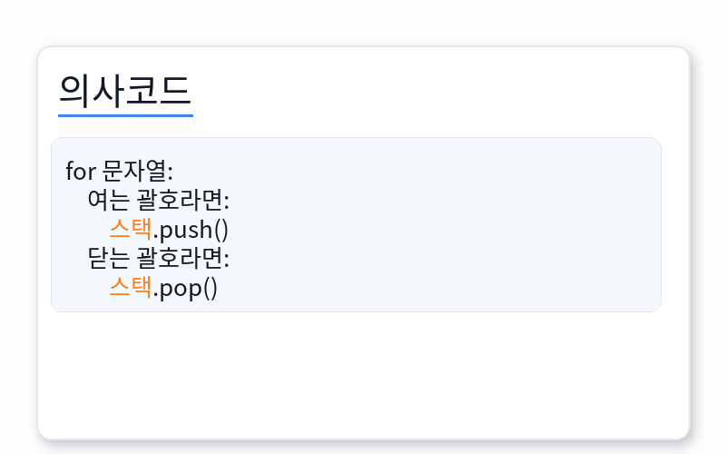

---
id: "STRLv01004"
db_id: 2032
legacy_id: "STRLv01004"
title: "04. [스택 - 4] 괄호"
platform: "doingcoding"
level: "Low"
tags:
  - "STRLv01 Stack 1"
authors:
  - "root"
supported_languages:
  - "C"
  - "C++"
  - "Java"
  - "Python3"
time_limit: "1s"
memory_limit: "256MB"
accepted_user_count: 9
has_hint: "true"
archived_at: "2026-05-22"
---

# 04. [스택 - 4] 괄호

## 1. 문제 설명
괄호 문자열은 두개의 괄호 기호인  "("와 "')"만으로 이루어진 문자열이다. 그 중에 괄호ㅗ의 모양이 바르게 구성된 문자열을 올바른 괄호 문자열이라고 부른다. 한쌍의 괄호 기호인 "()"은 기본 괄호 문자열이다. 만약 x가 올바른 괄호 문자열이라면, ()사이에 x를 넣은 (x)도 올바른 괄호 문자열이 된다. 올바른 괄호 문자열인 x와 y를 결합한 xy도 올바른 괄호 문자열이다. 예를 들어 "(())"와 "()()"은 올바른 괄호 문자열이지만 "))((", "(()", "(()())("은 올바른 괄호 문자열이 아니다.

입력으로 주어진 괄호 문자열이 올바른 괄호 문자열인지 아닌지 판단하는 프로그램을 작성해 주세요.

---

## 2. 입출력 설명

* **입력:**
"("와 ")"로만 이루어진 괄호 문자열이 주어집니다. (문자열의 길이는 2 이상 50 이하)

* **출력:**
올바른 괄호 문자열이면 YES, 아니라면 NO를 출력해 주세요.

---

## 3. 예시
### 예시 입력 1
```text
(())())
```

### 예시 출력 1
```text
NO
```

### 예시 입력 2
```text
(((()())()
```

### 예시 출력 2
```text
NO
```

### 예시 입력 3
```text
(()())((()))
```

### 예시 출력 3
```text
YES
```

### 예시 입력 4
```text
((()()(()))(((())))()
```

### 예시 출력 4
```text
NO
```

### 예시 입력 5
```text
()()()()(()()())()
```

### 예시 출력 5
```text
YES
```

---

## 4. 힌트
알고리즘 코딩대회에서 올바른 괄호~~~ 같은 문제가 나온다면 대부분 스택 문제 입니다.



스택에 무슨 값을 넣는지는 상관없습니다. 값을 '넣었다'만 있으면 됩니다.

팝을 할 수 없다면? "())"같은 문자열은 두 번째 )에서 팝을 할 수 없습니다.

for문이 종료된 후에 스택에 값이 남아있다면? "(()"같은 문자열은 for문 종료 후에 스택에 값이 하나 남아있게 됩니다.

올바른 괄호인지 아닌지 어떻게 스택으로 판단할 수 있나 생각해봅시다.
---

