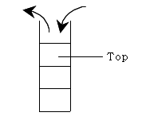
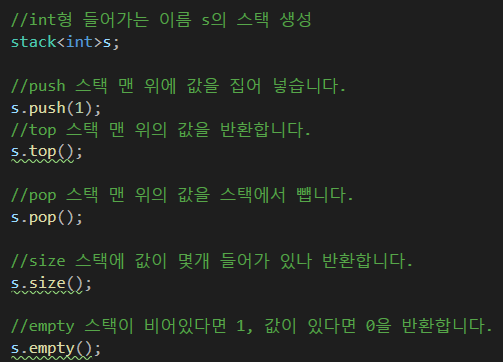
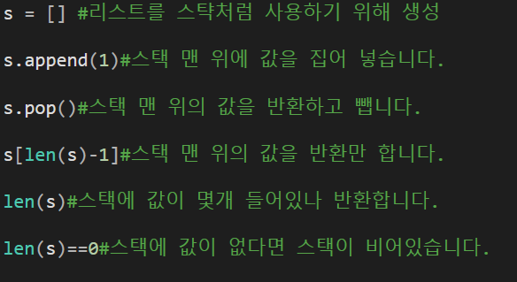
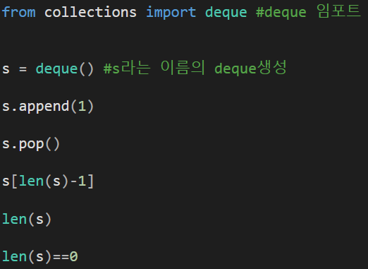
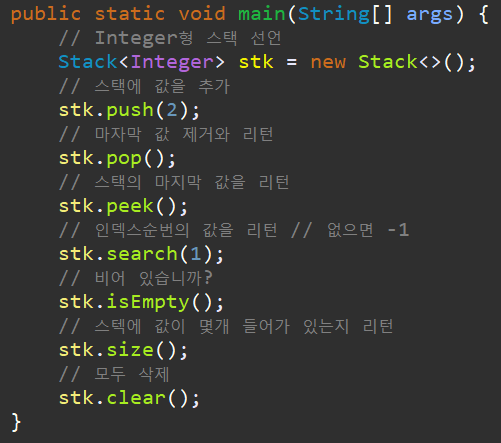

# 01. [스택 - 1] 스택 튜토리얼

## 1. 문제 설명
Stack은 "더미"란 뜻을 가집니다.

책 더미, 신문 더미 등에 사용하는 단어입니다.

책 더미를 예로 들어 봅시다.

책 더미를 쌓았다고 했을 때, 이 책 더미에서 책을 가져오는 가장 정상적인 방법은 제일 위에 있는 책을 가져오는 방식입니다.

다시 말하면 가장 먼저 들어간 책은 가장 나중에 꺼낼 수 있을 것입니다.

이런식으로 자료가 가장 밑에 쌓이고(입력). 자료를 가져올 때(출력)는 가장 위(최근)의 자료를 가져오는 자료구조를 Stack하고 합니다.

이러한 Stack의 특징 때문에 흔히 "FILO(First-In-Last-Out : 선입후출)" 혹은 "LIFO(Last-In-First-Out : 후입선출)"라고 합니다.



스택에서 쓰는 함수는 다음과 같습니다.

스택을 사용하디 위해선 <stack>헤더파일을 선언해야하며, 역시 cpp 헤더파일이라 using namespace std;를 선언해야 합니다.



===== Python =====

파이썬은 기존의 리스트를 간편하게 스택처럼 사용할 수 있습니다.



혹은 deque로 사용 가능합니다.

deque가 무엇인지는 큐의 덱에서 배워보도록 하고, 지금은 해당 자료구조를 스택처럼 간편하게 사용이 가능하다 정도만 알면 됩니다.

선언 이외에는 똑같은 방식으로 삽입 삭제, 탑, 길이를 사용 가능합니다.



===== Java =====



문제

주어진 명령은 다음의 3가지입니다.

1. "i a"는 a라는 수를 스택에 넣습니다. 이때, a는 10,000 이하의 자연수입니다.

2. "o"는 스택에서 데이터를 빼고, 그 데이터를 출력한다. 만약 스택이 비어있으면, "empty"를 출력합니다.

3. "c"는 스택에 쌓여있는 데이터의 수를 출력합니다.

---

## 2. 입출력 설명

* **입력:**
첫 줄에 N이 주어진다. N은 주어지는 명령의 수입니다. (1≤N≤100)

둘째 줄부터 N+1줄까지 N개의 명령이 주어지는데, 한 줄에 하나씩 주어집니다.

* **출력:**
각 명령에 대한 출력 값을 한 줄에 하나씩 출력합니다.

출력내용이 하나도 없는 경우는 주어지지 않습니다.

---

## 3. 예시
### 예시 입력 1
```text
7
i 7
i 5
c
o
o
o
c
```

### 예시 출력 1
```text
2
5
7
empty
0
```

---

## 4. 힌트
(힌트가 없습니다.)
---