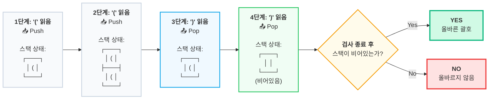

# 02. [스택 - 2] 괄호

## 1. 문제 설명
괄호 문자열은 두개의 괄호 기호인  "("와 "')"만으로 이루어진 문자열이다. 그 중에 괄호의 모양이 바르게 구성된 문자열을 올바른 괄호 문자열이라고 부른다. 한쌍의 괄호 기호인 "()"은 기본 괄호 문자열이다. 만약 x가 올바른 괄호 문자열이라면, ()사이에 x를 넣은 (x)도 올바른 괄호 문자열이 된다. 올바른 괄호 문자열인 x와 y를 결합한 xy도 올바른 괄호 문자열이다. 예를 들어 "(())"와 "()()"은 올바른 괄호 문자열이지만 "))((", "(()", "(()())("은 올바른 괄호 문자열이 아니다.

---

예를 들어, "(())" 가 올바른 문자인지 판별하는 과정은 다음 다이어그램으로 표현할 수 있다:


---

입력으로 주어진 괄호 문자열이 올바른 괄호 문자열인지 아닌지 판단하는 프로그램을 작성해 주세요.

---

## 2. 입출력 설명

* **입력:**
"("와 ")"로만 이루어진 괄호 문자열이 주어집니다. (문자열의 길이는 2 이상 50 이하)

* **출력:**
올바른 괄호 문자열이면 YES, 아니라면 NO를 출력해 주세요.

---

## 3. 예시
### 예시 입력 1
```text
(())())
```

### 예시 출력 1
```text
NO
```

### 예시 입력 2
```text
(((()())()
```

### 예시 출력 2
```text
NO
```

### 예시 입력 3
```text
(()())((()))
```

### 예시 출력 3
```text
YES
```

### 예시 입력 4
```text
((()()(()))(((())))()
```

### 예시 출력 4
```text
NO
```

### 예시 입력 5
```text
()()()()(()()())()
```

### 예시 출력 5
```text
YES
```

---

## 4. 힌트

올바른 괄호 쌍을 찾는 문제는 스택의 **후입선출(LIFO)** 성질을 활용하는 대표적인 문제입니다.

* **여는 괄호 `(`**를 만나면: "나중에 짝을 맞춰야 하니 기억해두자" ➡️ **스택에 Push**
* **닫는 괄호 `)`**를 만나면: "가장 최근에 기억해둔 `(`와 짝을 지어 없애자" ➡️ **스택에서 Pop**

---

### 🖥️ 괄호 검사 흐름 시각화 (Trace)

가장 대표적인 올바른 괄호 예시인 `(())`가 스택을 거쳐 어떻게 최종 판정을 받는지 컴퓨터의 생각 과정을 단계별로 나타낸 그림입니다.



#### ⚠️ 반드시 처리해야 할 예외 상황 (오답 케이스)
코드를 작성할 때 다음 두 가지 상황에서 올바르게 예외 처리를 해야 감점(또는 런타임 에러)을 피할 수 있습니다.

1. **닫는 괄호(`)`)가 나와서 빼려는데 스택이 이미 비어있는 경우 (예: `())`)**
   * 짝을 맞출 `(`가 없다는 뜻이므로, 끝까지 검사할 필요도 없이 즉시 **NO**를 리턴하고 종료해야 합니다. (비어있는 스택에 `pop()` 또는 `top()`을 호출하면 에러가 납니다!)
2. **모든 글자를 다 검사했는데 스택에 `(`가 남아있는 경우 (예: `(()`)**
   * 끝까지 다 검사한 뒤, 스택이 완전히 비어있는지(`stack.empty()`) 꼭 확인해야 합니다. 괄호가 남아있다면 짝을 찾지 못했다는 뜻이므로 **NO**가 됩니다.
