# 02. [스택 - 2] 괄호

## 1. 문제 설명
괄호 문자열은 두개의 괄호 기호인  "("와 "')"만으로 이루어진 문자열입니다. 그 중에 괄호의 모양이 바르게 구성된 문자열을 올바른 괄호 문자열이라고 부릅니다. 한쌍의 괄호 기호인 "()"은 기본 괄호 문자열입니다. 만약 x가 올바른 괄호 문자열이라면, ()사이에 x를 넣은 (x)도 올바른 괄호 문자열이 됩니다. 올바른 괄호 문자열인 x와 y를 결합한 xy도 올바른 괄호 문자열입니다. 예를 들어 "(())"와 "()()"은 올바른 괄호 문자열이지만 "))((", "(()", "(()())("은 올바른 괄호 문자열이 아닙니다.

---


예를 들어, "(())" 가 올바른 문자인지 판별하는 과정은 순서도로 표현할 수 있습니다:



---


입력으로 주어진 괄호 문자열이 올바른 괄호 문자열인지 아닌지 판단하는 프로그램을 작성해 주세요.

---

## 2. 입출력 설명

* **입력:**
"("와 ")"로만 이루어진 괄호 문자열이 주어집니다. (문자열의 길이는 2 이상 50 이하)

* **출력:**
올바른 괄호 문자열이면 YES, 아니라면 NO를 출력해 주세요.

---

## 3. 예시
### 예시 입력 1
```text
(())())
```

### 예시 출력 1
```text
NO
```

### 예시 입력 2
```text
(((()())()
```

### 예시 출력 2
```text
NO
```

### 예시 입력 3
```text
(()())((()))
```

### 예시 출력 3
```text
YES
```

### 예시 입력 4
```text
((()()(()))(((())))()
```

### 예시 출력 4
```text
NO
```

### 예시 입력 5
```text
()()()()(()()())()
```

### 예시 출력 5
```text
YES
```

---

## 4. 힌트

올바른 괄호 쌍을 찾는 문제는 스택의 **후입선출(LIFO)** 성질을 활용하는 대표적인 문제입니다.

* **여는 괄호 `(`** 를 만나면: "나중에 짝을 맞춰야 하니 기억해두자" ➡️ **스택에 Push**
* **닫는 괄호 `)`** 를 만나면: "가장 최근에 기억해둔 `(`와 짝을 지어 없애자" ➡️ **스택에서 Pop**
