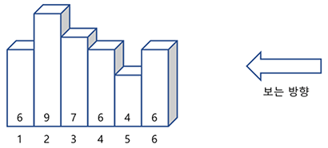
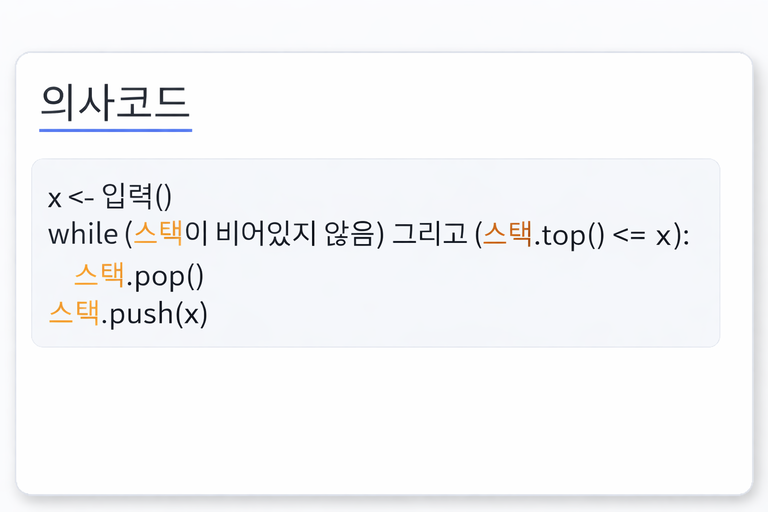

# 04. [스택 - 4] 막대기

## 1. 문제 설명
아래 그럼처럼 높이만 다르고 (같은 높이의 막대기가 있을 수 있음) 모양이 같은 막대기를 일렬로 세운 후,

왼쪽부터 차례로 번호를 붙이다.

각 막대기의 높이는 그림에서 보인 것처럼 순서대로 6,9,7,6,4,6 이다.

일렬로 세워진 막대기를 오른쪽에서 보면 보이는 막대기가 있고 보이지 않는 막대기가 있다.

즉, 지금 보이는 막대기보다 뒤에 있고 높이가 높은 것이 보이게 된다.

예를 들어, 그림과 같은 경우엔 3개(6번,3번,2번)의 막대기가 보인다.



N개의 막대기에 대한 높이 정보가 주어질 때,

오른쪽에서 보아서 몇 개가 보이는지를 알아내는 프로그램을 작성하려고 한다.

---

## 2. 입출력 설명

* **입력:**
표준 입력으로 다음 정보가 주어진다. 첫 번째 줄에는 막대기의 개수를 나타내는 정수 N(2≤N≤100,000)이 주어지고 이어지는 N줄 각각엔 막대기의 높이를 나타내는 정수 h(1≤h≤100,000)가 주어진다.

* **출력:**
표준 출력으로 오른쪽에서 N개의 막대기를 보았을 때, 보이는 막대기의 개수를 출력한다.

---

## 3. 예시
### 예시 입력 1
```text
6
6
9
7
6
4
6
```

### 예시 출력 1
```text
3
```

### 예시 입력 2
```text
5
5
4
3
2
1
```

### 예시 출력 2
```text
5
```

---

## 4. 힌트


스택의 난이도가 높아지면 이러한 유형의 코드를 많이 쓰게 됩니다. 참고하여 풀어보도록 합시다.
---