# 04. [스택 - 4] 막대기

## 1. 문제 설명
아래 그림처럼 높이가 서로 다른 막대기들을 일렬로 세운 뒤, 왼쪽부터 차례로 번호를 붙입니다.

일렬로 세워진 막대기를 오른쪽에서 바라볼 때, 다른 막대기에 가려지지 않고 보이는 막대기의 개수를 구해야 합니다. 즉, 어떤 막대기가 보이려면 그보다 오른쪽에 있는 모든 막대기들보다 높이가 높아야 합니다. 

예를 들어 아래 그림의 경우, 오른쪽에서 바라보면 6번, 3번, 2번 막대기만 보여 총 3개가 보입니다.


막대기의 개수 $N$과 각 막대기의 높이가 순서대로 주어질 때, 오른쪽에서 보았을 때 보이는 막대기의 총 개수를 출력하는 프로그램을 작성하세요.

---

## 2. 입출력 설명

* **입력:**
첫째 줄에 막대기의 개수를 나타내는 정수 $N$이 주어집니다. ($2 \le N \le 100,000$)
이어지는 $N$개의 줄에는 각 막대기의 높이를 나타내는 정수 $h$가 한 줄에 하나씩 주어집니다. ($1 \le h \le 100,000$)

* **출력:**
오른쪽에서 보았을 때 보이는 막대기의 개수를 출력합니다.

---


## 3. 예시
### 예시 입력 1
```text
6
6
9
7
6
4
6
```

### 예시 출력 1
```text
3
```

### 예시 입력 2
```text
5
5
4
3
2
1
```

### 예시 출력 2
```text
5
```

---

## 4. 힌트

오른쪽 끝(가장 최근에 입력된 막대기)에서부터 거꾸로 탐색을 시작하여, 지금까지 마주한 막대기 중 가장 큰 높이를 갱신해 나가며 개수를 세어보세요.



---
