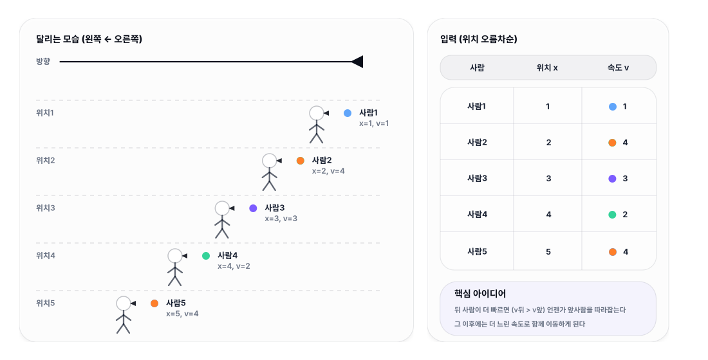

# 05. [스택 - 5] 조깅

## 1. 문제 설명
N명의 사람들이 청라호수공원에서 조깅을 하고 있다. (N은 1이상 100,000이하) 각 사람들은 서로 다른 위치에서 출발하여 서로 다른 속도로 달리고 있습니다.

트랙을 달리는 동안 사람들은 다른 사람들을 지나갈 수 없다. 빠른 사람이 다른 사람을 따라잡으면 느린 사람의 속도에 맞춰서 같이 달리게 돼요. 같이 달리는 사람끼리는 같은 그룹이 됩니다.

사람들이 계속 달리다보면 결국 서로 따라잡는 일 없이 그룹끼리 달리게 됩니다. 조깅을 하는 동안 만들어지는 그룹 수를 계산하는 프로그램을 작성하라.

---

## 2. 입출력 설명

* **입력:**
첫 줄에 사람의 수 N이 입력됩니다.

그 다음 N개 줄에 각 사람들의 시작위치와 속도가 입력된다. 사람들의 위치는 오름차순으로 입력이 돼요.

* **출력:**
사람들이 조깅을 하면서 만들어지는 그룹 수를 출력하라.

---

## 3. 예시
### 예시 입력 1
```text
5
0 1
1 2
2 3
3 2
6 1
```

### 예시 출력 1
```text
2
```

### 예시 입력 2
```text
10
0 1
1 1
3 4
4 7
5 3
9 6
10 6
15 7
19 8
22 9

```

### 예시 출력 2
```text
8
```

---

## 4. 힌트
아래의 방향으로 뛰어간다고 생각하고 문제를 푸셔야 합니다.

막대기는 특정 조건이 성립할 때, 스택에서 팝하는 형식으로 풀었습니다.

반대로 특정 조건이 성립할 때, 스택에 푸시를 하도록 합니다.

---



앞사람을 “절대 추월 못 한다”는 조건 때문에,**최종적으로는 앞쪽 그룹의 속도가 뒤쪽에 ‘상한(최대치)’처럼 작동**합니다.

이 입력을**맨 앞(가장 큰 위치)부터 뒤로**보면서 이렇게 생각하면 됩니다.

* 맨 앞 사람은 혼자 그룹 시작: (5,4) →**현재 그룹 최종속도 = 4**
* 다음 (4,2): 뒤에서 봤을 때**앞 그룹 속도(4)보다 느리거나 같으면**절대 따라잡히지 않으니**새 그룹**  
  →**현재 그룹 최종속도 = 2**
* 다음 (3,3), (2,4): 둘 다**2보다 빠름**→ 언젠가 (4,2)에게**따라잡혀**결국**그 그룹 속도 2로 달림**  
  → 그룹 수 증가 없음
* 마지막 (1,1):**2보다 느림**→ 절대 따라잡히지 않으니**새 그룹**  
  → 그룹 수 +1

그래서 최종 그룹은**3개**입니다.
---