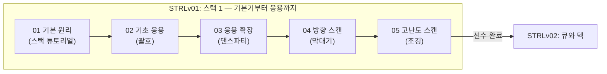

# STRLv01. 스택 1 (Stack 1)

## 단원 개요

본 단원은 자료구조의 핵심 입문 개념인 **스택(Stack)**의 원리적 이해와 기초 응용을 목표로 설계된 과정입니다.  
단순히 스택의 LIFO(Last-In-First-Out) 문법을 코드로 기입하는 것에 그치지 않고, **괄호 매칭(대칭성 검사)** 및 **단조 스캔(방향성 탐색)** 등으로 스택이 활용되는 흐름을 단계적으로 학습하도록 구성하였습니다.

### 수료 역량

본 단원을 완료한 학습자는 다음 역량을 갖추게 됩니다.

| 역량 | 설명 |
|------|------|
| **LIFO 추적** | 데이터의 삽입과 삭제가 한쪽 끝에서만 일어날 때의 데이터 상태 변화 예측 |
| **대칭성 검사** | 중첩되고 짝이 있는 기호(괄호 등)의 정합성을 스택의 Push/Pop으로 검증 |
| **단조성 스캔** | 배열을 역방향 또는 특정 순서로 훑으며 스택을 이용해 불필요한 데이터를 걷어내는 감각 습득 |

> 본 단원의 내용은 이후 **STRLv02. 큐와 덱**, **LV30. DFS/BFS 그래프 탐색** 단원의 직접적인 선수 학습입니다.

---

### 현황 요약

| 구분 | 총 문제 수 | 검증 완료(`[x]`) | 플랫폼 등록 완료 | 비고 |
|------|:---:|:---:|:---:|------|
| **수업 (Classwork)** | 5 | 5 | 5 | 정규화 및 리네임 예정 |
| **숙제 (Homework)** | 3 | 3 | 3 | 정규화 및 리네임 예정 |
| **합계** | **8** | **8** | **8** | |

> **`[x]` 검증 기준**: 예시 입·출력 100% 통과, 강사 교차 검수 완료, YAML 메타데이터 정합성 확인.

---

## 커리큘럼 흐름

---

## 1. 스택 1 — 교육적 스캐폴딩 매핑 테이블

개념의 누적·확장 및 수업과 과제 사이의 유기적인 연계를 고려하여 다음과 같이 순서를 정비합니다.

**Set 순서의 교수 설계 근거:**
* **1단계 (기본 원리):** 스택의 5대 API(Push, Pop, Top, Size, Empty) 동작에 친숙해지고 문자열 처리 및 Fast I/O를 연습합니다.
* **2단계 (대칭성 검사):** 괄호 쌍을 하나씩 지워나가는 시각적 매핑(Trace)을 통해 LIFO 구조가 실제 문제 해결에 쓰이는 메커니즘을 배웁니다.
* **3단계 (방향성 스캔):** 배열을 역방향으로 훑으며 최대값을 갱신하거나 스택에 후보군을 유지하는 단조성(Monotone) 스캔 로직을 체득합니다.

| **Set** | **구분** | **주제** | **문제 제목** | **id** | **db_id** | **Status** | **핵심 학습 포인트** |
| :---: | :--- | :--- | :--- | :--- | :--- | :---: | :--- |
| **01** | 수업 | **기본 원리** | [스택 튜토리얼](02_workspace/STRLv01001_530.md) | `STRLv01001` | **530** | `[x]` | 스택 자료구조의 기본 Push, Pop, Size 명령 처리 |
| | 숙제 | | [독서](02_workspace/SSTRLv01001_1460.md) | `SSTRLv01001` | **1460** | `[x]` | 문자열 push/pop 처리 및 C++ Fast I/O 최적화 |
| **02** | 수업 | **기초 응용** | [괄호](02_workspace/STRLv01002_2032.md) | `STRLv01002` | **2032** | `[x]` | 비어있을 때의 Pop 예외 처리 및 최종 스택 상태 확인 |
| | 숙제 | | [0은 빼!](02_workspace/SSTRLv01002_531.md) | `SSTRLv01002` | **531** | `[x]` | Push 중 0을 만나면 직전 데이터를 Pop하고 최종 합산 |
| **03** | 수업 | **응용 확장** | [댄스파티](02_workspace/STRLv01003_1156.md) | `STRLv01003` | **1156** | `[x]` | 괄호 문자가 다른 형태(`>`, `<`)로 주어지는 다중 쿼리 해결 |
| | 숙제 | | [찰떡궁합](02_workspace/SSTRLv01003_2033.md) | `SSTRLv01003` | **2033** | `[x]` | 문자열 형태(`A`, `Un`)로 치환된 괄호 매칭 문제 |
| **04** | 수업 | **방향 스캔** | [막대기](02_workspace/STRLv01004_2031.md) | `STRLv01004` | **2031** | `[x]` | 우측 끝에서부터 좌측으로 역방향 스캔하며 최대 높이 관리 |
| **05** | 수업 | **고난도 스캔** | [조깅](02_workspace/STRLv01005_1148.md) | `STRLv01005` | **1148** | `[x]` | 우측 끝 주자(최저 속도)부터 그룹을 형성하는 단조 스택 응용 |

---

## 2. 교수 설계 가이드 — 주요 학습 장애 지점 및 대응 전략

학습자들이 스택 단원에서 자주 겪는 학습 장애 지점(Pitfalls)과 강사의 대응 가이드라인입니다.

| 해당 Set | 학습 장애 지점 | 강사 대응 전략 |
|----------|--------------|---------------|
| **01 (튜토리얼)** | 스택이 비어있는 상태에서 `top()`이나 `pop()`을 호출하여 런타임 에러(Segment Fault)가 발생함 | 데이터를 조회하거나 뺄 때는 **반드시 `empty()` 체크를 선행**하는 것을 철칙으로 강조 |
| **02 (괄호)** | 여는 괄호와 닫는 괄호의 총 개수만 일치하면 올바른 괄호라고 오해함 (예: `)(`, `())(` 등) | 순서가 맞지 않아 스택이 비었을 때 pop을 시도하는 상황을 Visual Trace로 시연하여 반증 |
| **02 (괄호)** | 반복문이 종료된 후 스택이 다 비었는지 체크하는 것을 누락함 (예: `(()` ➡️ YES 판정 오류) | "검사 종료 후에도 스택에 남은 `(`가 있는지" 마지막 안전장치(`empty()`)의 필요성 학습 유도 |
| **04 (막대기)** | 앞에서부터 스캔하려고 하여 $O(N^2)$ 이상의 불필요한 탐색 코드를 작성함 | "오른쪽 끝에서 볼 때"라는 조건에 착안하여 **역방향으로 훑으며 최대값을 갱신**하는 $O(N)$ 최적화 발상 제시 |

---

## 3. 데이터 관리 정책

본 단원의 콘텐츠 파일은 다음 규칙에 따라 관리합니다.

| 항목 | 규칙 |
|------|------|
| **파일 명명** | `STRLv01XXXX_{db_id}.md` (수업) / `SSTRLv01XXXX_{db_id}.md` (숙제) |
| **01_raw_scraped** | 크롤링된 최초 원본 보관소로, 절대 직접 수정하지 않고 보존함 |
| **02_workspace** | 실제 편집 및 정규화(ID 및 파일명 재배치)를 진행하는 유일한 작업 영역 |
| **메타데이터 정합성** | 각 `.md` 파일의 YAML `id`, `db_id`, `legacy_id`는 이 README 테이블과 반드시 일치시킴 |
| **인덱스 갱신** | 워크스페이스의 변경 내용을 반영하기 위해 `scripts/generate_content_indexes.py` 실행 필수 |
| **정합성 체크** | `scripts/check_sets_index.ps1`을 실행하여 문제 수와 db_id 중복 여부를 최종 검증 |
