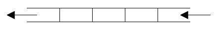
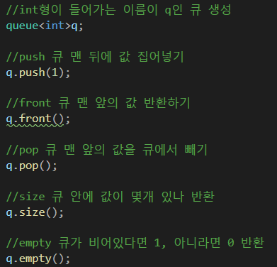
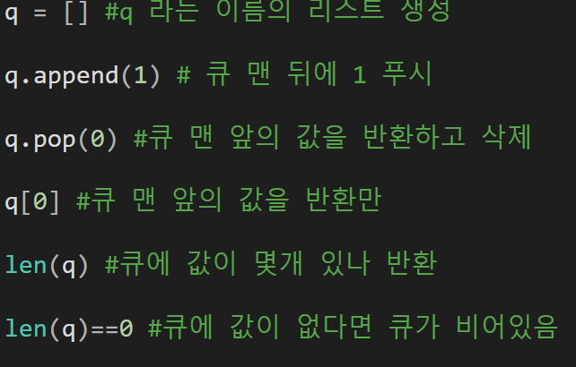
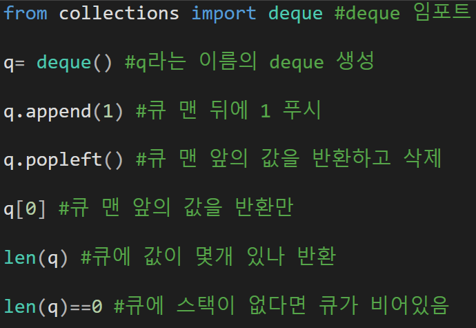
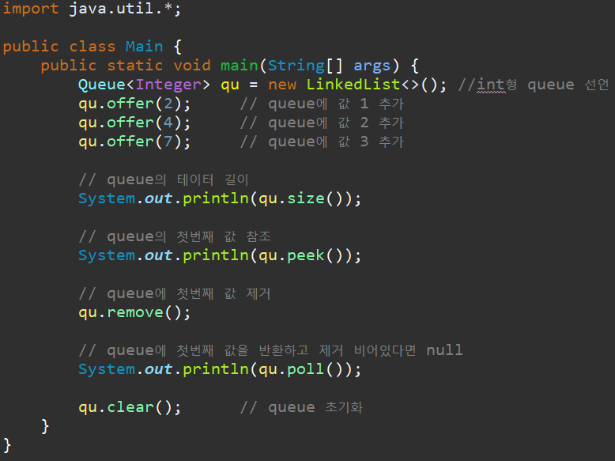

---
id: "STRLv02001"
db_id: 542
legacy_id: "STRLv02001"
title: "01. [큐 - 1] 큐 튜토리얼"
platform: "doingcoding"
level: "Mid"
tags:
  - "Lv31 STL Queue"
  - "STRLv2 Queue"
  - "STRLv02 Queue 1"
authors:
  - "root"
supported_languages:
  - "C"
  - "C++"
  - "Golang"
  - "Java"
  - "Python2"
  - "Python3"
time_limit: "1s"
memory_limit: "256MB"
accepted_user_count: 102
has_hint: "false"
archived_at: "2026-05-26"
---

# 01. [큐 - 1] 큐 튜토리얼

## 1. 문제 설명
큐는 먼저 들어온 데이터가 먼저 출력됩니다.

이러한 구조를 선입선출(FIFO - First In First Out)이라고 합니다.

이러한 큐 자료구조는 보통 우리의 생활에서는 매우 일상적인 자료구조 입니다.

큐 자료구조의 형태를 가장 흔히 볼 수 있는 게 “줄서기”가 될 것 입니다.

은행 창구에서 줄을 서거나, 버스를 기다리기 위해서 줄을 설 경우 가장 먼저 줄을 선 사람이 가장 먼저 은행 업무를 처리하거나,

버스를 타게 됩니다.(새치기 하는 경우는 생각하지 말자)



큐는 <queue>헤더파일에 있고, 역시 using namespace std;를 선언해야 합니다.

큐에서 쓰는 함수는 다음과 같습니다.



파이썬 큐

리스트로 구현



덱으로 구현



Java



문제

1. 주어지는 명령은 다음의 3가지 입니다.

2. "i a"는 a라는 수를 큐에 넣습니다. 이때, a는 10,000 이하의 자연수입니다.

3. "o"는 큐에서 데이터를 출력하고, 그 데이터를 뺍니다. 만약 큐가 비어있으면, "empty"를 출력합니다.

4. "c"는 큐에 있는 데이터의 수를 출력합니다.

---

## 2. 입출력 설명

* **입력:**
첫줄에 N이 주어진다. N은 주어지는 명령어의 수입니다.(1≤N≤100) 둘째 줄부터 N+1줄까지 한 줄에 하나씩 명령이 주어집니다.

* **출력:**
각 명령에 대한 출력 값을 한 줄에 하나씩 출력합니다.

---

## 3. 예시
### 예시 입력 1
```text
7
i 7
i 5
c
o
o
o
c
```

### 예시 출력 1
```text
2
7
5
empty
0
```

---

## 4. 힌트
(힌트가 없습니다.)
---

