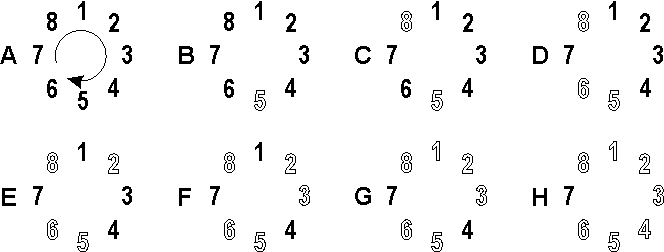

---
id: "SSTRLv02003"
db_id: 2039
legacy_id: "SSTRLv02003"
title: "03. [큐 - 3] 행운상 정하기"
platform: "doingcoding"
level: "Low"
tags:
  - "Bronze"
  - "USACO"
  - "SSTRLv02 Queue 1"
authors:
  - "root"
supported_languages:
  - "C"
  - "C++"
  - "Java"
  - "Python3"
time_limit: "2s"
memory_limit: "512MB"
accepted_user_count: 5
has_hint: "false"
archived_at: "2026-05-28"
---

# 03. [큐 - 3] 행운상 정하기

## 1. 문제 설명
농부 존은 N마리의 송아지 (1<=N<=2300) 중 한 마리를 골라 부드럽고 맛있고 영양가있는 아주 정말 진짜 엄청나게 특별한 건초 덩어리를 주려고 합니다.

농부 존에겐 정수 리스트가 주어지는데 이 리스트의 길이는 L(1<=N<=10)이다. 이 리스트는 1...N으로 이루어진 제거 순서를 나타냅니다.

만약 N마리 송아지들이 원형으로 정렬되어 있다면 제거 카운트는 1번 송아지부터 시작합니다.리스트의 L1번째 송아지가 제거됩니다. 다음 송아지부터 시작해서, L2만큼 센 후에 또 제거할 송아지를 찾습니다. 송아지들의 줄과 제거 순서는 모두 원형이며 순회합니다.  
예를 들어, 송아지 8마리와 {5, 3} 제거 리스트를 생각해 봅시다. 초기엔 송아지들이 아래 그림 A처럼 원형으로 배열되어 있습니다. 제거는 송아지를 없애는 게 아니라 추첨 리스트에서 뺀다는 뜻입니다. 송아지는 안전합니다.



1번에서 시작하여 5마리를 세고, 5번 송아지를 제거합니다. (그림 B), 그 다음 3마리를  세고 세 번째 송아지, 8번 송아지를 제거합니다. (그림 C)

제거 리스트가 끝나서 다시 처음부터 시작합니다. 송아리 5마리를 세고 다섯 번째 송아지를 제거합니다. (그림 D) 이 송아지는 6번입니다.

3마리를 세고 2번 송아지를 제거합니다. (그림 E), 제거 리스트를 다시 처음부터 시작해서 5마리를 세고 다섯 번째 송아지를 제거합니다. 3번 송아지 입니다. (그림 F) 3마리를 세고 1번 송아지를 제거합니다. (그림 G), 마지막으로 5마리를 세고 4번 송아지를 제거합니다. (그림 H)  
마지막에 남는 송아지는 7번 송아지 입니다.

---

## 2. 입출력 설명

* **입력:**
첫 번째 줄엔 송아지 수 N과 제거 리스트의 길이 L이 주어집니다.

두 번째 줄엔 숫자 L개가 입력됩니다. L1번부터 Ln번까지 순서대로 송아지를 제거합니다.

* **출력:**
마지막에 남은 정말 진짜 엄청나게 눈물이 날 정도로 감동적이면서 특별한 건초 덩어리를 받을 송아지의 번호를 출력해 주세요.

---

## 3. 예시
### 예시 입력 1
```text
8 2
5 3
```

### 예시 출력 1
```text
7
```

---

## 4. 힌트
(힌트가 없습니다.)
---

