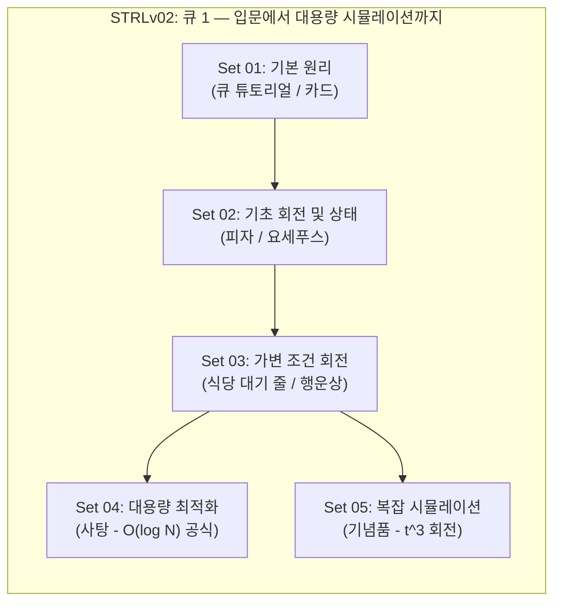

# STRLv02_Queue1 원본 크롤링 데이터 교육 품질 평가 리포트

본 문서는 [StepCode 교육적 품질 표준](../pedagogical_standards.md)에 따라 `STRLv02_Queue1/01_raw_scraped` 디렉터리 내의 원본 문제 파일 8개를 분석하고, 교육 설계 관점에서의 스캐폴딩 구조와 품질 적합성을 검토한 리포트입니다.

---

## 1. 큐 1 (Queue 1) — 교육적 스캐폴딩 및 커리큘럼 설계 평가

현재 수집된 8개의 문제(수업 5개, 숙제 3개)는 자료구조 **큐(Queue)**의 입문 단계로서 매우 훌륭한 계단식 난이도 흐름을 보여주고 있습니다. 개념의 점진적 확장과 학습 포인트의 중첩을 고려하여 다음과 같이 **5개 Set 구조**로 정렬하고 매핑할 수 있습니다.

### 큐 1 커리큘럼 흐름도

### 큐 1 교육적 스캐폴딩 매핑 테이블

| **Set** | **구분** | **주제** | **문제 제목** | **파일명 (예정)** | **db_id** | **추정 티어** | **핵심 학습 포인트** |
| :---: | :--- | :--- | :--- | :--- | :---: | :---: | :--- |
| **01** | 수업 | **기본 원리** | 큐 튜토리얼 | `STRLv02001_542.md` | **542** | 🟢 **티어 1** | 큐의 선입선출(FIFO) 개념 이해, 기본 API(Push, Pop, Size, Empty) 동작 학습 |
| | 숙제 | | 카드 | `SSTRLv02001_2034.md` | **2034** | 🟡 **티어 2** | 큐의 맨 앞 원소를 버리거나 맨 뒤로 다시 보내는 기본 회전 연산 및 단일 데이터 시뮬레이션 |
| **02** | 수업 | **기초 회전 및 상태** | 올림피아드 피자 | `STRLv02002_2036.md` | **2036** | 🟡 **티어 2** | 요소별 요구량(남은 피자 수)을 들고 있는 튜플/구조체 데이터 기반 상태 저장 큐 시뮬레이션 |
| | 숙제 | | 요세푸스 문제 | `SSTRLv02002_543.md` | **543** | 🟡 **티어 2** | $k$번째 사람을 반복적으로 제외하는 원형 큐 회전 시뮬레이션 ($O(N \cdot k)$) |
| **03** | 수업 | **가변 조건 회전** | 식당 입구 대기 줄 | `STRLv02003_2035.md` | **2035** | 🟡 **티어 2** | 대기 학생 수의 최댓값(Peak) 및 최댓값 도달 시점의 맨 뒤 요소(Rear)를 실시간으로 추적하는 기법 |
| | 숙제 | | 행운상 정하기 | `SSTRLv02003_2039.md` | **2039** | 🟡 **티어 2** | 고정 간격이 아닌 주기적으로 주어지는 $L$개의 제거 리스트 간격으로 원형 큐 회전 시뮬레이션 |
| **04** | 수업 | **대용량 최적화** | 사탕 | `STRLv02004_2038.md` | **2038** | 🔴 **티어 3** | $N \le 7,100,000$의 대규모 입력에서 $k=2$ 요세푸스 문제 해결 (수학적 닫힌 공식 유도 또는 $O(N)$ 최적화) |
| **05** | 수업 | **복잡 시뮬레이션** | 기념품 | `STRLv02005_2037.md` | **2037** | 🔴 **티어 3** | $t$단계마다 $t^3$번 회전하는 시뮬레이션 ($N \le 5000$, 모듈러 연산 활용 최적화) |

### 1.1 난이도 곡선 및 스캐폴딩 구조 분석

본 커리큘럼은 학습자의 인지적 과부하를 방지하기 위해 다음과 같은 세밀한 스캐폴딩 구조로 조정되었습니다.

1.  **순서 조정 (Set 01 숙제 ↔ Set 02 수업 스왑)**:
    *   **기존 안**: Set 01 숙제에 `올림피아드 피자`가 배치되고, Set 02 수업에 `카드`가 배치되어 있었습니다.
    *   **문제점**: `올림피아드 피자`는 단순한 큐 연산 외에도 각 원소의 개별 상태(남은 피자 수)와 학생 번호를 튜플/구조체로 함께 추적해야 하는 복잡한 구조입니다. 반면 `카드`는 단일 정수형 데이터의 순수 회전과 버리기 동작만 구현하면 되는 훨씬 가벼운 문제입니다. 따라서 기존 배치 순서는 "더 복잡한 상태 관리를 가벼운 큐 회전보다 먼저 배우는" 난이도 역전 현상이 있었습니다.
    *   **개선 안**: Set 01 숙제로 `카드`를 배정하여 튜토리얼 직후 가장 순수한 형태의 큐 삽입/삭제 흐름을 복습하게 하고, Set 02 수업으로 `올림피아드 피자`를 배정하여 "큐 원소에 개별 상태 정보를 담아 관리하는 방법"을 단계적으로 학습할 수 있게 교정했습니다.
2.  **회전 연산의 계단식 확장**:
    *   `카드` (버리고 1칸 뒤로) ➔ `요세푸스` (고정 $k$칸 뒤로) ➔ `행운상 정하기` (주기적으로 변하는 $L$개의 가변 칸 뒤로) 순으로 확장되어, 학습자가 원형 회전 시뮬레이션의 동작 방식을 점진적으로 일반화해 나갈 수 있습니다.
3.  **최적화 유도의 단계별 설계**:
    *   **Set 04 (`사탕`)**: 시뮬레이션의 한계치($N \le 7,100,000$)를 보여줌으로써, Queue 문제 카테고리에 있음에도 불구하고 역설적으로 "수학적 규칙성을 활용한 $O(1)$ 공식"의 필요성을 직면하도록 만듭니다.
    *   **Set 05 (`기념품`)**: 다시 시뮬레이션으로 복귀하되, $t^3$과 같은 연산량 폭증 조건에서 모듈러 연산(`%`)을 통해 실제로 필요한 회전수만 구하는 "시뮬레이션 최적화 기술"을 가르치며 큐 단원을 마무리합니다.

---

## 2. 문제별 품질 진단 및 개선 권장사항

`pedagogical_standards.md`에 명시된 핵심 기준을 토대로, 각 문제의 위반 사항 및 정규화(Normalization) 단계에서 수행해야 할 구체적인 수정 방향을 정의합니다.

### 🟢 Set 01 (기본 원리)

#### 1. [수업] 큐 튜토리얼 (`STRLv02001_542.md`)
*   **추정 티어**: **티어 1 (개념 입문형)**
*   **평가 결과**: 🔴 **부적합**
*   **품질 표준 위반 사항**:
    1.  **개념 중립성 (⭐3) 위반**: 본문에 C++ 전용 헤더 `<queue>`, `using namespace std;` 문구가 텍스트로 적혀 있으며, C++, Java, Python의 코드 스크린샷 이미지 4개가 첨부되어 특정 언어 편향과 난잡한 시각 구조를 보임.
    2.  **시각 자료 (⭐1) 미흡**: 원리를 설명하는 이미지로 제공된 파일들이 개념도보다 코드 캡처 위주임.
    3.  **예제 추적 (⭐2) 누락**: 7개 명령어로 구성된 예제 1의 큐 내부 상태 및 출력 과정을 한 단계씩 보여주는 추적 과정이 없음.
    4.  **힌트 전략 (⭐4) 부재**: `has_hint: "false"`로 설정되어 있으며 힌트가 비어 있음.
*   **개선 방향**:
    *   언어 종속적 코드 스크린샷을 모두 제거하고, 큐의 추상 자료형(ADT) 관점의 개념 및 연산 설명으로 대체.
    *   큐의 FIFO(선입선출) 구조를 보여주는 간단한 Mermaid 다이어그램 추가.
    *   예제 1의 `i 7`, `i 5`, `c`, `o`, `o`, `o`, `c` 동작에 대해 큐 내부 상태(Front/Rear)와 출력의 변화를 담은 **텍스트 블록 기반 예제 추적** 추가.
    *   `has_hint: "true"`로 변경하고, 빈 큐에서 `o`를 시도할 때 `empty` 체크가 필요함을 암시하는 힌트 작성.

#### 2. [숙제] 올림피아드 피자 (`SSTRLv02001_2036.md`)
*   **추정 티어**: **티어 2 (표준 연습형)**
*   **평가 결과**: 🟡 **부분 적합**
*   **품질 표준 위반 사항**:
    1.  **슬림화 우선주의 위반**: 힌트 섹션에 예제 1에 대한 상세한 줄글 기반 추적 정보가 나열되어 있어 지문이 뚱뚱해짐.
    2.  **힌트 남용**: 표준 연습형(티어 2)의 힌트는 생략하거나 1줄 팁으로 처리해야 함에도 장황한 흐름을 상세 설명함.
*   **개선 방향**:
    *   `has_hint: "false"`로 수정하고 힌트 섹션을 `(힌트가 없습니다.)`로 대체하거나, 실수하기 쉬운 경계값 처리용 1줄 팁만 남김.
    *   *1줄 팁 예시*: "큐에 '참가자 번호'와 '필요한 피자 조각 수'를 함께 묶어 저장하고, 1조각씩 나누어준 뒤 아직 배부르지 않다면 다시 큐의 맨 뒤에 넣는 방식으로 시뮬레이션해 보세요."

---

### 🟡 Set 02 (기초 회전)

#### 3. [수업] 카드 (`STRLv02002_2034.md`)
*   **추정 티어**: **티어 2 (표준 연습형)**
*   **평가 결과**: 🟢 **매우 적합**
*   **분석**:
    *   `has_hint: "false"`, `(힌트가 없습니다.)` 설정이 규정에 완벽히 부합함.
    *   설명이 간결하고 예시를 통해 핵심 규칙을 3초 이내에 직관적으로 파악할 수 있도록 서술됨.

#### 4. [숙제] 요세푸스 문제 (`SSTRLv02002_543.md`)
*   **추정 티어**: **티어 2 (표준 연습형)**
*   **평가 결과**: 🟡 **부분 적합**
*   **품질 표준 위반 사항**:
    1.  **슬림화 우선주의 위반**: 본문 설명이 위키백과의 정의를 그대로 인용하여 줄바꿈이 난무하고 장황함. 초심자 입장에서 줄글 가독성이 떨어짐.
*   **개선 방향**:
    *   위키백과의 건조하고 학술적인 정의를 덜어내고, 문제를 요약하여 **5줄 이내**로 대폭 슬림화.
    *   *개선안*: "1번부터 N번까지 N명의 사람이 원을 이루어 앉아 있습니다. 특정 위치부터 시작하여 매번 k번째 사람을 순서대로 제외합니다. 모든 사람이 제외될 때까지 이 과정을 반복하며, 제외되는 사람들의 번호를 순서대로 출력하는 프로그램을 작성하세요."

---

### 🟡 Set 03 (가변 조건 회전)

#### 5. [수업] 식당 입구 대기 줄 (`STRLv02003_2035.md`)
*   **추정 티어**: **티어 2 (표준 연습형)**
*   **평가 결과**: 🔴 **부적합**
*   **품질 표준 위반 사항**:
    1.  **슬림화 우선주의 위반**: 본문이 식사 이벤트에 대해 너무 장황하게 반복 설명함 (약 15줄).
    2.  **힌트 과적**: 힌트 섹션에 5단계 연산에 대한 줄글 추적이 구구절절 설명되어 있음.
*   **개선 방향**:
    *   본문 요구사항을 슬림화하여 줄임.
    *   `has_hint: "false"`로 수정하고 힌트 섹션을 `(힌트가 없습니다.)`로 대체하거나, 최댓값 및 최소 번호 갱신 시의 조건 비교에 관한 1줄 팁 제공.
    *   *1줄 팁 예시*: "대기 학생 수의 최댓값을 갱신할 때마다, 현재 대기 줄의 맨 뒤에 있는 학생의 번호도 함께 기록해 두세요. 최댓값이 같을 경우의 예외 조건 처리도 잊지 마세요."

#### 6. [숙제] 행운상 정하기 (`SSTRLv02003_2039.md`)
*   **추정 티어**: **티어 2 (표준 연습형)**
*   **평가 결과**: 💀 **치명적 결함 (부적합)**
*   **품질 표준 위반 사항**:
    1.  **본문 유실**: `## 1. 문제 설명` 섹션이 **완전히 비어 있음**. 크롤링 과정에서 유실된 것으로 판단됨.
*   **개선 방향 (복원 필요)**:
    *   예제와 입출력 조건(송아지 수 $N$, 제거 간격 리스트 $L$, 남는 송아지 $7$)을 분석한 결과, 아래와 같은 동작을 수행하는 문제로 복원해야 함.
    *   *복원 본문 가안*: 
        > $1$번부터 $N$번까지 $N$마리의 송아지가 원형으로 앉아 있습니다. 이 송아지들을 주기적으로 제외하여 마지막 한 마리를 남깁니다.  
        > 제거하는 간격은 $L$개의 정수로 이루어진 리스트 $P = [P_1, P_2, \dots, P_L]$에 따라 정해집니다.  
        > 첫 번째 단계에서는 시작 송아지부터 시계 방향으로 $P_1$번째 송아지를 제외합니다. 그 다음 제외된 송아지의 바로 다음 송아지부터 시작하여 $P_2$번째 송아지를 제외합니다. 이처럼 $P$의 값들을 순환적으로($P_1, P_2, \dots, P_L, P_1, P_2, \dots$) 적용하며 송아지를 제외합니다.  
        > 마지막에 남는 송아지의 번호를 출력하는 프로그램을 작성하세요.

---

### 🔴 Set 04 & Set 05 (대용량 및 심화)

#### 7. [수업] 사탕 (`STRLv02004_2038.md`)
*   **추정 티어**: **티어 3 (심화 도전형)**
*   **평가 결과**: 🟡 **부분 적합**
*   **품질 표준 위반 사항**:
    1.  **힌트 내 가독성 불량**: 힌트의 각 라운드 생존자 목록에 의미 없는 다중 공백(`1   3 4 5 6 7`)이 섞여 레이아웃이 어색함.
    2.  **티어에 맞지 않는 힌트**: $N \le 7,100,000$으로 일반적인 큐 시뮬레이션 시 시간/메모리 초과(TLE/MLE)가 발생할 수 있는 특수한 문제임. 단순한 예제 값 추적보다는, 문제를 해결할 수 있는 힌트(수학적 성질 또는 최적화 방향)가 제시되어야 함.
*   **개선 방향**:
    *   다중 공백이 포함된 힌트 레이아웃 정돈.
    *   힌트에서 요세푸스 문제의 $k=2$일 때의 유명한 규칙성(2진수 비트 시프트 또는 $N = 2^a + L$ 형태의 분할)을 스스로 생각할 수 있도록 유도하는 수학적 힌트로 변경.
    *   *힌트 개선 예시*:
        > ### 💡 힌트 1 (방향) — 인접한 매개변수의 결과 관찰하기
        > N=1부터 N=8까지 직접 손으로 풀어보며 정답 번호의 규칙을 표로 정리해 보세요. N이 2의 거듭제곱(2, 4, 8 등)일 때 정답이 항상 1이 되는 성질을 발견할 수 있습니다.
        > ### 💡 힌트 2 (수학적 성질) — 2의 거듭제곱 분할
        > $N$을 $2^a + L$ ($0 \le L < 2^a$) 형태로 표현할 수 있다면, 마지막에 남는 번호는 $2L + 1$이 됩니다. 이 공식을 이용하면 대용량의 $N$에 대해서도 $O(1)$ 시간에 문제를 해결할 수 있습니다.

#### 8. [수업] 기념품 (`STRLv02005_2037.md`)
*   **추정 티어**: **티어 3 (심화 도전형)** 또는 **티어 2 (표준 연습형)**
*   **평가 결과**: 🟡 **부분 적합**
*   **품질 표준 위반 사항**:
    1.  **설명 장황**: t단계의 세제곱 수 처리 규칙이 다소 이해하기 까다롭게 적혀 있음.
    2.  **힌트 부재**: `has_hint: "false"`로 힌트가 완전히 생략되어 있으나, 세제곱 수만큼 실제로 회전하면 $O(N \cdot t^3) \approx O(N^4)$가 되어 시간 초과가 발생하므로, 모듈러 연산(`%`)을 사용하라는 힌트가 전략적으로 필요함.
*   **개선 방향**:
    *   지문 설명을 다듬어 $t$단계마다 회전 횟수가 $t^3$이라는 규칙을 명확하게 함.
    *   `has_hint: "true"`로 변경하고, 회전 횟수를 현재 큐의 크기로 나눈 나머지(`%`)만큼만 실제로 회전시키는 최적화 팁을 제공.
    *   *힌트 개선 예시*:
        > ### 💡 힌트 1 (최적화) — 큰 수의 회전 방지
        > t단계에서 $t^3$만큼 큐를 회전시켜야 합니다. 하지만 $t$가 커지면 $t^3$은 매우 큰 수가 되어 모든 회전을 시뮬레이션하면 시간 초과가 납니다.  
        > 큐의 크기가 $M$일 때, $K$번 회전하는 것과 $K \pmod M$번 회전하는 것은 결과가 완전히 동일함을 이용해 회전 횟수를 줄여 보세요.

## 3. 파이썬(Python) 1초 내 해결 가능성 진단 및 대응 전략

인터프리터 언어 특성상 Python은 대용량 및 다중 루프 회전 연산에서 C/C++ 대비 상당한 오버헤드를 가집니다. 각 문제의 입력 크기(Constraint)와 시간 제한(Time Limit)을 고려한 Python 1초 내 통과 가능성을 진단합니다.

| 문제 번호 | 문제 제목 | 시간 제한 | 입력 제한 | Python 1초 통과 여부 | 진단 및 권장 최적화 구현 방식 |
| :---: | :--- | :---: | :--- | :---: | :--- |
| **STRLv02001** | 큐 튜토리얼 | 1.0초 | $N \le 100$ | 🟢 **가능** | 명령어 수가 극히 적으므로 `collections.deque`로 단순 시뮬레이션 시 0.001초 미만 소요. |
| **SSTRLv02001** | 올림피아드 피자 | 2.0초 | $N \le 1000$ | 🟢 **가능** | 최대 피자 조각 수 100이므로 최악의 경우에도 연산 횟수 $10^5$ 이하. deque 사용 시 0.05초 이내 통과 가능. |
| **STRLv02002** | 카드 | 1.0초 | $N \le 1000$ | 🟢 **가능** | 연산 횟수 $O(N)$으로 매우 가벼움. deque 사용 시 0.01초 이내 통과 가능. |
| **SSTRLv02002** | 요세푸스 문제 | 1.0초 | $N \le 10000$ | 🟢 **가능 (조건부)** | 단순 `q.append(q.popleft())` 형태의 큐 회전으로 $k \approx N$인 최악의 경우 $O(N \cdot k) \approx 10^8$ 루프가 돌아 Python에서 **TLE(시간 초과)** 위험이 높음. ➔ **대응안**: 리스트의 `% len(list)` 인덱싱 및 `pop(idx)`을 활용한 $O(N^2)$ 방식(0.05초 이내 완료) 또는 `collections.deque.rotate()` 함수 활용을 추천하는 팁 제공 필요. |
| **STRLv02003** | 식당 입구 대기 줄 | 1.0초 | $N \le 100,000$ | 🟢 **가능** | 단순 선형 순회 $O(N)$ 시뮬레이션이므로 deque 사용 시 0.05초 내 통과 가능. |
| **SSTRLv02003** | 행운상 정하기 | 2.0초 | $N, L \le 10000$ 추정 | 🟢 **가능 (조건부)** | 요세푸스 문제와 동일하게 단순 루프 기반 회전 시 TLE 가능성이 있음. ➔ **대응안**: 리스트 인덱싱 `% len(list)` 및 `pop(idx)` 방식 유도를 위한 1줄 팁 제공. |
| **STRLv02004** | 사탕 | 2.0초 | $N \le 7,100,000$ | 🔴 **불가능 (우회 필요)** | $N = 7.1 \times 10^6$에 달하는 데이터에 대해 $O(N)$ 시뮬레이션을 단순 루프로 돌릴 경우 C/C++은 통과하나 Python은 인터프리터 오버헤드로 인해 **무조건 TLE**가 발생함. ➔ **대응안**: $O(1)$의 수학적 닫힌 공식(Josephus $k=2$ 해법: $2(N - 2^{\lfloor \log_2 N \rfloor}) + 1$)을 사용하도록 힌트 및 팁 설계가 필수적임. |
| **STRLv02005** | 기념품 | 2.0초 | $N \le 5000$ | 🟢 **가능 (조건부)** | 단계별 회전 수가 $t^3$으로 무척 크므로 $t^3 \pmod M$ 최적화가 필수적이며, 매 단계 큐를 수동으로 회전하면 TLE 위험이 존재함. ➔ **대응안**: 리스트 인덱스 연산 및 `pop()` 사용, 혹은 C로 작성된 `deque.rotate()` 함수 사용을 가이드. |

---

## 4. 정규화 및 리팩토링 로드맵 제안

향후 `02_workspace`를 생성하고 콘텐츠를 정제할 때 아래 순서에 따라 작업을 진행할 것을 권장합니다.

1.  **디렉터리 생성 및 복사**:
    *   `STRLv02_Queue1/02_workspace/` 디렉터리를 생성하고, `01_raw_scraped` 내의 파일들을 이관 및 파일명 표준화 (`STRLv02XXXX_{db_id}.md` / `SSTRLv02XXXX_{db_id}.md`).
2.  **SSTRLv02003 (행운상 정하기) 본문 복원**:
    *   완전히 유실된 1번 문제 설명 섹션을 위에서 정립한 기획안에 근거해 마크다운으로 재작성.
3.  **STRLv02001 (큐 튜토리얼) 전면 개편**:
    *   언어 종속적 이미지 제거 및 Mermaid 다이어그램 도입.
    *   예제 1 추적(Trace) 텍스트 추가 및 `has_hint: "true"` 설정.
4.  **지문 슬림화 및 힌트 다이어트**:
    *   티어 2 문제들(`올림피아드 피자`, `요세푸스`, `식당 대기 줄`)의 지문을 10줄 이내로 간결화하고, 장황한 예제 추적 힌트를 제거/1줄 팁으로 대체.
5.  **티어 3 최적화 문제 힌트 보강**:
    *   `사탕` ($O(1)$ 요세푸스 공식 유도 힌트) 및 `기념품` (모듈러 연산 힌트) 보강.
6.  **빌드 및 최종 검증**:
    *   `generate_content_indexes.py` 및 `check_sets_index.ps1`을 통한 데이터 유효성 및 정합성 검사 완료.

