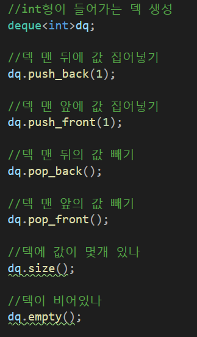
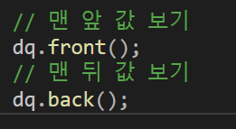

---
id: "STRLv03001"
db_id: 1087
legacy_id: "STRLv03001"
title: "01. [덱 - 1] 덱 튜토리얼"
platform: "doingcoding"
level: "Mid"
tags:
  - "Lv31 STL Queue"
  - "STRLv3 Dequeue"
  - "STRLv03 Dequeue 1"
authors:
  - "root"
supported_languages:
  - "C"
  - "C++"
  - "Golang"
  - "Java"
  - "Python2"
  - "Python3"
time_limit: "1s"
memory_limit: "256MB"
accepted_user_count: 95
has_hint: "false"
archived_at: "2026-05-26"
---

# 01. [덱 - 1] 덱 튜토리얼

## 1. 문제 설명
덱은 삽입과 삭제를 앞 뒤 모두 할 수 있는 자료구조입니다. 큐에서 push로 큐 맨 뒤에 삽입, pop으로 큐 맨앞에 삭제 하던 것 처럼 할 수 있습니다. 덱에 넣을 땐 push\_back()또는 push\_front()로 앞 뒤 어디에 넣을 지 정할 수 있으며 pop도 역시 pop\_back()또는 pop\_front()로 위치를 정할 수 있습니다. 덱 역시 큐 헤더파일에 있으며 deque<자료형>이름;으로 선언합니다.





간단한 문제로 덱을 익혀봅시다.

맨 처음에 명령 수 t가 들어옵니다. (t는 100이하 자연수)

이후 명령이 들어옵니다.

명령이 1로 시작하면 맨 뒤에 값을 집어 넣습니다. 옆에 넣을 정수가 공백으로 구분되어 주어집니다.

명령이 2로 시작하면 맨 앞에 값을 집어 넣습니다. 역시 넣을 정수가 공백으로 구분되어 주어집니다.

명령이 3으로 시작하면 맨 뒤의 값을 뺍니다. 값이 없다면 아무것도 안합니다.

명령이 4로 시작하면 맨 앞의 값을 뺍니다. 값이 없다면 아무것도 안합니다.

명령을 전부 수행하고 나서 덱에 들어있는 원소를 앞에서부터 출력하는 프로그램을 작성해주세요. 덱이 비어있다면 -1을 출력해주세요.

---

## 2. 입출력 설명

* **입력:**
맨 처음에 명령 수 t가 들어옵니다. (t는 100이하 자연수)

이후 명령이 들어옵니다.

명령이 1로 시작하면 맨 뒤에 값을 집어 넣습니다. 옆에 넣을 정수가 공백으로 구분되어 주어집니다.

명령이 2로 시작하면 맨 앞에 값을 집어 넣습니다. 역시 넣을 정수가 공백으로 구분되어 주어집니다.

명령이 3으로 시작하면 맨 뒤의 값을 뺍니다.

명령이 4로 시작하면 맨 앞의 값을 뺍니다.

* **출력:**
명령을 전부 수행하고 나서 덱에 들어있는 원소를 앞에서부터 출력하는 프로그램을 작성해주세요. 덱이 비어있다면 -1을 출력해주세요.

---

## 3. 예시
### 예시 입력 1
```text
10
1 7
1 10
4
3
2 4
4
2 3
2 10
3
2 9

```

### 예시 출력 1
```text
9 10 
```

### 예시 입력 2
```text
5
2 4
1 4
3
4
3
```

### 예시 출력 2
```text
-1

```

---

## 4. 힌트
(힌트가 없습니다.)
---

