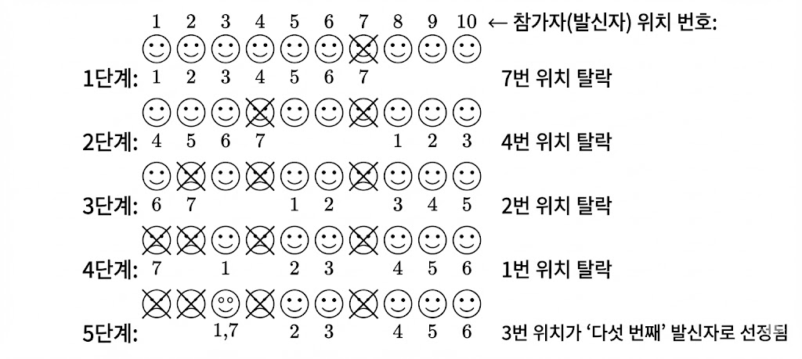
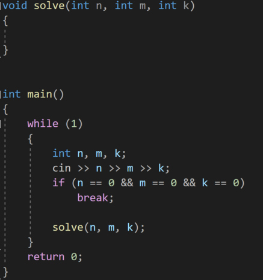
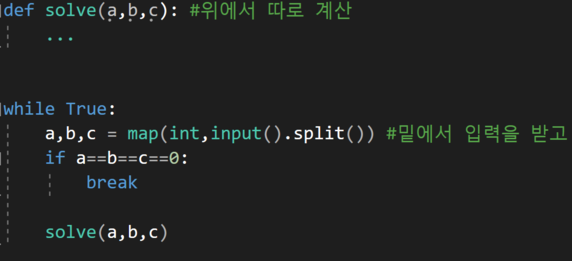

---
id: "STRLv04001"
db_id: 2056
legacy_id: "STRLv04001"
title: "01. [자료구조 종합 - 01] 라디오 추첨"
platform: "doingcoding"
level: "Low"
tags:
  - "STRLv04 자료구조 초급 1-1"
  - "STRLv04 자료구조 브론즈 1-1"
authors:
  - "root"
supported_languages:
  - "C"
  - "C++"
  - "Java"
  - "Python3"
time_limit: "1s"
memory_limit: "256MB"
accepted_user_count: 11
has_hint: "true"
archived_at: "2026-05-26"
---

# 01. [자료구조 종합 - 01] 라디오 추첨

## 1. 문제 설명
지역 라디오 방송국이 전화 경품 추천을 진행하고 있습니다. DJ J-Z Plus가 경품 추첨을 관리합니다. DJ는 무작위로 "다섯 번째 전화가 걸려오면 그 사람이 경품을 받을 기회를 얻습니다" 라고 말합니다. 이때 스위치보드에는 수십 명의 전화가 걸려오고, DJ는 단순히 다섯 번째 전화를 고를 수도 있지만 모두가 거의 동시에 전화를 하기 때문에 조금 더 복잡한 방식으로 추첨을 하려고 합니다. 추가로 무작위 숫자, 예를 들어 7을 고르고 전화가 오면 매 일곱 번째 전화를 제거합니다. 4명의 전화가 제거되면, 그 후에 또 일곱 번째를 선택하여 "다섯 번째" 전화가 되게 합니다. 아래 그림은 이 방법이 어떻게 진행되는지를 나타냅니다. 이 경우 위치 3번의 전화가 "다섯 번째" 전화로 선택되었습니다.



물론 "다섯 번째" 전화와 숫자 7은 무작위로 고른 거라 매번 바뀔 수 있습니다. 주어진 정보를 통해 어떤 전화가 경품에 당첨되는지 계산하는 프로그램을 작성해주세요.

---

## 2. 입출력 설명

* **입력:**
각 테스트케이스는 3개의 정수 n,m,k로 구분되어 주어집니다. n은 전화를 건 사람의 수, m는 제거되는 전화 순서, k는 최종적으로 선택될 사람입니다. 위 그림에서는 n=10 m = 7, k = 5입니다. 각 정수들은 모두 200 이하입니다. 입력의 마지막 줄은 0 0 0이 입력됩니다.

* **출력:**
각 테스트케이스에 대해 K번째로 선택된 경품을 받을 사람을 출력해 주세요.

---

## 3. 예시
### 예시 입력 1
```text
10 7 5
20 1 20
0 0 0
```

### 예시 출력 1
```text
3
20
```

---

## 4. 힌트
앞으로는 이런 테스트케이스가  여러 개 들어오는 문제를 자주 보게될 것입니다.

C++



Python



무한반복을 돌리면서 입력을 받고, 입력값이 맞는지 확인합니다.

맞으면 그 함수를 따로 호출하여 계산합니다.

함수로 분리할 필요는 없지만 이렇게 계산을 하면 편합니다.
---

