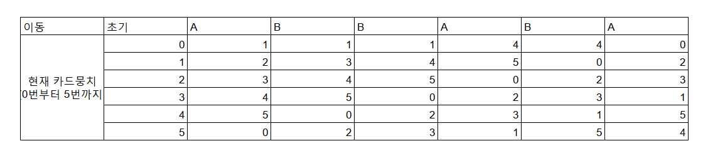

---
id: "STRLv04004"
db_id: 2059
legacy_id: "STRLv04004"
title: "04. [자료구조 종합 - 04] 카드"
platform: "doingcoding"
level: "Low"
tags:
  - "STRLv04 자료구조 초급 1-1"
  - "STRLv04 자료구조 브론즈 1-1"
authors:
  - "root"
supported_languages:
  - "C"
  - "C++"
  - "Java"
  - "Python3"
time_limit: "2s"
memory_limit: "512MB"
accepted_user_count: 7
has_hint: "false"
archived_at: "2026-05-26"
---

# 04. [자료구조 종합 - 04] 카드

## 1. 문제 설명
기훈이는 새로 개장한 두잉 카지노 포커테이블에서 일하는 카드 딜러입니다. 그는 독특한 개인적인 습관으로, 덱을 섞을 때 두 가지 방식으로 카드를 이동시킵니다.

* A: 맨 위 카드를 뽑아 맨 아래로 보낸다.
* B: 맨 위에서 두 번째 카드를 뽑아 맨 아래로 보낸다.

처음에 기훈이는 m장의 카드를 가지고 있고(참고로 m은 일반적인 플레잉카드덱 52장보다 더 클 수 도 있습니다.) 카드들은 연속적으로 번호가 매겨져 있습니다. 맨 위의 카드가 0장 맨 아래 카드가 m-1번입니다. 다음과 같은 이동방법이 있다고 합시다.

ABBABA

아래 표는 각 단계의 이동이 적용된 후 덱 상태를 보여줍니다.



이동 문자열과 값 k가 주어지면 (단 0<k<m-1) 전체 이동을 모두 적용한 후에, 덱 맨 위에서 k-1번째, k번째, k+1번째 카드가 무엇인지 계산하는 프로그램을 작성해 주세요. 맨 위의 카드를 0번째 카드로 취급합니다. 위의 예시에서 k=3이라면 정답은 3 1 5가 됩니다.

---

## 2. 입출력 설명

* **입력:**
카드의 수 m, 알고 싶은 위치 k,(0 < k < m − 1, 3 ≤ m ≤ 1,000,000),그리고 카드를 섞는 방법을 나타내는 문자열이 주어집니다. 마침표.로 문자열의 끝을 나타냅니다. 이동은 1이상 100,000의 문자열입니다.

* **출력:**
전체 이동을 모두 적용한 뒤에 k-1번째, k번째, k+1번째 카드를 공백으로 구분하여 출력하여 주세요.

---

## 3. 예시
### 예시 입력 1
```text
6 3 ABBABA.
```

### 예시 출력 1
```text
3 1 5
```

---

## 4. 힌트
(힌트가 없습니다.)
---

