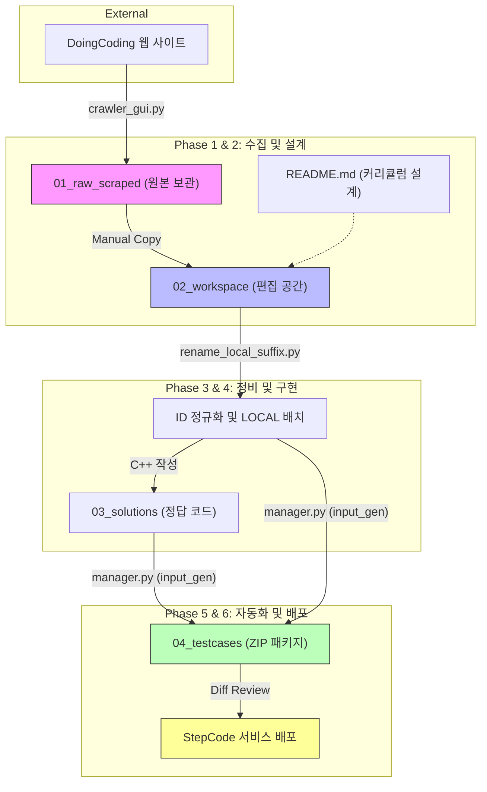

# StepCode DoingCoding — 콘텐츠 제작 파이프라인 (E2E Guide)

이 문서는 DoingCoding 플랫폼의 문제를 수집하여 학습 콘텐츠로 변환하고, 테스트케이스를 자동 생성 및 패키징하는 **전체 워크플로우의 표준**을 정의합니다.

> **원칙**: 100% 자동화보다 **사람이 최종 확인하는 반자동화**를 목표로 합니다. 각 단계는 다음 단계로 넘어가기 전에 사람이 검토합니다.

---

## 📌 전체 흐름 요약

콘텐츠 제작은 수집부터 배포까지 총 6단계의 파이프라인으로 구성됩니다.

### 1️⃣ 시각적 워크플로우 (Data Lifecycle)


### 2️⃣ 단계별 상세 개요 (Phase Overview)
| 단계 | 명칭 | 주요 활동 | 핵심 도구/파일 | 산출물 (Outputs) |
|:---:|:---:|:---|:---|:---|
| **Phase 1** | **데이터 수집** | 웹 사이트의 문제 데이터를 로컬로 크롤링 | `crawler_doingcoding_gui.py` | `01_raw_scraped/` 원본 MD |
| **Phase 2** | **워크스페이스 구성** | 원본 복사 및 전체 커리큘럼 설계 | `README.md` 매핑 테이블 | 작업용 MD 파일 세트 |
| **Phase 3** | **파일 정비** | ID 정규화 및 신규(LOCAL) 문제 배치 | `rename_local_suffix.py` | `02_workspace/` 내 표준화된 MD |
| **Phase 4** | **정답 구현** | 모든 문제에 대한 C++ 모범 답안 작성 | C++ (scanf/printf) | `03_solutions/` 내 CPP 파일 |
| **Phase 5** | **테스트 자동화** | 입력 생성 및 입출력 쌍 ZIP 패키징 | `manager.py`, `input_gen.py` | `04_testcases/` 내 ZIP 파일 |
| **Phase 6** | **검증 및 배포** | 최종 QA 및 웹 업로드 (Diff 기반) | (예정) 웹 업로더 도구 | 웹 플랫폼 실제 서비스 반영 |

---

## Phase 1: 데이터 수집 (Crawling)

**Step 1**: DoingCoding 크롤러를 실행하여 원본 문제 데이터를 수집합니다.

- **도구**: `Resources/tools/crawler_doingcoding_gui.py`
- **출력 위치**: `{단원}/01_raw_scraped/` (크롤러 설정을 통해 해당 폴더로 직접 출력하거나, 전역 `scraped/` 폴더에서 복사해옵니다.)
- **보존 원칙**: `01_raw_scraped` 내의 파일은 원본 데이터로 간주하며, 절대 직접 수정하지 않습니다.

> ⚠️ 크롤러는 JavaScript 렌더링 및 로그인이 필요하므로, 반드시 GUI 모드(`crawler_doingcoding_gui.py`)로 실행합니다.

---

## Phase 2: 워크스페이스 구성 (Setup)

**Step 2**: 크롤링 결과를 편집 가능한 작업 공간으로 복사합니다.

- `01_raw_scraped`에 저장된 모든 MD 파일을 **복사**(이동 아님)하여 `02_workspace/`에 붙여넣습니다.
- 이 과정에서 문제의 메타데이터나 내용을 1차적으로 훑어보며 상태를 점검합니다.

**Step 3**: 커리큘럼 매핑 테이블(`README.md`)을 작성하고 교육 설계를 수행합니다.

- 어떤 문제를 어떤 순서로 배치할지, 어떤 신규 문제(`_LOCAL`)를 추가할지 계획합니다.
- 테이블 컬럼 구성: `ID | db_id | Legacy/Source | Status | 핵심 포인트`
- **교육적 스캐폴딩(Scaffolding) 설계**: 문제의 배치 순서는 개념이 점진적으로 누적·확장되는 체계적인 스캐폴딩 구조로 설계되어야 합니다.
  - *예시 (switch-case 단원)*: `기본 1:1 정수 분기 → break 누락(fall-through) 현상 관찰 → default 예외 처리 → 정수 case 그룹핑 → 문자(char) 분기 → 복합 응용`
  - 이전 문제에서 익힌 기초 지식이나 실수가 다음 문제에서 자연스럽게 디딤돌(응용/예외 처리 등)이 될 수 있도록 난이도와 개념 결합도를 점증 설계합니다.
- **초심자/심화 학습자 공동 학습 효율 극대화 및 꼼수 방지 원칙 (Bypass Prevention)**:
  - 지문에 단순히 *"단순 출력이 아닌 실제 변수/배열의 값을 바꾸어 출력하시오"* 와 같은 텍스트 제약을 다는 것은 학습 의욕이 없거나 숙련되지 않은 초심자에게 우회(Hardcoded print)를 조장하고 학습 효율을 낮춥니다.
  - 따라서 **입출력 설계 자체를 논리적으로 고안하여 인메모리 연산의 실제 작동 과정을 강제**합니다.
    - *Swap(값 교환)*: 고정된 위치를 스왑하는 대신, 교환할 인덱스 $A, B$를 런타임에 입력받게 하여 임시 변수 `temp` 논리를 정석대로 코딩하게 강제합니다. (하드코딩 출력 불가)
    - *Mutation(값 변경)*: 배열 전체를 가공하여 출력하는 대신, 가공이 끝난 후 조회할 인덱스 $K$를 입력받아 그 방의 값만 확인하는 식의 입출력을 설계하여 실제 인플레이스(In-place) 값 갱신을 강제합니다.
    - *다중 배열*: 복잡한 정렬이나 중첩 루프 대신, 단일 루프로 해결되면서도 두 개의 배열을 일대일 병렬 순회하는 직관적인 실용 문항(예: 자격증 과락 검사 등)을 배치하여 입문자의 연산 시각을 넓힙니다.
  - 이 원칙은 초심자에게는 한 문제 안에서 논리의 동작 원리를 정확히 이해시키고, 심화 학습자에게는 불필요한 꼼수 시도를 막아 코딩 집중도를 높임으로써 양쪽 모두의 학습 효율을 비약적으로 향상시킵니다.
- **수업 5 : 숙제 3 (5:3) 문항 압축 가이드라인**:
  - 학습자의 인지 피로도 분산 및 콘텐츠 품질 집중을 위해, 한 단원의 문항은 **수업용(ALL) 최대 5문항, 숙제용(SALL) 최대 3문항**으로 압축하여 설계합니다.
  - 단순 조건 변경(예: 홀수 출력 $\rightarrow$ 짝수 출력) 세트는 통합 또는 생략하여 중복을 최소화합니다.
  - 수업용 ALL은 개념 입문부터 최종 마스터까지의 5단계 계단을 형성하며, 숙제용 SALL은 그 중 인지 도약이 크고 확실한 검증이 요구되는 3개 지점의 복습 과제형으로 매핑합니다.
- **교육적 위계 점검**: 주제(Topic)가 실제 파일 내용과 일치하는지 반드시 확인합니다.
  - (이 단계의 불일치를 방치하면, 나중에 v05-Step15처럼 오기가 발생합니다.)
- **복합 개념 단원의 폴더 분리 규칙 (Option A)**:
  - 선형 재귀(v05)와 구조적 재귀(v10)처럼 한 대단원 내에서 난이도 및 개념 장벽 격차가 큰 경우에는 작업 공간을 `02_workspace_v05/`, `02_workspace_v10/`과 같이 하위 디렉토리로 구조화하여 분리합니다.
  - 이를 통해 각 하위 개념별로 가독성 높게 문항을 격리 보관할 수 있습니다.

---

## Phase 3: 파일 정비 (File Management)

**Step 4 (1차)**: 크롤링된 기존 문제들의 파일명과 front-matter를 새 ID 체계로 교체합니다.

- 파일명 형식: `ALLv{단원번호}{순번}_{db_id}.md` (예: `ALLv05001_519.md`)
- YAML front-matter의 `id`, `db_id`, `legacy_id`를 테이블과 100% 일치시킵니다.
- **YAML 따옴표 규칙**: string 값(`id`, `title`, `platform`, `level`, `time_limit`, `memory_limit`, `has_hint`, `archived_at` 등)은 반드시 큰따옴표(`"..."`)로 감쌉니다. 숫자형인 `db_id`와 `accepted_user_count`는 따옴표 없이 기입합니다.
- **자동화 도구**: `scripts/rename_local_suffix.py` (링크 업데이트도 포함)

**Step 5 (2차)**: `README.md`에 계획된 신규 문제들을 배치합니다.

- 파일명 형식: `ALLv{단원번호}{순번}_LOCAL.md` (예: `ALLv05015_LOCAL.md`)
- front-matter의 `db_id`는 `LOCAL`로, `legacy_id`는 `null`로 설정합니다.
- 이 문제들은 강사가 직접 문제 설명과 입출력 예시를 작성합니다.

> 💡 **테이블 렌더링 호환성 가이드 (우회법)**
> 웹 렌더링 환경에서 표준 Markdown Table(표) 형식이 깨지거나 올바르게 보이지 않는 현상이 있을 수 있습니다. 따라서 요일이나 계절 매핑처럼 일대일/일대다 대응 관계를 지문에 표현할 때는 표 형식을 지양하고, 화살표(`→`)를 사용한 **그룹화된 글머리 기호 목록** 형태로 통일하여 서술합니다.
> - *작성 예시*:
>   ```markdown
>   - **1 ~ 5** (월요일 ~ 금요일) → `평일`
>   - **6 ~ 7** (토요일 ~ 일요일) → `주말`
>   ```

---

## Phase 4: 정답 코드 작성 (Solution Writing)

**Step 6**: 신규(`_LOCAL`) 문제들에 대한 정답 코드를 작성하여 `03_solutions/`에 저장합니다.

- 파일명은 대응하는 MD 파일과 동일하게 사용합니다. (예: `ALLv05015_LOCAL.cpp`)
- **코드 컨벤션**:
  - 반드시 **표준 입출력(stdin/stdout)** 사용 (`scanf`, `printf`). 파일 입출력 사용 금지.
  - Python 문제: C-style 포맷 문자열 사용 (`'%d x %d = %d' % (n, i, val)`)
  - 코드의 논리적 오류 여부를 손으로 한 번 이상 추적하여 검증 후 저장합니다.

---

## Phase 5: 테스트케이스 자동화 (Test Case Production)

**Step 7**: 각 문제별 입력 생성기(`input_gen.py`)를 작성하고 `manager.py`를 실행합니다.

### 7a. 입력 생성기 작성 (`temp/{ID}/input_gen.py`)

`input_gen.py`는 케이스 번호(`sys.argv[1]`)를 인자로 받아 **해당 케이스의 입력값 1개**를 stdout으로 출력하는 스크립트입니다.

```python
import sys, random

case_num = int(sys.argv[1]) if len(sys.argv) > 1 else 1

if case_num == 1:
    print(1)             # 경계값 최소
elif case_num == 15:
    print(1000)          # 경계값 최대
else:
    print(random.randint(1, 1000))  # 랜덤 케이스
```

> ⚠️ `input_gen.py`는 MD 파일을 직접 파싱하지 않습니다. 강사가 MD의 제약 조건을 읽고, 해당 조건을 코드로 **수동 구현**합니다. (자동화 방향은 Step 10 참조)

**Edge Case 설계 원칙**:
- Case 1: 최소값 / 빈 입력
- Case 2~3: 문제 설명의 예시 입력
- Case 15 (마지막): 최대값
- Case 4~14: `random` 모듈로 다양한 범위 커버

### 7b. manager.py 실행

```powershell
# 특정 문제, 15개 케이스 생성 및 ZIP 패키징
python scripts/manager.py {ID}_LOCAL 15

# 예시
python scripts/manager.py ALLv05015_LOCAL 15
```

`manager.py` 내부 동작:
1. `03_solutions/{ID}.cpp` → `temp/{ID}/solution.exe` 컴파일 (MinGW `g++` 사용)
2. `input_gen.py {i}` 실행 → `{i}.in` 파일 생성
3. `solution.exe < {i}.in > {i}.out` 실행
4. `{1..15}.in` + `{1..15}.out` → `04_testcases/{ID}_LOCAL.zip` 압축

> ℹ️ MinGW 경로는 `manager.py` 내부에 고정(`C:\MinGW\bin\g++.exe`)되어 있습니다. 환경이 다르면 이 경로를 수정해야 합니다.

---

## Phase 6: 검증 및 배포 (QA & Deployment) — 예정

### Step 8: ZIP 무결성 검증

생성된 ZIP 파일의 샘플을 추출하여 다음을 확인합니다.

```python
import zipfile
with zipfile.ZipFile("04_testcases/ALLv05015_LOCAL.zip") as zf:
    print(zf.namelist())  # 30개 파일 (15 in + 15 out) 확인
    # 입력이 제약 조건 내에 있는지 확인
    # 출력이 수학적으로 기대값과 일치하는지 확인
```

### Step 9: 교육 품질 검토 및 리포트 작성

- 문제 본문의 설명이 초심자에게 충분히 이해 가능한지 검토하고, 힌트, 예시, 제약 조건의 누락 여부를 점검합니다.
- [pedagogical_standards.md](../pedagogical_standards.md) 가이드에 맞춰 분석한 품질 검사 결과를 `workspace_evaluation_report.md` 파일로 작성하여 단원 폴더 내에 저장합니다.
- **리포트 필수 포함 항목**:
  1. **단원 전체의 5개 Set 구성 및 난이도 곡선(스캐폴딩) 분석**
  2. **수업 문제(ALL)와 숙제 문제(SALL) 간의 관계 및 학습 연계 매핑 다이어그램** (Mermaid 등을 활용하여 선수 학습 교량과 복습 포인트를 시각화)
  3. **문제별 품질 진단 결과** (추정 티어, 규정 위반 사항, 개선 방향)
  4. **파이썬(Python) 1초 내 해결 가능성 진단 및 대응 전략**
  5. **정규화 및 리팩토링 로드맵 체크리스트**
- 필요시 개념 구조 시각 자료를 추가로 작성하여 적용을 계획합니다.


### Step 10: 웹 업로드 및 배치 처리 (반자동화)

- 웹 DB의 현재 상태와 로컬 파일의 메타데이터(프론트매터 등)를 파싱하여 검증합니다.
- 대량의 문제를 업로드(배치 처리)할 때는 데이터 오염 방지를 위해 **"수동 승인형 순차 큐(Queue)"** 방식을 사용하여 안전성을 확보합니다.
- **배치 처리 동작 흐름**:
  1. GUI에서 업로드할 여러 개의 MD 파일(또는 폴더 전체)을 선택하여 작업 큐에 담습니다.
  2. 파이썬 엔진(`uploader_engine`)이 첫 번째 문제의 데이터를 웹 폼에 자동으로 주입합니다.
  3. **[안전장치]** 데이터 주입이 끝나면 엔진이 즉시 작업을 일시 정지(Pause)하고, GUI에 확인 팝업을 띄웁니다.
  4. 관리자가 웹 브라우저 화면을 통해 올바르게 주입되었는지 1차로 눈으로 검수하고, 이상이 없으면 웹사이트의 `저장` 버튼을 **직접 클릭**합니다.
  5. 저장이 완료되면 GUI 팝업의 `[다음 문제로]` 버튼을 눌러 다음 문제의 데이터 주입을 이어갑니다.
- **웹 업로드 시의 경로 추론 룰 (Option A 정합성)**:
  - 웹 업로더 GUI(`uploader_gui.py`)는 문제 지문 마크다운 파일의 경로를 기반으로 테스트케이스 zip 파일 경로를 다음과 같이 치환하여 자동 검출합니다:
    `inferred_zip = path.replace("02_workspace", "04_testcases").replace(".md", ".zip")`
  - 만약 워크스페이스가 하위 디렉토리(예: `02_workspace_v05`)로 분리된 복합 단원일 경우, 업로더가 정상적으로 매핑할 수 있도록 **`04_testcases` 하위에도 동일한 이름의 폴더(`04_testcases_v05`, `04_testcases_v10`)를 생성하여 zip 파일을 분배**해야 합니다. (그렇지 않으면 경로 추론 에러가 발생합니다.)
- **목표**: 대량 작업 시 관리자의 피로도를 최소화하면서도, "최종 저장은 사람이 눈으로 직접 보고 누른다(Human-in-the-loop)"는 원칙을 고수하여 치명적인 데이터 오염 및 업로드 사고를 원천 차단합니다.
---

## 📁 단원 표준 디렉토리 구조

단원은 단일 개념 단원(기본 구조)과 하위 폴더 분리가 필요한 복합 개념 단원(Option A 구조)으로 구분하여 운영합니다.

### 1) 기본 구조 (단일 개념 단원)
```
{단원명}/                   # 예: LV06_조건/
├── 01_raw_scraped/         # 크롤링된 원본 파일 (절대 수정 금지)
├── 02_workspace/           # 편집 가능한 문제 MD 파일
│   ├── ALLv05001_519.md    # 기존 크롤링 문제 (db_id 있음)
│   └── ALLv05015_LOCAL.md  # 신규 제작 문제 (db_id=LOCAL)
├── 03_solutions/           # 정답 CPP 파일 (하위 분리 금지)
│   └── ALLv05015_LOCAL.cpp
├── 04_testcases/           # 최종 ZIP 패키지
│   └── ALLv05015_LOCAL.zip
```

### 2) Option A 구조 (복합 개념 단원)
```
{단원명}/                   # 예: LV26_재귀/
├── 01_raw_scraped/         # 크롤링된 원본 파일
├── 02_workspace_v05/       # 선형 재귀용 작업 MD 파일 세트
├── 02_workspace_v10/       # 구조적 재귀용 작업 MD 파일 세트
├── 03_solutions/           # 정답 CPP 파일 (★절대 분리 금지 - 단일 폴더 고정)
│   ├── ALLv05005_LOCAL.cpp
│   └── ALLv10001_LOCAL.cpp
├── 04_testcases_v05/       # 선형 재귀 배포용 ZIP 패키지 (업로더 연계 필수)
│   └── SALLv05003_LOCAL.zip
├── 04_testcases_v10/       # 구조적 재귀 배포용 ZIP 패키지 (업로더 연계 필수)
│   └── SALLv10001_LOCAL.zip
├── scripts/
│   ├── manager.py          # 컴파일 + 실행 + 패키징 자동화
│   └── rename_local_suffix.py
├── temp/                   # 빌드 중간 산출물
└── README.md               # 커리큘럼 전체 매핑 테이블
```
*(주의: `03_solutions`는 `manager.py` 내부 rglob 컴파일 엔진이 고정된 디렉토리 구조를 전제하므로 절대로 하위 폴더를 쪼개서는 안 됩니다. 반면 `04_testcases`는 `uploader_gui.py`의 자동 치환 경로 추론 규칙과 동기화되어야 하므로 워크스페이스 명칭에 맞춰 폴더를 반드시 동일 분리해야 합니다.)*


---

## 🚫 규칙 요약 (Mandates)

| 항목 | 규칙 |
|---|---|
| **파일/폴더명** | 영문 소문자 snake_case만 허용. 공백·한글 금지. |
| **LOCAL 접미사** | 웹 DB 미등록 신규 문제에만 사용. `db_id: LOCAL`. |
| **코드 입출력** | stdin/stdout 기반. 파일 I/O 사용 금지. |
| **Python 포맷** | C-style 포맷 문자열 (`'%d' % n`) 사용. |
| **원본 보존** | `scraped/` 폴더는 절대 수정하지 않음. |
| **커리큘럼 정합성** | README 주제(Topic)와 파일 내용 일치 여부를 Step 3에서 반드시 검증. |
| **YAML 따옴표** | string 값은 큰따옴표(`"..."`) 필수. `db_id`, `accepted_user_count`만 예외(숫자형). |
| **테이블 우회** | 웹 렌더링 호환성을 위해 표(Table) 대신 화살표(`→`)를 사용하는 그룹화된 목록 형식 권장. |
| **교육 스캐폴딩** | 문제 배치 순서는 개념이 점진적으로 누적·확장되는 스캐폴딩 구조로 설계 필수. |
| **꼼수 방지 설계** | 단순 지문 제약 대신 가변 인덱스 입력 등을 활용해 실제 인메모리 연산(Swap, Mutation)을 강제하도록 입출력을 설계합니다. |
| **초심자 예외 격리** | 경계값 초과 오류를 유발하는 인덱스 예외 처리가 아닌 직관적인 통계(Max-Min 차이 등)로 극값 탐색 난이도를 제어합니다. |
| **5:3 문항 압축** | 세트당 수업용(ALL) 최대 5문제, 숙제용(SALL) 최대 3문제로 가볍게 설계. |
| **03_solutions 고정** | `manager.py` 컴파일 빌드를 위해 솔루션 디렉토리는 절대 하위 분할 금지. |
| **04_testcases 분리** | `uploader_gui.py` 업로드 경로 추론을 위해 워크스페이스 분리 명칭과 반드시 1:1 일치. |

