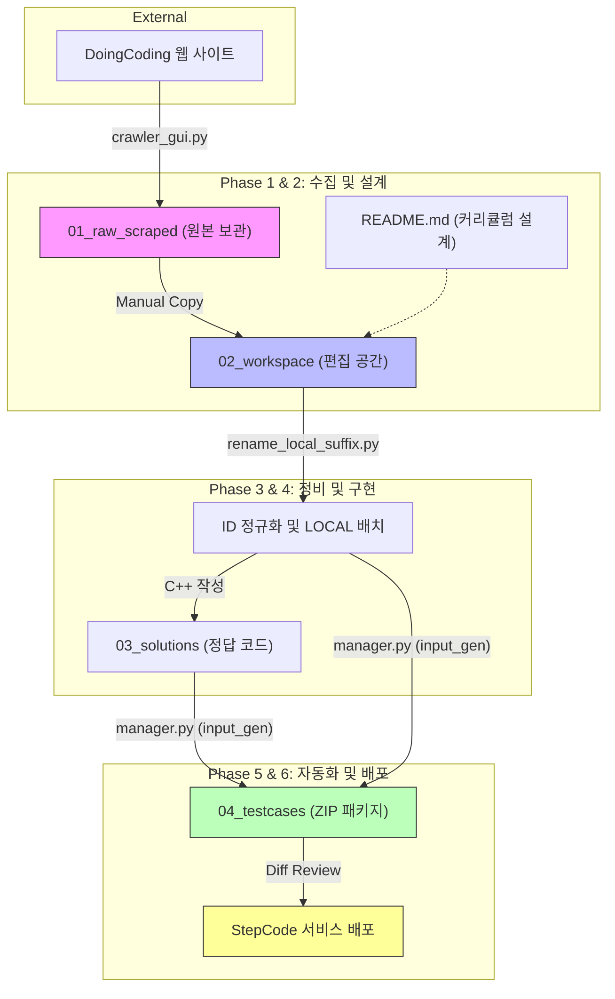

# StepCode DoingCoding — 콘텐츠 제작 파이프라인 (E2E Guide)

이 문서는 DoingCoding 플랫폼의 문제를 수집하여 학습 콘텐츠로 변환하고, 테스트케이스를 자동 생성 및 패키징하는 **전체 워크플로우의 표준**을 정의합니다.

> **원칙**: 100% 자동화보다 **사람이 최종 확인하는 반자동화**를 목표로 합니다. 각 단계는 다음 단계로 넘어가기 전에 사람이 검토합니다.

---

## 📌 전체 흐름 요약

콘텐츠 제작은 수집부터 배포까지 총 6단계의 파이프라인으로 구성됩니다.

### 1️⃣ 시각적 워크플로우 (Data Lifecycle)


### 2️⃣ 단계별 상세 개요 (Phase Overview)
| 단계 | 명칭 | 주요 활동 | 핵심 도구/파일 | 산출물 (Outputs) |
|:---:|:---:|:---|:---|:---|
| **Phase 1** | **데이터 수집** | 웹 사이트의 문제 데이터를 로컬로 크롤링 | `crawler_doingcoding_gui.py` | `01_raw_scraped/` 원본 MD |
| **Phase 2** | **워크스페이스 구성** | 원본 복사 및 전체 커리큘럼 설계 | `README.md` 매핑 테이블 | 작업용 MD 파일 세트 |
| **Phase 3** | **파일 정비** | ID 정규화 및 신규(LOCAL) 문제 배치 | `rename_local_suffix.py` | `02_workspace/` 내 표준화된 MD |
| **Phase 4** | **정답 구현** | 모든 문제에 대한 C++ 모범 답안 작성 | C++ (scanf/printf) | `03_solutions/` 내 CPP 파일 |
| **Phase 5** | **테스트 자동화** | 입력 생성 및 입출력 쌍 ZIP 패키징 | `manager.py`, `input_gen.py` | `04_testcases/` 내 ZIP 파일 |
| **Phase 6** | **검증 및 배포** | 최종 QA 및 웹 업로드 (Diff 기반) | (예정) 웹 업로더 도구 | 웹 플랫폼 실제 서비스 반영 |

---

## Phase 1: 데이터 수집 (Crawling)

**Step 1**: DoingCoding 크롤러를 실행하여 원본 문제 데이터를 수집합니다.

- **도구**: `Resources/tools/crawler_doingcoding_gui.py`
- **출력 위치**: `{단원}/01_raw_scraped/` (크롤러 설정을 통해 해당 폴더로 직접 출력하거나, 전역 `scraped/` 폴더에서 복사해옵니다.)
- **보존 원칙**: `01_raw_scraped` 내의 파일은 원본 데이터로 간주하며, 절대 직접 수정하지 않습니다.

> ⚠️ 크롤러는 JavaScript 렌더링 및 로그인이 필요하므로, 반드시 GUI 모드(`crawler_doingcoding_gui.py`)로 실행합니다.

---

## Phase 2: 워크스페이스 구성 (Setup)

**Step 2**: 크롤링 결과를 편집 가능한 작업 공간으로 복사합니다.

- `01_raw_scraped`에 저장된 모든 MD 파일을 **복사**(이동 아님)하여 `02_workspace/`에 붙여넣습니다.
- 이 과정에서 문제의 메타데이터나 내용을 1차적으로 훑어보며 상태를 점검합니다.

**Step 3**: 커리큘럼 매핑 테이블(`README.md`)을 작성하고 교육 설계를 수행합니다.

- 어떤 문제를 어떤 순서로 배치할지, 어떤 신규 문제(`_LOCAL`)를 추가할지 계획합니다.
- 테이블 컬럼 구성: `ID | db_id | Legacy/Source | Status | 핵심 포인트`
- **교육적 위계 점검**: 주제(Topic)가 실제 파일 내용과 일치하는지 반드시 확인합니다.
  - (이 단계의 불일치를 방치하면, 나중에 v05-Step15처럼 오기가 발생합니다.)

---

## Phase 3: 파일 정비 (File Management)

**Step 4 (1차)**: 크롤링된 기존 문제들의 파일명과 front-matter를 새 ID 체계로 교체합니다.

- 파일명 형식: `ALLv{단원번호}{순번}_{db_id}.md` (예: `ALLv05001_519.md`)
- YAML front-matter의 `id`, `db_id`, `legacy_id`를 테이블과 100% 일치시킵니다.
- **YAML 따옴표 규칙**: string 값(`id`, `title`, `platform`, `level`, `time_limit`, `memory_limit`, `has_hint`, `archived_at` 등)은 반드시 큰따옴표(`"..."`)로 감쌉니다. 숫자형인 `db_id`와 `accepted_user_count`는 따옴표 없이 기입합니다.
- **자동화 도구**: `scripts/rename_local_suffix.py` (링크 업데이트도 포함)

**Step 5 (2차)**: `README.md`에 계획된 신규 문제들을 배치합니다.

- 파일명 형식: `ALLv{단원번호}{순번}_LOCAL.md` (예: `ALLv05015_LOCAL.md`)
- front-matter의 `db_id`는 `LOCAL`로, `legacy_id`는 `null`로 설정합니다.
- 이 문제들은 강사가 직접 문제 설명과 입출력 예시를 작성합니다.

---

## Phase 4: 정답 코드 작성 (Solution Writing)

**Step 6**: 신규(`_LOCAL`) 문제들에 대한 정답 코드를 작성하여 `03_solutions/`에 저장합니다.

- 파일명은 대응하는 MD 파일과 동일하게 사용합니다. (예: `ALLv05015_LOCAL.cpp`)
- **코드 컨벤션**:
  - 반드시 **표준 입출력(stdin/stdout)** 사용 (`scanf`, `printf`). 파일 입출력 사용 금지.
  - Python 문제: C-style 포맷 문자열 사용 (`'%d x %d = %d' % (n, i, val)`)
  - 코드의 논리적 오류 여부를 손으로 한 번 이상 추적하여 검증 후 저장합니다.

---

## Phase 5: 테스트케이스 자동화 (Test Case Production)

**Step 7**: 각 문제별 입력 생성기(`input_gen.py`)를 작성하고 `manager.py`를 실행합니다.

### 7a. 입력 생성기 작성 (`temp/{ID}/input_gen.py`)

`input_gen.py`는 케이스 번호(`sys.argv[1]`)를 인자로 받아 **해당 케이스의 입력값 1개**를 stdout으로 출력하는 스크립트입니다.

```python
import sys, random

case_num = int(sys.argv[1]) if len(sys.argv) > 1 else 1

if case_num == 1:
    print(1)             # 경계값 최소
elif case_num == 15:
    print(1000)          # 경계값 최대
else:
    print(random.randint(1, 1000))  # 랜덤 케이스
```

> ⚠️ `input_gen.py`는 MD 파일을 직접 파싱하지 않습니다. 강사가 MD의 제약 조건을 읽고, 해당 조건을 코드로 **수동 구현**합니다. (자동화 방향은 Step 10 참조)

**Edge Case 설계 원칙**:
- Case 1: 최소값 / 빈 입력
- Case 2~3: 문제 설명의 예시 입력
- Case 15 (마지막): 최대값
- Case 4~14: `random` 모듈로 다양한 범위 커버

### 7b. manager.py 실행

```powershell
# 특정 문제, 15개 케이스 생성 및 ZIP 패키징
python scripts/manager.py {ID}_LOCAL 15

# 예시
python scripts/manager.py ALLv05015_LOCAL 15
```

`manager.py` 내부 동작:
1. `03_solutions/{ID}.cpp` → `temp/{ID}/solution.exe` 컴파일 (MinGW `g++` 사용)
2. `input_gen.py {i}` 실행 → `{i}.in` 파일 생성
3. `solution.exe < {i}.in > {i}.out` 실행
4. `{1..15}.in` + `{1..15}.out` → `04_testcases/{ID}_LOCAL.zip` 압축

> ℹ️ MinGW 경로는 `manager.py` 내부에 고정(`C:\MinGW\bin\g++.exe`)되어 있습니다. 환경이 다르면 이 경로를 수정해야 합니다.

---

## Phase 6: 검증 및 배포 (QA & Deployment) — 예정

### Step 8: ZIP 무결성 검증

생성된 ZIP 파일의 샘플을 추출하여 다음을 확인합니다.

```python
import zipfile
with zipfile.ZipFile("04_testcases/ALLv05015_LOCAL.zip") as zf:
    print(zf.namelist())  # 30개 파일 (15 in + 15 out) 확인
    # 입력이 제약 조건 내에 있는지 확인
    # 출력이 수학적으로 기대값과 일치하는지 확인
```

### Step 9: 교육 품질 검토

- 문제 본문의 설명이 초심자에게 충분히 이해 가능한지 검토합니다.
- 힌트, 예시, 제약 조건의 누락 여부를 점검합니다.
- 필요시 Mermaid 다이어그램 또는 추가 예시를 삽입합니다.

### Step 10: 웹 업로드 (반자동화)

- 웹 DB의 현재 상태와 로컬 파일을 **diff 비교**하여 변경 사항만 표시합니다.
- 사람이 각 변경 항목을 확인한 후 업로드 여부를 승인합니다.
- **목표**: 전자동 배포가 아닌 "필드 자동 채워주기 + 사람 최종 승인" 방식.

---

## 📁 단원 표준 디렉토리 구조

```
{단원명}/                   # 예: LV26_재귀/
├── 01_raw_scraped/         # 크롤링된 원본 파일 (절대 수정 금지)
├── 02_workspace/           # 편집 가능한 문제 MD 파일
│   ├── ALLv05001_519.md    # 기존 크롤링 문제 (db_id 있음)
│   └── ALLv05015_LOCAL.md  # 신규 제작 문제 (db_id=LOCAL)
├── 03_solutions/           # 정답 CPP 파일
│   └── ALLv05015_LOCAL.cpp
├── 04_testcases/           # 최종 ZIP 패키지 (배포용)
│   └── ALLv05015_LOCAL.zip
├── scripts/
│   ├── manager.py          # 컴파일 + 실행 + 패키징 자동화
│   └── rename_local_suffix.py  # 파일명/README 링크 일괄 업데이트
├── temp/                   # 빌드 중간 산출물 (커밋 대상 아님)
│   └── ALLv05015_LOCAL/
│       ├── input_gen.py
│       ├── solution.exe
│       ├── 1.in / 1.out ...
└── README.md            # 커리큘럼 전체 매핑 테이블
```

---

## 🚫 규칙 요약 (Mandates)

| 항목 | 규칙 |
|---|---|
| **파일/폴더명** | 영문 소문자 snake_case만 허용. 공백·한글 금지. |
| **LOCAL 접미사** | 웹 DB 미등록 신규 문제에만 사용. `db_id: LOCAL`. |
| **코드 입출력** | stdin/stdout 기반. 파일 I/O 사용 금지. |
| **Python 포맷** | C-style 포맷 문자열 (`'%d' % n`) 사용. |
| **원본 보존** | `scraped/` 폴더는 절대 수정하지 않음. |
| **커리큘럼 정합성** | README 주제(Topic)와 파일 내용 일치 여부를 Step 3에서 반드시 검증. |
| **YAML 따옴표** | string 값은 큰따옴표(`"..."`) 필수. `db_id`, `accepted_user_count`만 예외(숫자형). |
