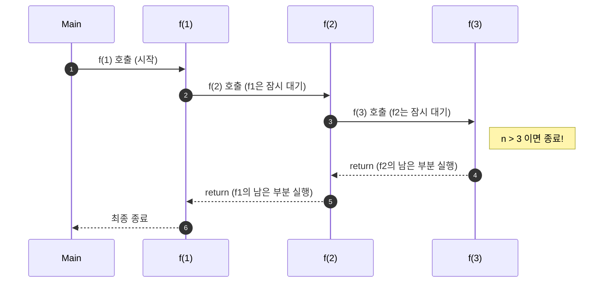

# [ALLv05001번] 01. [재귀함수 - 1] 재귀함수의 원리

## 1. 문제 설명

**재귀함수(Recursion)**란 어떤 문제를 해결하기 위해 함수 내부에서 **자기 자신과 똑같은 함수를 다시 호출하는 방식**을 말합니다. 이는 큰 문제를 해결하기 위해, 그 문제를 구성하는 더 작은 단위의 문제를 반복해서 해결해 나가는 아주 강력한 도구입니다.

### ① 무한 호출과 컴퓨터의 한계
가장 단순한 형태의 재귀함수는 아무런 조건 없이 자신을 계속 부르는 구조입니다.

```c
void f() {
    f(); // 자기 자신을 호출합니다.
}
```

이 코드를 실행하면 함수 `f`는 무한히 자신을 호출하게 됩니다. 컴퓨터는 함수가 호출될 때마다 "이 함수가 끝나면 어디로 돌아가야 하는지"를 메모리에 기록해 둡니다. 하지만 호출이 끝없이 반복되면 이 기록장(스택)이 가득 차서 프로그램이 강제 종료되는데, 이를 **스택 오버플로우(Stack Overflow)**라고 부릅니다.

### ② 안전한 종료: 탈출 조건 (Base Case)
재귀함수가 정상적으로 작동하려면 반드시 **반복을 멈추는 규칙**이 필요합니다. 이를 **탈출 조건** 또는 **기저 조건**이라고 합니다. 보통 매개변수를 활용하여 특정 상태에 도달했을 때 함수를 끝내도록 설계합니다.

```c
void f(int n) {
    if (n > 5) return; // 탈출 조건: n이 5보다 크면 함수를 종료합니다.
    printf("hello\n");
    f(n + 1);          // 재귀 호출: n을 1씩 키우며 다음 단계를 수행합니다.
}
```

### ③ 실행 과정 시각화: "잠시 멈춤과 복귀"
재귀함수의 가장 중요한 특징은 새로운 함수를 호출하는 순간, **현재 함수의 실행은 잠시 멈추고 새로운 함수 안으로 들어간다**는 점입니다. 호출된 함수가 모두 끝나야만 멈췄던 곳으로 돌아와 남은 일을 처리합니다.



#### **[코드로 보는 함수 전개도 (n=3일 때)]**
재귀함수를 코드 레벨에서 펼쳐보면 다음과 같은 **중첩된 구조**가 됩니다. 안쪽 상자가 닫히면 바깥쪽 상자가 차례대로 닫히는 원리를 이해해 보세요.

```text
printNumbers(1) 실행
{
    printf(1); // 1을 출력합니다.
    printNumbers(2) 호출 (1번 함수는 잠시 대기)
    {
        printf(2); // 2를 출력합니다.
        printNumbers(3) 호출 (2번 함수는 잠시 대기)
        {
            printf(3); // 3을 출력합니다.
            printNumbers(4) 호출 (3번 함수는 잠시 대기)
            {
                if (4 > 3) return; // 탈출 조건을 만나 종료됩니다.
            }
            // 4번 함수가 끝나고 3번 함수로 돌아옵니다.
        }
        // 3번 함수가 끝나고 2번 함수로 돌아옵니다.
    }
    // 2번 함수가 끝나고 1번 함수로 돌아와 모든 과정을 마칩니다.
}
```

### ④ 작업의 타이밍: 호출 전과 호출 후
재귀함수 안에서 어떤 일을 할 때, 그 위치에 따라 결과가 크게 달라집니다.
*   **호출 전에 실행**: 안으로 "들어가면서" 일을 합니다. (예: 1, 2, 3... 순서로 출력)
*   **호출 후에 실행**: 작업을 마치고 "나오면서" 일을 합니다. (예: 3, 2, 1... 역순으로 출력)

이번 문제에서는 1부터 N까지 순서대로 출력하는 재귀함수를 설계하며, 함수가 깊이 들어가는 과정에서 데이터를 처리하는 방법을 익혀보겠습니다.

---

## 2. 입출력 설명

* **입력:**
정수 n이 입력됩니다. (n은 1 이상 200 이하)

* **출력:**
1부터 n까지 한 줄에 하나씩 출력합니다.

---

## 3. 예시

### 예시 입력 1
```text
10
```

### 예시 출력 1
```text
1
2
3
4
5
6
7
8
9
10
```

---

## 4. 힌트

💡 **힌트 1: 현재 상태를 기억하는 변수**
함수가 호출될 때마다 "지금이 몇 번째인지"를 알아야 합니다. `void solve(int k)`와 같이 현재 값을 전달하는 매개변수를 활용해 보세요.

💡 **힌트 2: 언제 멈춰야 할까요?**
입력받은 `n`보다 출력하려는 값 `k`가 커지면 더 이상 함수를 부르지 않고 `return;`을 통해 종료해야 합니다.

💡 **힌트 3: 출력의 위치 고민하기**
숫자를 화면에 먼저 보여준 뒤에 다음 숫자를 불러야 할까요, 아니면 다음 숫자를 다 부르고 나서 보여줘야 할까요? 1부터 순서대로 나오게 하는 올바른 순서를 생각해 보세요.

---

<!-- ANSWER_START -->
## [정답 및 해설 (Ground Truth)]

### 모범 코드 (C)
```c
#include <stdio.h>

int N;

void printNumbers(int k) {
    if (k > N) return;     // 탈출 조건
    printf("%d\n", k);     // 호출 전 출력 (1, 2, 3...)
    printNumbers(k + 1);   // 다음 숫자 호출
}

int main() {
    if (scanf("%d", &N) == 1) {
        printNumbers(1);
    }
    return 0;
}
```
<!-- ANSWER_END -->
