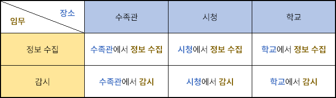

---
id: dc_ALLv10002
title: "02. [재귀함수 - 2] 스파이"
platform: "doingcoding"
is_scraped: true
time_limit: "1s"
memory_limit: "1024MB"
tags: [doingcoding, scraped]
source_url: "http://edu.doingcoding.com/problem/ALLv10002"
---

# [ALLv10002번] 02. [재귀함수 - 2] 스파이

## 1. 문제 설명
스파이 민겸이는 이웃 나라와의 평화를 위해N일간 임무를 수행한다.

민겸이는 정보 수집과 감시 2가지 임무를 수행한다. 각 임무는 수족관, 시청, 학교에서 수행할 수 있다. 두 임무는 성격이 크게 다르기 때문에 하루에 한 가지 임무만 수행할 수 있으며, 수족관, 시청, 학교는 멀리 떨어져 있기 때문에 하루에 한 가지 장소에서만 임무를 수행할 수 있다. 또한, 민겸이는 반드시 하루에 최소 하나의 임무를 수행해야 한다.



다시 말해, 민겸이는 하루에 위 표의 6가지 행동 중 하나를 선택하여 할 수 있다.

민겸이는 각 장소에서 각 임무를 수행할 때, 임무 완수를 위한 진척도를 얻을 수 있다. 그러나 민겸이는 스파이이기 때문에, 같은 장소에서 오래 근무하면 사람들의 눈에 띄어 얻을 수 있는 진척도가 낮아진다. 민겸이가 전날에 임무를 수행한 곳과 같은 장소를 선택하면 그 날은 원래의 절반에 해당하는 진척도만 얻을 수 있다. 이때, 장소가 같다면 임무가 달라도 얻는 진척도는 원래의 절반이 됨에 유의하자.

민겸이의 기여도는 얻은 진척도의 합이다. 각 장소에서 각 임무를 수행했을 때 얻을 수 있는 진척도가 주어질 때 민겸이가M이상의 기여도를 얻을 수 있는 임무 수행 방법이 몇 가지인지 구하라.

---

## 2. 입출력 설명

* **입력:**
첫째 줄에는 민겸이가 임무를 수행하는 총 일수 N과 민겸이가 얻고 싶은 최소 기여도 M이 공백으로 구분되어 주어진다.

둘째 줄에 민겸이가 정보 수집 임무를 수족관, 시청, 학교에서 수행했을 때 얻을 수 있는 진척도가 순서대로 공백으로 구분되어 주어진다.

셋째 줄에 민겸이가 감시 임무를 수족관, 시청, 학교에서 수행했을 때 얻을 수 있는 진척도가 순서대로 공백으로 구분되어 주어진다.

* 1 ≤ N ≤ 8
* 1 ≤ M ≤ 25
* 주어지는 모든 진척도는0이상10이하의 짝수이다.
* 주어지는 모든 수는 정수이다.

* **출력:**
민겸이가 기여도를M이상 얻을 수 있는 임무 수행 방법이 몇 가지인지 출력한다.

---

## 3. 예시

### 예시 입력 1
```text
2 7
4 2 4
2 4 4
```

### 예시 출력 1
```text
10
```

### 예시 입력 2
```text
3 10
4 2 2
6 4 2
```

### 예시 출력 2
```text
98
```

---

## 4. 힌트
(힌트가 없습니다.)

---

<!-- ANSWER_START -->
## [정답 및 해설 (Ground Truth)]

### 모범 코드 (Python)
**(백준 크롤러에서는 정답 코드를 긁어올 수 없으므로, 선생님께서 아래에 직접 보충해 주세요)**

```python
A, B = map(int, input().split())
print(A + B)
```
<!-- ANSWER_END -->
